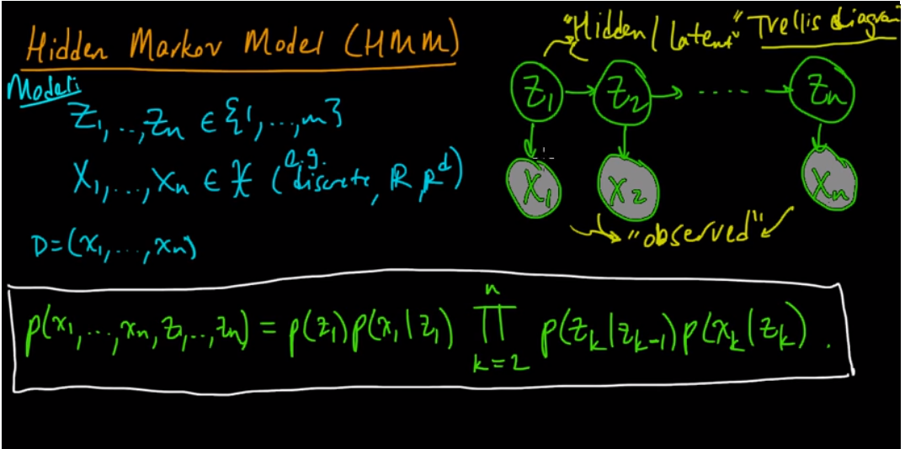
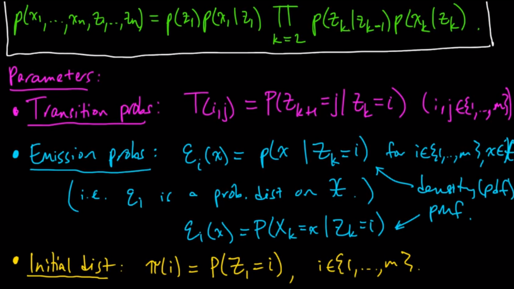
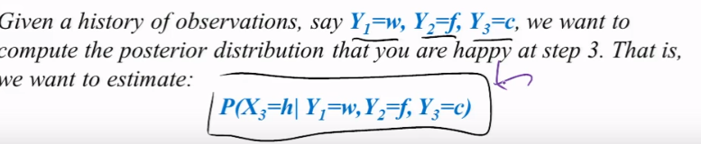
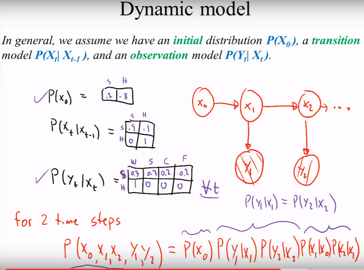

# Probabilistic Models

Instead of drawing a boundary between classes, a probabilistic model says how likely each answer is, and for sequences, how likely each next state is. The page starts with naive Bayes and Bayesian belief networks, moves to Markov models and the hidden Markov model, then to input-output HMMs, and ends with conditional random fields.

### PROBABILISTIC ALGORITHMS

The path runs from the simplest probabilistic classifier to sequence models where each label depends on the one before it.

#### NAIVE BAYES

Naive Bayes is the entry point: apply Bayes' rule and assume the features are independent. A Vidhya piece on NB used to open this list; that address no longer opens and is kept at the end of the page. [Baysian tree](https://github.com/UBS-IB/bayesian_tree) is the UBS-IB bayesian_tree repository on GitHub. Jake VanderPlas's Python Data Science Handbook chapter, In Depth: Naive Bayes Classification, covers [NB, GNB, multi nominal NB](https://jakevdp.github.io/PythonDataScienceHandbook/05.05-naive-bayes.html).

#### BAYES, BAYESIAN BELIEF NETWORKS

Naive Bayes is one fixed use of Bayes theorem; a belief network lets the dependencies between variables be drawn explicitly. [Mastery on bayes theorem](https://machinelearningmastery.com/bayes-theorem-for-machine-learning/) is MachineLearningMastery's gentle introduction to Bayes theorem for machine learning. [Introduction To BBS](https://codesachin.wordpress.com/2017/03/10/an-introduction-to-bayesian-belief-networks/) is Sachin Joglekar's blog post introducing Bayesian belief networks. A complementing SLIDE presentation that shows how to build the network’s tables, and a very nice presentation regarding BBS, used to follow; both are kept at the end of the page.

Fitting those tables is an estimation problem. [Maximum Likelihood](http://mathworld.wolfram.com/MaximumLikelihood.html) (log likelihood) - proofs for bernoulli, normal, poisson. For [Another example](https://codesachin.wordpress.com/2017/03/10/an-introduction-to-bayesian-belief-networks/), the same Sachin Joglekar post works one through.

#### MARKOV MODELS

Belief networks have no notion of time; Markov models add it, and they need two words kept straight first. Random vs Stochastic ([here](https://math.stackexchange.com/questions/114373/whats-the-difference-between-stochastic-and-random) and [here](https://math.stackexchange.com/questions/569951/what-is-the-difference-between-a-random-vector-and-a-stochastic-process)): the first question asks what the difference between stochastic and random is, and the second asks how a random vector differs from a stochastic process. A variable is 'random'. A process is 'stochastic'.

Apart from this difference the two words are synonyms

In other words, a random vector is a generalization of a single random variables to many, and a stochastic process is a sequence of random variables, or a sequence of random vectors (and then you have a vector-stochastic process).

(What is a Markov Model?) A Markov Model is a stochastic(random) model which models temporal or sequential data, i.e., data that are ordered. It provides a way to model the dependencies of current information (e.g. weather) with previous information. It is composed of states, transition scheme between states, and emission of outputs (discrete or continuous). Several goals can be accomplished by using Markov models: learn statistics of sequential data, do prediction or estimation, and recognize patterns.

The weather version makes it concrete. ([sunny cloudy explanation](http://techeffigytutorials.blogspot.co.il/2015/01/markov-chains-explained.html)) Markov Chains is a probabilistic process, that relies on the current state to predict the next state. To be effective the current state has to be dependent on the previous state in some way: if it looks cloudy outside, the next state we expect is rain. If the rain starts to subside into cloudiness, the next state will most likely be sunny. Not every process has the Markov Property, such as the Lottery, this weeks winning numbers have no dependence to the previous weeks winning numbers.

The tutorial then walks these steps:

1. They show how to build an order 1 markov table of probabilities, predicting the next state given the current.
2. Then it shows the state diagram built from this table.
3. Then how to build a transition matrix from the 3 states, i.e., from the probabilities in the table
4. Then how to calculate the next state using the “current state vector” doing vec\*matrix multiplications.
5. Then it talks about the setting always into the rain prediction, and the solution is using two last states in a bigger table of order 2. He is not really telling us why the probabilities don't change if we add more states, it stays the same as in order 1, just repeating.

#### MARKOV MODELS / HIDDEN MARKOV MODEL

In a plain Markov chain the state is visible; in a hidden Markov model only its effects are. The same notes are in [Timeseries](forecasting.md).

HMM tutorials

The tutorials that used to lead this section, a four-part HMM tutorial (Part 1, 2, 3, 4), a Medium intro to HMM / MM, and HMM with sklearn and networkx, no longer open and are kept at the end of the page. What remains from the Medium thread is the [Paper like example](https://medium.com/@kangeugine/hidden-markov-model-7681c22f5b9), a Medium post on the hidden Markov model.

HMM variants

Implementations come next. [Stack exchange on hmm](https://datascience.stackexchange.com/questions/8460/python-library-to-implement-hidden-markov-models) asks which stable, well-documented Python library can implement Hidden Markov Models. [HMM LEARN](https://github.com/hmmlearn/hmmlearn) is hmmlearn, Hidden Markov Models in Python, with scikit-learn like API (sklearn, still being developed). [Pomegranate](https://pomegranate.readthedocs.io/en/latest/) is the pomegranate documentation, and it covers more than HMMs:

 1. General mixture models
 2. Hmm
 3. Basyes classifiers and naive bayes
 4. Markov changes
 5. Bayesian networks
 6. Markov networks
 7. Factor graphs

There is also [GHMM with python wrappers](http://ghmm.org/), and [Hmms](https://github.com/lopatovsky/HMMs) is lopatovsky's continuous-time Hidden Markov Model on GitHub (old).

With the tools listed, the idea itself: HMM ([what is? And why HIDDEN?)](https://youtu.be/jY2E6ExLxaw?t=27m38s) - the idea is that there are things that you CAN OBSERVE and there are things that you CAN'T OBSERVE. From the things you OBSERVE you want to INFER the things you CAN'T OBSERVE (HIDDEN). I.e., you play against someone else in a game, you don't see their choice of action, but you see the result.

In Python, the hmmlearn [code](https://github.com/hmmlearn/hmmlearn) is the main option. HMMs were previously part of [sklearn ](http://scikit-learn.sourceforge.net/stable/modules/hmm.html) Python previously part of the library, until the sklearn.hmm module was deprecated for no longer matching the project's scope and API. For sequence labeling, Python [seqLearn](http://larsmans.github.io/seqlearn/reference.html) is the seqlearn API reference.

This youtube video [part1](https://www.youtube.com/watch?v=TPRoLreU9lA) - explains about the hidden markov model. It shows the visual representation of the model and how we go from that the formula:

<figure><figcaption>
Figure.

Credit: <a href="https://lh6.googleusercontent.com/H4cc7N9jYDubaIjtW7KKpJaGZ0vVa9BhLnzmCYtxtHzFoDiWm5V6oleAc9nV_3IxJ3sd8iIn1TixXhgMNNPIHSaY_Y5F3bXaFW1ujecr_wpHzqnS0mQF-cTIcmRnNAMWtbie1VI7">copied from the original hosted image</a>.
</figcaption></figure>

It breaks down the formula to three parts, which the next figure (also copied from the original hosted image) writes out:

- transition probability formula - the probability of going from Zk to Zk+1
- emission probability formula - the probability of going from Zk to Xk
- (Pi) Initial distribution - the probability of Z1=i for i=1..m

<figure><figcaption>
Figure.

Credit: <a href="https://lh5.googleusercontent.com/4H0tKAQZosxj0cGmCcy98By6AqS3BooOvgBBLftz2Q85jeHWCUf2Ur9wGOa_OwvsC46lVOVk8i6j2uZHgRgf0DIeyOkLaY-m3NgLUUDaFVhqiFYtFlUdaYxSy0qwXPSJ2Je-zcfP">copied from the original hosted image</a>.
</figcaption></figure>

In [part2](https://www.youtube.com/watch?v=M_IIW0VYMEA) of the video, mathematicalmonk's Hidden Markov models (part 2) continues from there.

\* HMM in weka, with github, working on 7.3, not on 9.1; that link no longer opens and is kept at the end of the page.

If the formulas are still opaque, simpler explanations help:

1. Probably the simplest explanation of Markov Models and HMM as a “game” - [link](http://www.fejes.ca/EasyHMM.html)
2. This [video](https://www.youtube.com/watch?v=jY2E6ExLxaw) explains that building blocks of the needed knowledge in HMM, starting probabilities P0, transitions and emissions (state probabilities)

This [post](https://www.quora.com/What-is-a-simple-explanation-of-the-Hidden-Markov-Model-algorithm) This explains HMM and ties our understanding together, as the Quora answer to what a simple explanation of the Hidden Markov Model algorithm is. [A cute explanation on quora](https://www.quora.com/What-is-a-simple-explanation-of-the-Hidden-Markov-Model-algorithm) from that thread comes with these figures:

<figure><figcaption>
Figure.

Credit: <a href="https://lh4.googleusercontent.com/NZOT7lKEm-kjQS4J_L161Pdu6vVA9SmamcNf2IISN2nl-uD35whZhjOH25t_JVePqB7dMh5q9nHRcThBc0iT0GHg326Attj5pAfROG9u1ZUaUObmFnGmPgYZTe_LXwghnhTQdvWI">copied from the original hosted image</a>.
</figcaption></figure>

This is the iconic image of a Hidden Markov Model. There is some state (x) that changes with time (markov). And you want to estimate or track it. Unfortunately, you cannot directly observe this state (hidden). That's the hidden part. But, you can observe something correlated with the state (y).

OBSERVED DATA -> INFER -> what you CANT OBSERVE (HIDDEN).

<figure><figcaption>
Figure.

Credit: <a href="https://lh3.googleusercontent.com/p3MzUK2Vwne89LbeUW_f49e3GuIO62OXDvXNGuZaLWeuTac0D5K5jXoTdJbhomJQqT6wsYSWzWeZ7G4ITvvoy958cHYrtojcjwF0ucQCrhwHekUZmXgB8HFGaAOX30xMf2oP3TRn">copied from the original hosted image</a>.
</figcaption></figure>

Considering this model, P(X0) is the initial state for happy or sad, P(Xt | X t-1) is the transition model from time-1 to time, and P(Yt | Xt) is the observation model for happy and sad (X) in 4 situations (w, sad, crying, facebook). The last figure fills in those tables.

<figure><figcaption>
Figure.

Credit: <a href="https://lh4.googleusercontent.com/5MOIyOwwg7VU39m2L2OqNM8VWatLz4bXCN3i1x6c9cQSJWaEeR6leubji6Bt0F-ptUJcXGYuIKjtTUmeh9iZCumgy6PPYESHzaBXOWk2fjeidWXaUIa2lNQsFW3wFhdP2BHWfKwW">copied from the original hosted image</a>.
</figcaption></figure>

#### INPUT OUTPUT HMM (IOHMM)

A plain HMM only emits outputs; an input-output HMM also conditions on inputs. The [Incomplete python code](https://github.com/Mogeng/IOHMM) for unsupervised / semi-supervised / supervised IOHMM - training is there, prediction is missing. The reference behind it is Machine learning - a probabilistic approach, david barber; that link no longer opens and is kept at the end of the page.

#### CONDITIONAL RANDOM FIELDS (CRF)

HMMs model how observations are generated; a CRF models the labels given the observations directly, which is why it shows up in templatization and NER. The same notes are in [CRF for templatization](templatization.md#crf-for-templatization), [Named Entity Recognition (NER)](../language-ai/named-entity-recognition-ner.md), and [Timeseries](forecasting.md).

[Make sense intro to CRF, comparison against HMM ](https://medium.com/ml2vec/overview-of-conditional-random-fields-68a2a20fa541) is Ravish Chawla's overview: CRFs are a discriminative model for predicting sequences that use contextual information from previous labels. [HMM, CRF, MEMM](https://medium.com/@Alibaba_Cloud/hmm-memm-and-crf-a-comparative-analysis-of-statistical-modeling-methods-49fc32a73586) is Alibaba Cloud's comparative analysis of those three statistical modeling methods. [Another crf article](https://medium.com/@phylypo/nlp-text-segmentation-using-conditional-random-fields-e8ff1d2b6060) is Phylypo Tum on text segmentation, showing how CRF, a special case of the log-linear model, solves the label bias issue of MEMM. The neural network CRF, [NNCRF](https://medium.com/@Akhilesh_k_r/neural-networks-conditional-random-field-crf-973712a0fd30), builds the sequence probability from the softmax outputs the network assigns to each label. The author's list had a fifth item, another one, without an address.

For code, [scikit-learn inspired API for CRFsuite](https://github.com/TeamHG-Memex/sklearn-crfsuite) is TeamHG-Memex/sklearn-crfsuite, [Sklearn wrapper](https://github.com/supercoderhawk/sklearn-crfsuite) is the supercoderhawk fork of the same scikit-learn inspired API, and [Python crfsuite](https://github.com/scrapinghub/python-crfsuite) is scrapinghub's python binding for crfsuite. [Pycrf suite vidahya](https://www.analyticsvidhya.com/blog/2018/08/nlp-guide-conditional-random-fields-text-classification/) is the Analytics Vidhya complete guide to text classification using conditional random fields in Python.

Two last references close the loop back to Markov models. What is a Markov Model?) The Introduction to Markov Models notes show how to establish the transition probabilities between states from collected data: [http://cecas.clemson.edu/~ahoover/ece854/refs/Ramos-Intro-HMM.pdf](http://cecas.clemson.edu/~ahoover/ece854/refs/Ramos-Intro-HMM.pdf). Another one is Freddy Boulton's CRF tutorial in PyTorch, which starts from two identical dice, one fair and one not: [https://towardsdatascience.com/conditional-random-fields-explained-e5b8256da776](https://towardsdatascience.com/conditional-random-fields-explained-e5b8256da776)

## Deprecated links


These links and images no longer work. The original wording is kept here. A same-resource copy, when one was checked, is used above.

- Vidhya on NB. This address no longer opens: https://towardsdatascience.com/my-secret-sauce-to-be-in-top-2-of-a-kaggle-competition-57cff0677d3c
- very nice presentation. This address no longer opens: http://chem-eng.utoronto.ca/~datamining/Presentations/Bayesian_Belief_Network.pdf
- 1. This address no longer opens: http://gekkoquant.com/2014/05/18/hidden-markov-models-model-description-part-1-of-4/
- 2. This address no longer opens: http://gekkoquant.com/2014/05/26/hidden-markov-models-forward-viterbi-algorithm-part-2-of-4/
- 3. This address no longer opens: http://gekkoquant.com/2014/09/07/hidden-markov-models-examples-in-r-part-3-of-4/
- 4. This address no longer opens: http://gekkoquant.com/2015/02/01/hidden-markov-models-trend-following-sharpe-ratio-3-1-part-4-of-4/
- Intro to HMM. This address no longer opens: https://towardsdatascience.com/introduction-to-hidden-markov-models-cd2c93e6b781
- HMM with sklearn and networkx. This address no longer opens: http://www.blackarbs.com/blog/introduction-hidden-markov-models-python-networkx-sklearn/2/9/2017
- HMM in weka, with github, working on 7.3, not on 9.1. This address no longer opens: http://www.doc.gold.ac.uk/~mas02mg/software/hmmweka/index.html
- Machine learning - a probabilistic approach, david barber.. This address no longer opens: https://pdfs.semanticscholar.org/a632/9a41ee67fae978ccac1e37370f074497a4fe.pdf
- complementing SLIDE presentation. This address no longer opens: https://www.slideshare.net/GiladBarkan/bayesian-belief-networks-for-dummies
