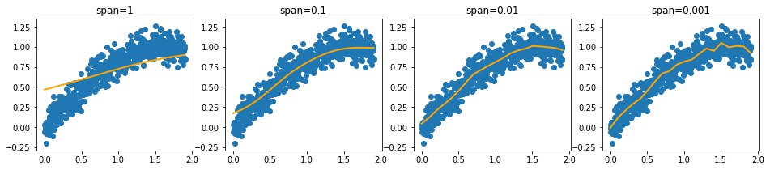
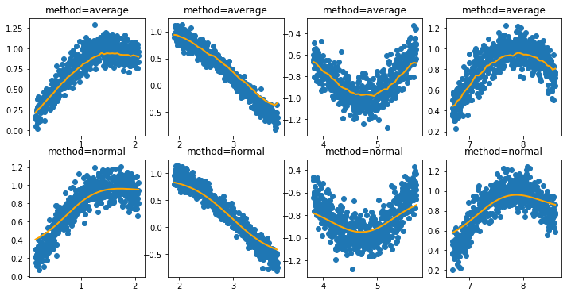
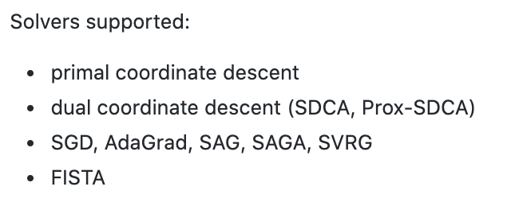
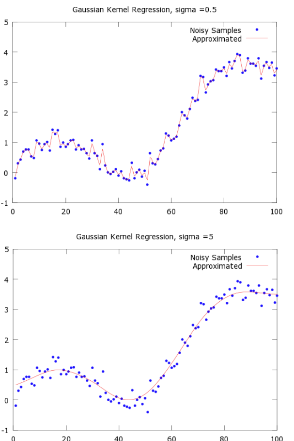

# Regression

This page is about fitting continuous targets: regression algorithms, kernel regression, and the error metrics used to judge them. It covers libraries and tree/SVR/logistic notes alongside R2, RMSE, and related measures.

The same notes are in [Feature Types](../data/feature-types.md), [Normalization & Scaling](../data/normalization-and-scaling.md), [NYC TAXI](../ai-product/examples.md), [REGRESSION ALGORITHMS](#regression-algorithms), and [SUPPORT VECTOR REGRESSION (SVR)](linear-separator-algorithms.md#support-vector-regression-svr).

### REGRESSION ALGORITHMS

This section lists regression libraries, trees, SVR, logistic regression, and error metrics.

The same notes are in [Regression](regression.md) and [SUPPORT VECTOR REGRESSION (SVR)](linear-separator-algorithms.md#support-vector-regression-svr).

1. Sk-lego to fit with intervals a linear regressor on top of non linear data

<figure><figcaption>
Figure.

Credit: <a href="https://lh6.googleusercontent.com/7yCwBKFpFonYWiaBrAy1AeM10-3YMc_HJayDR9-whuLp3K5TRxoIVeyP8EJqqQeO0MImgFpQFGuLa3mVo0tr-390ns4dErivP7jDNsE7NaJXo5k2l6Od4aJpKLrzpM1lZ73USG_Y">copied from the original hosted image</a>.
</figcaption></figure>

1. Sk-lego monotonic

<figure><figcaption>
Figure.

Credit: <a href="https://lh3.googleusercontent.com/P1FIn55eoT2vzJ86cyyFMLklCph_Sk0KsFJiMgH4VMYstg9iED7hOP8fR8lVt9u5e0nVXsc8wTvb5iX3BgePkGY7p6BkHkDsyVywRZHWKNOpMJGSiJFFBGzkB3j76MHypzlwxE4g">copied from the original hosted image</a>.
</figcaption></figure>

1. [Lightning](https://github.com/scikit-learn-contrib/lightning) - lightning is a library for large-scale linear classification, regression and ranking in Python.
   <figure><figcaption>
Figure.

Credit: <a href="https://lh6.googleusercontent.com/IP4Qg9ynzzWdjcFVqiy9TJfOzX7l8_9t8upL8ORVj4zHie6p1GKnuOoWBvth6yXCBQjmGi6W8wXVNPfBQkNwJqdo29TB6y3YTe23PsMOwgES9uF6U_8iGaYu8jHvmG2zvjriT3QV">copied from the original hosted image</a>.
</figcaption></figure>
2. Linear regression TBC
3. CART - [classification and regression tree](http://www.simafore.com/blog/bid/62482/2-main-differences-between-classification-and-regression-trees), basically the diff between classification and regression trees - instead of IG we use sum squared error

The same notes are in [CART TREES](decision-trees.md#cart-trees).

4. SVR - regression based svm, with kernel only.
5. [NNR](https://deeplearning4j.org/linear-regression)- regression based NN, one output node
6. [LOGREG](http://www.statisticssolutions.com/what-is-logistic-regression/) - Logistic regression - is used as a classification algo to describe data and to explain the relationship between one dependent binary variable and one or more nominal, ordinal, interval or ratio-level independent variables. Output is BINARY. I.e., If the likelihood of killing the bug is > 0.5 it is assumed dead, if it is < 0.5 it is assumed alive.

- Assumes binary outcome
- Assumes no outliers
- Assumes no intercorrelations among predictors (inputs?)

Regression Measurements:

1. R^2 - [several reasons it can be too high.](http://blog.minitab.com/blog/adventures-in-statistics-2/five-reasons-why-your-r-squared-can-be-too-high)
   1. Too many variables
   2. Overfitting
   3. Time series - seasonality trends can cause this
2. [RMSE vs MAE](https://medium.com/human-in-a-machine-world/mae-and-rmse-which-metric-is-better-e60ac3bde13d)

#### KERNEL REGRESSION

This subsection describes Gaussian kernel regression and its link to RBF networks.

[Gaussian Kernel Regression](http://mccormickml.com/2014/02/26/kernel-regression/) does–it takes a weighted average of the surrounding points

- variance, sigma^2. Informally, this parameter will control the smoothness of your approximated function.
- Smaller values of sigma will cause the function to overfit the data points, while larger values will cause it to underfit
- There is a proposed method to find sigma in the post!
- Gaussian Kernel Regression is equivalent to creating an RBF Network with the following properties: - described in the post

<figure><figcaption>
Gaussian kernel regression.

Credit: <a href="https://lh4.googleusercontent.com/V9zIvIq9putPPvzrwOOSayDsZllNCgwMhMvYNBu2rSYGSLFI9LfIxzjMWy2Z0wSw4T1CwOqQBd5qX45pgAq4lpfUbMR0CiGmu5rec38RTusLA1Fg5XaqqPZ3D4zvIQoR2Kb5w8fb">copied from the original hosted image</a>.
</figcaption></figure>

## Metrics

This section lists coefficient of determination and other regression error metrics.

1. [R2](https://en.wikipedia.org/wiki/Coefficient_of_determination)
2. Medium [1](https://medium.com/data-science/regression-an-explanation-of-regression-metrics-and-what-can-go-wrong-a39a9793d914), [2](https://medium.com/@george.drakos62/how-to-select-the-right-evaluation-metric-for-machine-learning-models-part-1-regrression-metrics-3606e25beae0), [3](https://medium.com/@george.drakos62/how-to-select-the-right-evaluation-metric-for-machine-learning-models-part-2-regression-metrics-d4a1a9ba3d74), [4](https://medium.com/usf-msds/choosing-the-right-metric-for-machine-learning-models-part-1-a99d7d7414e4)

## Deprecated links


These links and images no longer work. The original wording is kept here. A same-resource copy, when one was checked, is used above.


- Medium 1. This address no longer opens: https://towardsdatascience.com/regression-an-explanation-of-regression-metrics-and-what-can-go-wrong-a39a9793d914
3. Tutorial. This address no longer opens: https://www.dataquest.io/blog/understanding-regression-error-metrics/
- Sk-lego. This address no longer opens: https://scikit-lego.readthedocs.io/en/latest/preprocessing.html#Interval-Encoders
