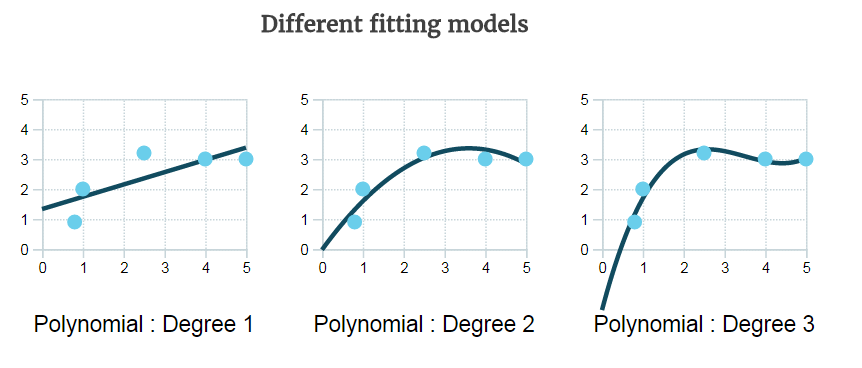
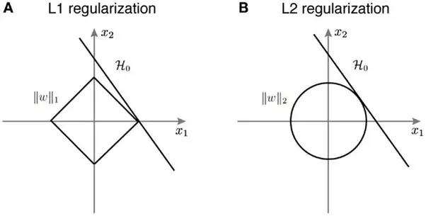
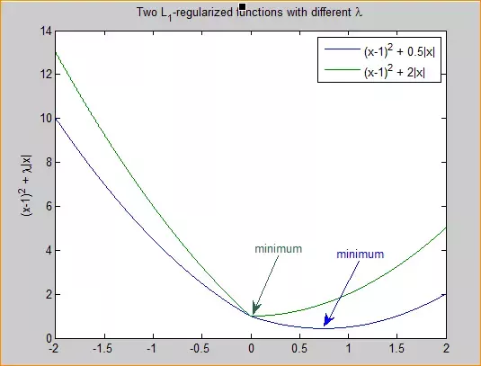
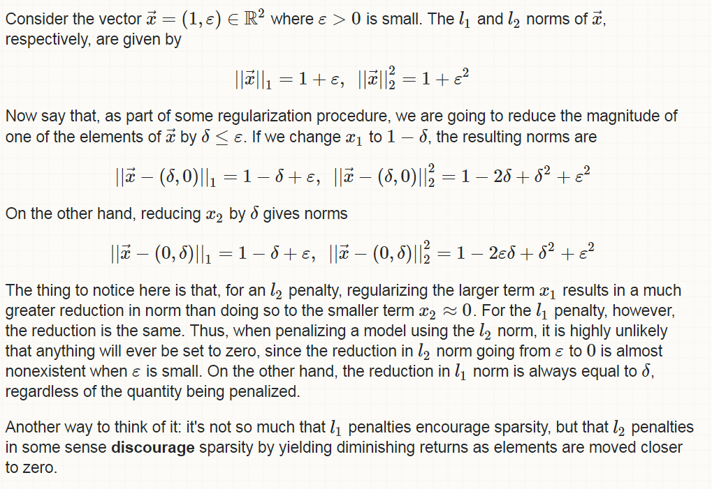
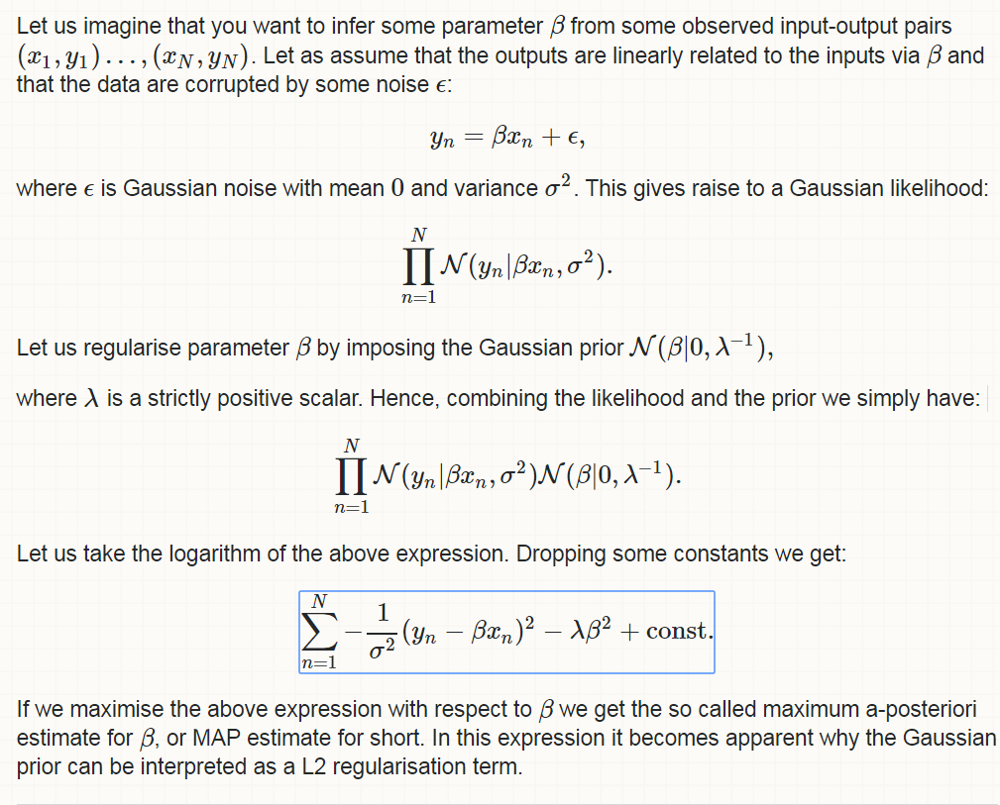

# Regularization

This page is about regularization: a penalty added to a loss so that a model which fits noise is discouraged.

The same notes are in [DROPOUT LAYERS IN KERAS AND GENERAL](../deep-learning/deep-neural-nets.md#dropout-layers-in-keras-and-general), [Follow the regularized leader](../decision-intelligence/follow-the-regularized-leader.md), [Intuition for regularization in SVM](linear-separator-algorithms.md#intuition-for-regularization-in-svm), and [Regularization and influence](linear-separator-algorithms.md#regularization-and-influence).

## What regularization is

This section is the definition: a penalty on a model that fits noise, and how lambda changes which models are ruled out.

[Regularization in linear regression](https://datanice.github.io/machine-learning-101-what-is-regularization-interactive.html): to find the best model, we define a loss or cost function that describes how well the model fits the data, and we try to minimize it. A complex model that also fits the noise is overfitted, so we penalize it by adding a complexity term. That term adds a bigger loss for more complex models.

- A bigger lambda rules out high-complexity models (degree 3). The penalty is stronger.
- A smaller lambda rules out models with high training error, such as a linear model on non-linear data? (degree 1).
- The optimum is in between (degree 2).

### Cost functions

This note points at Andrew Ng's lecture on cost functions, which is the loss that regularization is added to.

([I did not watch this](http://web.archive.org/web/20180309202629/https://www.coursera.org/learn/machine-learning/lecture/db3jS/model-representation), but here Andrew Ng talks about cost functions.)

## Vector norms

This section recalls what a vector norm is, because L1 and L2 are norms.

[A rehearsal on vector normalization](http://mathworld.wolfram.com/VectorNorm.html): for L1, L2, L3, L4, and so on, what is the norm? In some cases it is the absolute value.

<figure><figcaption>
Vector norms for L1, L2, L3, L4, and so on.

Credit: <a href="https://lh4.googleusercontent.com/5hTo0rvgBumQGTtucuYoXqXdL3Le2hDfKmqy6JfLwzWXFGn-SjWXcT34vc04uM6SJAuixyRkxPIUr3Fyv-3CrJ1SdqWjGll_hvy3p9rMjY-ZT0bV07Y2fvzBNgCG1-xbhlLdOxaJ">copied from the original hosted image</a>.
</figcaption></figure>

### ISO surfaces, the Lp norm, and sparseness

This video goes over ISO surfaces, the Lp norm, and sparseness.

Watch this. It also explains ISO surfaces, the Lp norm, and sparseness.





## L1 and L2

These links point at L1 for sparse models and at formulas that compare L1 with L2.

The same notes are in [FEATURE SELECTION](../data/dependence-and-selection.md#feature-selection).

[L1, for sparse models](https://stats.stackexchange.com/questions/45643/why-l1-norm-for-sparse-models)

[L1 versus L2, with some formulas](https://towardsdatascience.com/l1-and-l2-regularization-methods-ce25e7fc831c)

### As a loss and as regularization

This section compares L1 and L2 as a loss and as regularization.

(What is the difference, and what are the features?) [L1 versus L2](http://web.archive.org/web/20260102124606/http://www.chioka.in/differences-between-l1-and-l2-as-loss-function-and-regularization/) as a loss function and as regularization.



L1 moves the regressor faster. It selects features by driving coefficients to zero. With sparse algorithms it is computationally efficient. With others it is not, so use L2.



L2 moves more slowly. It does not make the coefficients sparse, and it is computationally efficient.



## Why L1 leads to sparsity

This section explains why the L1 penalty drives some coefficients to zero.

Why does L1 lead to sparsity?

- [Intuition](https://www.quora.com/Why-is-L1-regularization-supposed-to-lead-to-sparsity-than-L2) and [some of the math](https://www.quora.com/What-is-the-difference-between-L1-and-L2-regularization)

<figure><figcaption>
Where the hypothesis meets the L1 and L2 constraints.

Credit: <a href="https://lh6.googleusercontent.com/WOFPU50nTvEN0O6HdQZ8ZEyJQ3lAETvDEF_gyPWkauv7OG13X31ac51_iSTVHvejv34i4DVhQ67W2NgGh5i9Z90iZ3ojhtoLJVWVqo2nmPPb6Rla_eb21CoAI7uT-bjBvaWTYZ3J">copied from the original hosted image</a>.
</figcaption></figure>

- L1 and L2 regularization add constraints to the optimization problem. The curve H0 is the hypothesis. The solution is the set of points where H0 meets the constraints.
- In L2 the hypothesis is tangential to $$||w||_2$$. The point of intersection has both an x1 component and an x2 component. In L1, because of the shape of $$||w||_1$$, the viable solutions are limited to the corners of the axis, for example x1, so x2 = 0. The solution has eliminated the role of x2, which leads to sparsity.
- This extends to higher dimensions, which is why L1 regularization leads to solutions in which many of the variables are 0.
- In other words, L1 regularization leads to sparsity.
- It is also treated as feature selection. With LibSVM, the recommendation is to select features before using the SVM, and to use L2 instead.

### A one-dimensional intuition

This section gives a second intuition, in one dimension, for why L1 can land exactly on zero.

[L1 sparsity, intuition 2](https://www.quora.com/What-is-the-difference-between-L1-and-L2-regularization)

- For simplicity, consider the one-dimensional case.
- L2: the L2-regularized loss $$F(x) = f(x) + \lambda ||x||^2$$ is smooth. The optimum is the stationary point, where the derivative is 0. That stationary point of F can become very small as λ increases, but it still will not be 0 unless $$f'(0) = 0$$.
- L1: the regularized loss $$F(x) = f(x) + \lambda ||x||$$ is not smooth. It has a kink, a minimum corner, at 0, and it is not differentiable there. Optimization theory says the optimum of a function is either a point where the derivative is 0 or one of the irregularities, such as a corner or a kink. So the optimal point of F can be 0 even when 0 is not the stationary point of f. If λ is large enough it is 0, which is a stronger regularization effect. Below is a graphical illustration.

<figure><figcaption>
A graphical illustration of the one-dimensional L1 and L2 losses.

Credit: <a href="https://lh4.googleusercontent.com/stbOxAhMUFmtwSCdHHFFRdw-A3ngyZzVZHmEvezUHb5dkQrF4KQVs27I3euth9gUng3nkx4g7H2Gn2cx7_R0lzO-14sGhr9Yz8OiLYZ1gRoWIV8b5tl3pVI7z9uvRMI6IXhEpn9k">copied from the original hosted image</a>.
</figcaption></figure>

#### In more than one dimension

This part is the same idea when there is more than one feature.

In more than one dimension: if a feature is not important, the loss it contributes is small, and the non-differentiable regularization effect turns it off.

### Another intuition and formulation

This link is another intuition and formulation for the same sparsity result.

[An intuition and a formulation, which is pretty good:](https://stats.stackexchange.com/questions/45643/why-l1-norm-for-sparse-models)

<figure><figcaption>
An intuition and a formulation.

Credit: <a href="https://lh5.googleusercontent.com/BJ_dZzNlDQLh23d5OvjEJV-IYcBRjw57fZbWcuxO9bmpxpXIV1kKrZ3rIR4b_eKU4dx7tiFFCCd-VD2KYEcG9Yj5PqvpLzcUcj163WfrtaiC5b6JmgoOtZbJCE7j8VyOQpcOiSPc">copied from the original hosted image</a>.
</figcaption></figure>

## Priors

This section ties the penalties to priors: L2 to a Gaussian prior, and L1 to a Laplacean prior.

L2 regularization is [equivalent to a Gaussian prior](https://stats.stackexchange.com/questions/163388/l2-regularization-is-equivalent-to-gaussian-prior).

<figure><figcaption>
L2 regularization as a Gaussian prior.

Credit: <a href="https://lh6.googleusercontent.com/IKbhIIL-8B_VML7_gaPwgW70A9suIWqR2iELzjKTD_ABm9vruQUc5RSs83vYK8ujWb-q16gL2W4hzMT3f9FBCTsQQxH2_U-r24zXIva3FnllHjYc-VfA1qQEMyUu76ncSrI8ovri">copied from the original hosted image</a>.
</figcaption></figure>

L1 regularization is [equivalent to a Laplacean prior](https://stats.stackexchange.com/questions/163388/l2-regularization-is-equivalent-to-gaussian-prior) (same link as above).

> Similarly the relationship between the L1 norm and the Laplace prior can be understood in the same fashion. Take a Laplace prior instead of a Gaussian prior, combine it with your likelihood, and take the logarithm.

## Regularization in an SVM

This note says how regularization shows up in an SVM, through the parameter C.

[How does regularization look in an SVM?](https://datascience.stackexchange.com/questions/4943/intuition-for-the-regularization-parameter-in-svm) It comes down to controlling `C`.

## Deprecated links


These links and images no longer work. The original wording is kept here. A same-resource copy, when one was checked, is used above.


- (Difference between? And features of) L1 vs L2 as loss function and regularization. This address no longer opens: http://www.chioka.in/differences-between-l1-and-l2-as-loss-function-and-regularization/
- (did not watch) but here is andrew ng talks about cost functions. This address no longer opens: https://www.coursera.org/learn/machine-learning/lecture/db3jS/model-representation
