# Log Parsing / Templatization

Raw logs are free text, and before any anomaly detection can run on them each line has to be reduced to a template plus its variable parts. The page starts with the parsing problem and the Logpai collection, then moves through CRF-based templatization, Log3C and its sibling tools, and the LogParser benchmark, and ends with word vectors on logs, feature extraction windows, and PCA-based anomaly detection.

The same notes are in [ASSOCIATION RULES](data-mining.md#association-rules).

The entry point is [Awesome log analysis](https://github.com/logpai/awesome-log-analysis), logpai's list of awesome research on log analysis, anomaly detection, fault localization, and AIOps. The figure below is taken from that list.

<figure>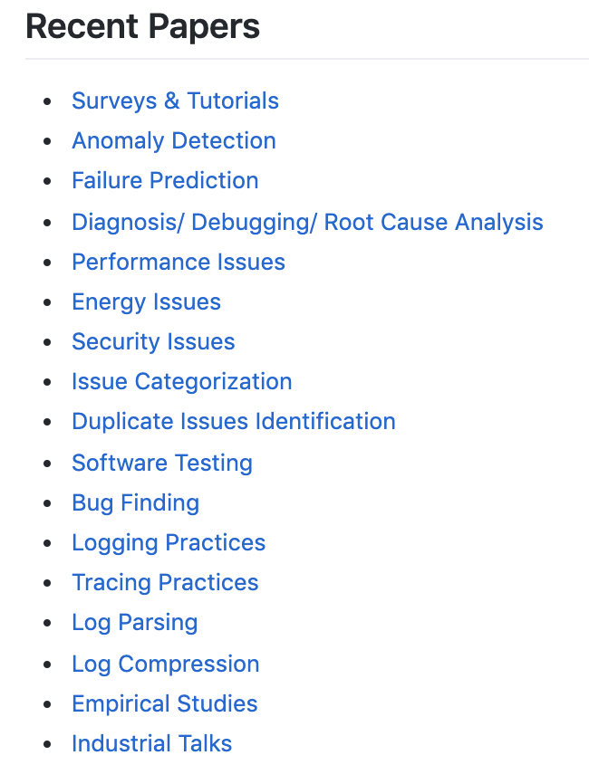<figcaption>
Awesome log analysis.

Credit: <a href="https://lh6.googleusercontent.com/PM_BNp146KH_xeEkpCfptSnhvjgluGa9WpxORgpRPqE3CmDMDhGEdRW2ldG1IXV9ZhJXIvJQkEvmNPALe7kw6Xb8JHY-5NRfql27kS2Cf4wgkBKOqDCsmhYhcZolYDy-1ycekXgx">copied from the original hosted image</a>.
</figcaption></figure>

The same repository keeps a papers.md file, (really good) [And list of papers for each field](https://github.com/logpai/awesome-log-analysis/blob/master/papers.md#anomaly-detection), which opens at the anomaly-detection papers. For a wider view, [How to use log analytics to detect log anomaly](https://www.msystechnologies.com/blog/how-to-use-log-analytics-to-detect-log-anomaly/) is more of a survey into the technologies available, and its figure follows.

<figure>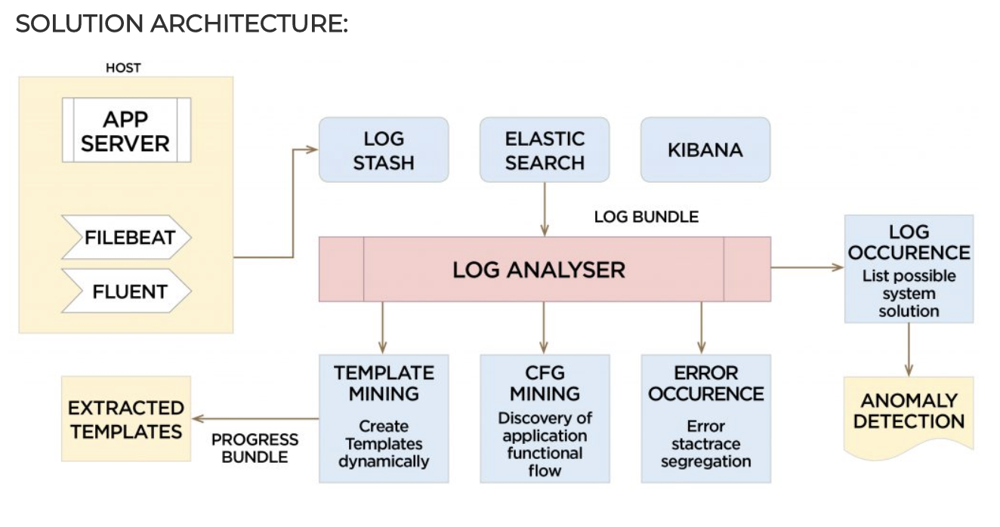<figcaption>
How to use log analytics to detect log anomaly.

Credit: <a href="https://lh6.googleusercontent.com/1mjl7BDsTwHKIVLWnlsMffU3S6A4QIKkoL-sMpgEwiYUZyRVHAtY0FI7M2707LvjTHFf3fZ2aiwhzGaCCD2o9nEmfbQIye0cH0HHBy1ZeVPM_X1DhaThvHw82FFnNHC2gfcboIB5">copied from the original hosted image</a>.
</figcaption></figure>

### Logpai

Most of the tools on this page come from one group. [Logpai](https://github.com/logpai) is LOGPAI, Log Analytics Powered by AI, the GitHub organization that hosts the repositories below. Its [Loghub datasets](https://github.com/logpai/loghub) are a large collection of system log datasets for AI-driven log analytics [ISSRE'23]. The [logpaI loglizer:](https://github.com/PinjiaHe) link points to the GitHub profile of PinjiaHe, whose paper [An Evaluation Study on Log Parsing and Its Use in Log Mining](https://jiemingzhu.github.io/pub/pjhe_dsn2016.pdf) comes out of the Chinese University of Hong Kong, Shenzhen. The loglizer code itself is in the [git](https://github.com/logpai/loglizer) repo, a machine learning toolkit for log-based anomaly detection [ISSRE'16].

## CRF for templatization

Logpai's parsers are rule and clustering based, but templatization can also be framed as a sequence-labeling task. The same notes are in [CONDITIONAL RANDOM FIELDS (CRF)](probabilistic-models.md#conditional-random-fields-crf).

[Towards an NLP based log template generation algorithm for system log analysis](http://www.3at.work/papers/cfi2014.pdf) starts from system logs of network equipment, one of the most important sources for network management, where generating log templates (the meta format) from real log messages is still difficult. Its answer — CRF for templatization, i.e. NER style. The catch is the amount of training data:

> we can see that the more learning data given, the more accurately CRF produces log templates. Clearly a sufficient number of train data enables us to analyze less frequently appearing log templates. Therefore, it is reasonable that a log template can be analyzed correctly if train data include some of similar templates. However, in terms of log template accuracy, CRF requires 10000 train data to achieve same accuracy as Vaarandi’s algorithm

The three figures below are from the same paper.

<figure>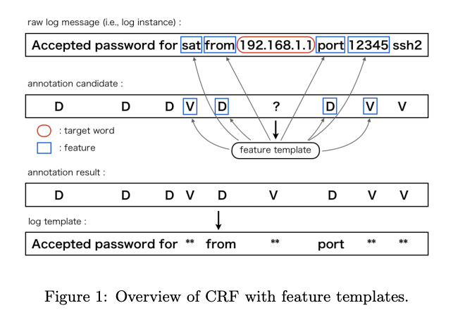<figcaption>
Towards an NLP based log template generation algorithm for system log analysis.

Credit: <a href="https://lh5.googleusercontent.com/-_axdpi4F7bTBQGnRnzf--j4mja6NMbRJfaoLmIQOQJeuF5fBqojXEBDbpzFKkGBK7skRMIQi6AGKCXzWl7PgSnqGe5dekwxRqRtqLxAoGpIBvH0XAlgNVxJJeZTRmnTE2UalNqo">copied from the original hosted image</a>.
</figcaption></figure>

<figure>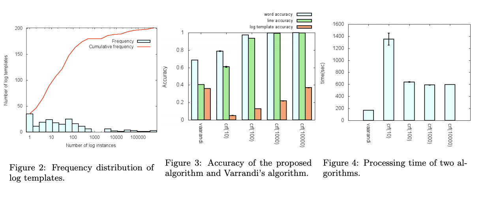<figcaption>
Towards an NLP based log template generation algorithm for system log analysis.

Credit: <a href="https://lh4.googleusercontent.com/hxCR-hM0aqF8wQBdKwloQtyHrd00MuP3rgfLbKZiiBRv5K06E5y7bsLp9Ye7MPNqztMULM429ZEbmFGX_OGcLjP2TKHLlaa896Etyvj0rkeU-Fb5zoyTrJFON6Fm_RrhGL2by8qV">copied from the original hosted image</a>.
</figcaption></figure>

<figure>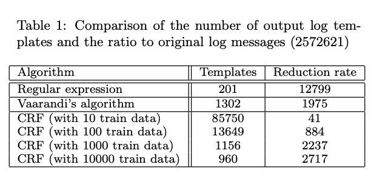<figcaption>
Towards an NLP based log template generation algorithm for system log analysis.

Credit: <a href="https://lh5.googleusercontent.com/edSGC4ElX8-mn2pc6yn5WbqzUPYSRxorl1o-Yk9e8w-GBHrKa8234G1glpBpd3NxUdJJpf8Uyij-GSuTWnLYwDGnr7i-z63LtNQixj9a5oYPY4M6DMi3Msif_PSAr41lN7jqc9y8">copied from the original hosted image</a>.
</figcaption></figure>

## Log3C

Parsing is only the first step; the point is to find the problems the logs describe. [log3C](https://github.com/logpai/Log3C) is logpai's log-based impactful problem identification using machine learning [FSE'18], and the [paper](https://dl.acm.org/citation.cfm?id=3236083) is its ACM publication. Log3C is a general framework that identifies service system problems from system logs. It utilizes both system logs and system KPI metrics to promptly and precisely identify impactful system problems. Log3C consists of four steps: Log parsing, Sequence vectorization, Cascading Clustering and Correlation analysis. This is a joint work by CUHK and Microsoft Research. The repository contains the source code of Log3C, including data loading, sequence vectorization, cascading clustering, data saving, etc. The core part is the cascading clustering algorithm, which groups a large number of sequence vectors into clusters by iteratively sampling, clustering, matching. The three Log3C figures show that pipeline.

<figure>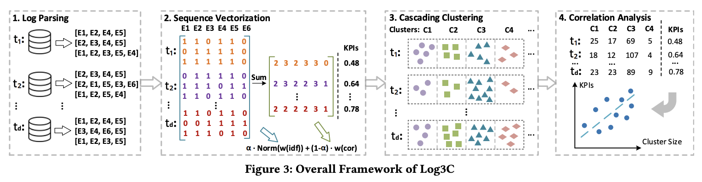<figcaption>
Log3C.

Credit: <a href="https://lh5.googleusercontent.com/66iv2rGsmWcnFbMZPO2Neg0t9X__mkGI8bOCh1ZAjdIvqqmdov8jiGwWiQANu69PalsDQaDTEbzbu1JezOi_w2Y7z1Ff_do7mwXFFhqY5CUW1CQ3ba19sLMsXP7JpUA375VWxO1H">copied from the original hosted image</a>.
</figcaption></figure>

<figure>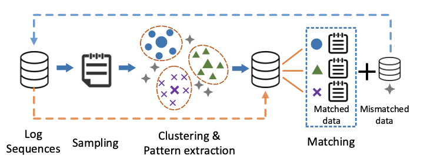<figcaption>
Log3C.

Credit: <a href="https://lh3.googleusercontent.com/5w3vUKudl-w5oht9i7rw13Wl6DnQaNIPgyaCscyoqBEFZ3r0r7Hz8NonRA6LSQuPxDL--J6O2Rlb1698dsGz_D5NlVn5RBY0tw6FcHgqO3BYLOm_AFzRzxOYzGPp7NIog8Or6-fu">copied from the original hosted image</a>.
</figcaption></figure>

<figure>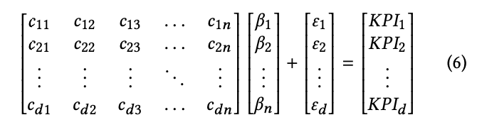<figcaption>
Log3C.

Credit: <a href="https://lh6.googleusercontent.com/_5BvgUnyNm-3doZBdOzj2fY16UtBVlfp4xc--EU0YVBaHDaOnIsfRPuicMKiEgQOlycYDpYBZrfUGDaJIN0rw4kiAnA0o57HLwUUnHWR0lObuNIjslSqbmf8C_pkbxGudgHnjDdp">copied from the original hosted image</a>.
</figcaption></figure>

The paper is explicit about its limits. Selection of KPI: In our experiments, we use failure rate as the KPI for problem identification. failure rate is an important KPI for evaluating system service availability. There are also other KPIs such as mean time between failures, average request latency, throughput, etc. In our future work, we will experiment with problem identification concerning different KPI metrics. Noises in labeling: Our experiments are based on three datasets that are collected as a period of logs on three different days. The engineers manually inspected and labeled the log sequences. (false positives/negatives) may be introduced during the manual labeling process. However, as the engineers are experienced professionals of the product team who maintain the service system, we believe the amount of noise is small (if it exists)

It also sets Log3C against the two baselines that come back later on this page. Furthermore, we compare our method with two typical methods: PCA [41] and Invariants Mining [23]. All these three methods are unsupervised, log-based problem identification methods. PCA projects the log sequence vectors into a subspace. If the projected vector is far from the majority, it is considered as a problem. Invariants Mining extracts the linear relations (invariants) between log event occurrences, which hypothesizes that log events are often pairwise generated. For example, when processing files, "File A is opened" and "File A is closed" should be printed as a pair. Log sequences that violate the invariants are regarded as problematic. Log3C achieves good recalls (similar to those achieved by two comparative methods) and surpasses the comparative methods concerning precision and F1-measure.

The same group built tools for the rest of the log lifecycle. [Logzip](https://github.com/logpai/logzip) is an optimized log compression tool via iterative clustering [ASE'19], and its [paper](https://arxiv.org/abs/1910.00409) is Logzip: Extracting Hidden Structures via Iterative Clustering for Log Compression. Logzip is an (personal note seems to be offline) efficient compression tool specific for log files. It compresses log files by utilizing the inherent structures of raw log messages, and thereby achieves a high compression ratio. The results show that logzip can save about half of the storage space on average over traditional compression tools. Meanwhile, the design of logzip is highly parallel and only incurs negligible overhead. In addition, we share our industrial experience of applying logzip to Huawei's real products.

Logadvisor moves upstream, to where logs are written. [paper1](https://jiemingzhu.github.io/pub/qfu_icse2014.pdf) is Where Do Developers Log? An Empirical Study on Logging Practices in Industry, which argues that it is crucial to avoid logging too little or too much and that developers need informed decisions on where to log and what to log. [2](https://jiemingzhu.github.io/pub/jmzhu_icse2015.pdf) is Learning to Log: Helping Developers Make Informed Logging Decisions, from the CUHK Sub-Lab of the Ministry of Education Key Laboratory of High Confidence Software Technologies. Our goal, referred to as “learning to log”, is to automatically learn the common logging practice as a machine learning model, and then leverage the model to guide developers to make logging decisions during new development. The model is built in three steps:

1. Labels: logging method (e.g., Console.Writeline())
2. Features: we need to extract useful features (e.g., exception type) from the collected code snippets for making logging decisions,
3. Train / suggest

The two Logadvisor figures show that setup.

<figure>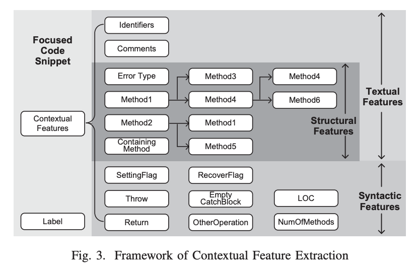<figcaption>
Logadvisor.

Credit: <a href="https://lh3.googleusercontent.com/k1bAC6cD6Ut9lBfUfXeqht9j8jzd4OLcLM_as4pJcEhtX2VuCJmFbVRnJAtos5_lXd8X7ZkFU6WCYmx02bQo0NtWNEZc9J4KgzrwdC7X3uHiDsmbakWbun15SHFiQ_QxNjAyBbpK">copied from the original hosted image</a>.
</figcaption></figure>

<figure>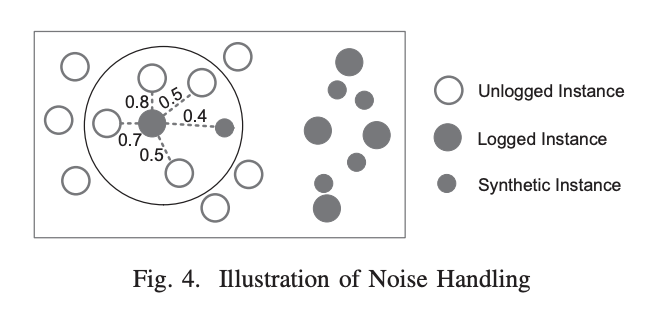<figcaption>
Logadvisor.

Credit: <a href="https://lh6.googleusercontent.com/4LRepv7-CHy91fExDSyk59vmmGXN4yFHayTDe5qmj0u1UXLBrBTmtKKlUwZOWxf-sT-9i0FJ7rs5ZPhQ5koykZgtQhrNJSmGK8T_Fuq49gFqHozzBiubl4bq09qyympjOSK7gcs1">copied from the original hosted image</a>.
</figcaption></figure>

A related dataset covers the text of the log line itself. [Logging descriptions -](https://github.com/logpai/LoggingDescriptions) This repository maintains a set of `<code, log>` pairs extracted from popular open-source projects, which are amendable to logging description generation research.

The tool that ties parsing to detection is (REALLY GOOD) [Loglizer](https://github.com/logpai/loglizer). Its [paper](https://jiemingzhu.github.io/pub/slhe_issre2016.pdf) is Experience Report: System Log Analysis for Anomaly Detection, which starts from the fact that developers traditionally inspect logs manually with keyword search and rule matching, and that modern systems produce too many logs for that. The [git demo](https://github.com/logpai/loglizer/tree/master/demo) is the demo folder of the repo. Loglizer is a machine learning-based log analysis toolkit for automated anomaly detection.

<figure>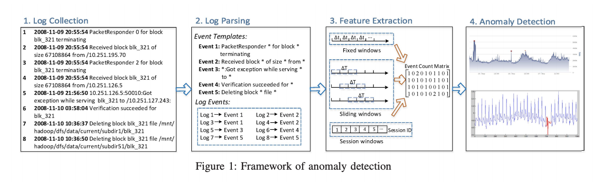<figcaption>
Loglizer.

Credit: <a href="https://lh4.googleusercontent.com/TtxjVZA8y03fapSbEa0-9m5qD6nZEl1sUShed_UmBXaKcoRjqov5SOLCM4uWW6U9dOG_9nmYNOBqTUDnYDtUAY06XVQUsc7oJSQdvLbOCEh4_0Tsaih_ucswOYmm5hVmINkwj99l">copied from the original hosted image</a>.
</figcaption></figure>

## LogParser benchmark

With so many parsers around, the question is which one to use. [LogParser](https://github.com/logpai/logparser) is a benchmark for log parsers using 13 models on 16 datasets. **Important insights:** Drain is fastest, most performing on most datasets (9/16). Fitting parameters should be adapted, which what makes drain the most performing. The benchmark also calls for more demanding metrics. The papers behind it:

- [ICSE'19] Jieming Zhu, Shilin He, Jinyang Liu, Pinjia He, Qi Xie, Zibin Zheng, Michael R. Lyu. [Tools and Benchmarks for Automated Log Parsing](https://arxiv.org/pdf/1811.03509.pdf). International Conference on Software Engineering (ICSE), 2019.
- [TDSC'18] Pinjia He, Jieming Zhu, Shilin He, Jian Li, Michael R. Lyu. [Towards Automated Log Parsing for Large-Scale Log Data Analysis](https://jiemingzhu.github.io/pub/pjhe_tdsc2017.pdf). IEEE Transactions on Dependable and Secure Computing (TDSC), 2018.
- [ICWS'17] Pinjia He, Jieming Zhu, Zibin Zheng, Michael R. Lyu. [Drain: An Online Log Parsing Approach with Fixed Depth Tree](https://jiemingzhu.github.io/pub/pjhe_icws2017.pdf). IEEE International Conference on Web Services (ICWS), 2017.
- [DSN'16] Pinjia He, Jieming Zhu, Shilin He, Jian Li, Michael R. Lyu. [An Evaluation Study on Log Parsing and Its Use in Log Mining](https://jiemingzhu.github.io/pub/pjhe_dsn2016.pdf). IEEE/IFIP International Conference on Dependable Systems and Networks (DSN), 2016.

The benchmark figure summarizes the comparison.

<figure>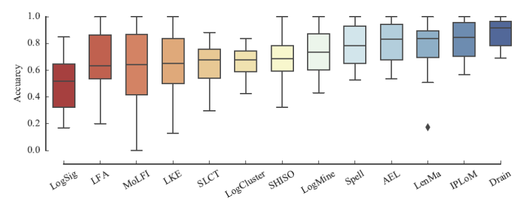<figcaption>
LogParser benchmark.

Credit: <a href="https://lh5.googleusercontent.com/61Q9N3ArWIwYdnQpUiTHMWCc5C_gnGeYkLZ9uv0GhNorh4tRQ-x9YReH0JZkSsLEYooAqVHWhzavf9ejTiHxDkmoSVpplEpbxMwXJ2EGx0xB3Xb08eDaz1qoVUNWtj-zupggmzOu">copied from the original hosted image</a>.
</figcaption></figure>

Beyond the benchmarked parsers, deep models read the logs directly. [Gpt3 with logs](https://www.zebrium.com/blog/using-gpt-3-with-zebrium-for-plain-language-incident-root-cause-from-logs) was the Zebrium post on plain-language incident root cause from logs; the address now lands on Skylar Advisor, which combines real-time observability data, operational context, and customer-owned knowledge into explainable AI guidance for IT operations. [DeepLog](https://www.cs.utah.edu/~lifeifei/papers/deeplog.pdf) is DeepLog: Anomaly Detection and Diagnosis from System Logs through Deep Learning, which treats the system log, recorded at critical points to help debug failures and perform root cause analysis, as the input for anomaly detection. GitHub - wuyifan18/DeepLog is a Pytorch Implementation of DeepLog. ( [git](https://github.com/wuyifan18/DeepLog)

[Log2vec](https://netman.aiops.org/wp-content/uploads/2020/05/Log2Vec-icccn20.pdf) is the Tsinghua University paper with Federico Zaiter, Bingjin Chen, and Dan Pei, and its code ([git](https://github.com/NetManAIOps/Log2Vec)) is a distributed representation method for online logs.

Three earlier sources come back here as plain addresses. logpaI loglizer: An Evaluation Study on Log Parsing and Its Use in Log Mining is by PinjiaHe, whose profile is [https://github.com/PinjiaHe](https://github.com/PinjiaHe). The toolkit is a machine learning toolkit for log-based anomaly detection [ISSRE'16] - logpai/loglizer, **(REALLY GOOD)**, with the Loglizer paper linked above, at [https://github.com/logpai/loglizer](https://github.com/logpai/loglizer). The next section is based on 3 things we learned about applying word vectors to logs, archived at [https://web.archive.org/web/20180629032123/https://gab41.lab41.org/three-things-we-learned-about-applying-word-vectors-to-computer-logs-c199070f390b](https://web.archive.org/web/20180629032123/https://gab41.lab41.org/three-things-we-learned-about-applying-word-vectors-to-computer-logs-c199070f390b)

## Word vectors on logs

Instead of parsing templates first, the Lab41 write-up, 3 things we learned about applying word vectors to logs, runs GloVe on the log stream. GloVe consistently identified approximately 50 percent or more of the seeded events in the synthetic data as either exact or as valid sub-sequence matches. GloVe tended to nominate a limited number of template sequences that weren’t related to seeded events and many of those were tied to high frequency templates. When we tested GloVe against a generated data set with multiple SSH sessions in an auditd file, GloVe correctly proposed a single event that included all of the auditd record types defined in the SSH user login lifecycle.

The catch is that Glove produces sub sequences that needs to be stitched to create a match, as the figure shows.

<figure>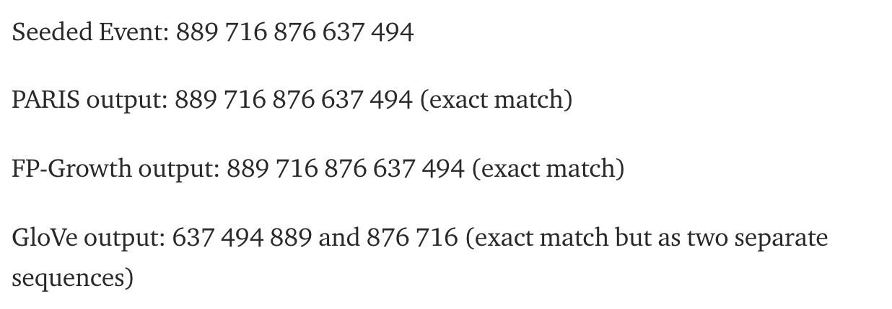<figcaption>
Glove produces sub sequences that needs to be stitched to create a match.

Credit: <a href="https://lh4.googleusercontent.com/OtPZY2dZzyVEny4mhyvjzq4ZYfOeoKPq3fGSXm9Mk7aP4eDSHP3G54LrLXEZs67Q8QjXUOKXFs5UHPIwI8LGTMAQ6l5NmR4UjXOegQkCa6CX05ZONxLzWtdYqjw99_y_CJBlchDj">copied from the original hosted image</a>.
</figcaption></figure>

On speed, Glove is faster than paris and fp growth. On accuracy, their clustering method misclassified.

## Feature extraction windows

Whether events come from a parser or from word vectors, they have to be grouped into sequences before a model can use them. Feature extraction uses a fixed window, a sliding window, or a session window.

Fixed window: Both fixed windows and sliding windows are based on timestamp, which records the occurrence time of each log. Each fixed window has its size, which means the time span or time duration. As shown in Figure 1, the window size is Δt, which is a constant value, such as one hour or one day. Thus, the number of fixed windows depends on the predefined window size. Logs that happened in the same window are regarded as a log sequence.

Sliding window: Different from fixed windows, sliding windows consist of two attributes: window size and step size, e.g., hourly windows sliding every five minutes. In general, step size is smaller than window size, therefore causing the overlap of different windows. Figure 1 shows that the window size is ΔT , while the step size is the forwarding distance. The number of sliding windows, which is often larger than fixed windows, mainly depends on both window size and step size. Logs that occurred in the same sliding window are also grouped as a log sequence, though logs may duplicate in multiple sliding windows due to the overlap.

Session window: Compared with the above two windowing types, session windows are based on identifiers instead of the timestamp. Identifiers are utilized to mark different execution paths in some log data. For instance, HDFS logs with block_id record the allocation, writing, replication, deletion of certain block. Thus, we can group logs according to the identifiers, where each session window has a unique identifier

## PCA for log anomaly detection

Once logs are windowed into event count vectors, the PCA baseline that Log3C compared against can be applied. The same notes are in [Anomaly Detection](anomaly-detection.md) and [PCA](dimensionality-reduction-methods.md#pca).

There are many Supervised methods and most importantly a cool unsupervised method - > PCA for anomaly based on the length of the projected transformed sample vector by dividing the first and last PC vectors. PCA was first applied in log-based anomaly detection by Xu et al. [47]. In their anomaly detection method, each log sequence is vectorized as an event count vector. After that, PCA is employed to find patterns between the dimensions of event count vectors. Employing PCA, two subspace are generated, namely normal space Sn and anomaly space Sa. Sn is constructed by the first k principal components and Sn is constructed by the remaining (n−k), where n is the original dimension. Then, the projection ya = (1−P P T )y of an event count vector y to Sa is calculated, where P = [v1,v2, ...,vk,] is the first k principal components. If the length of ya is larger

## Deprecated links


These links and images no longer work. The original wording is kept here. A same-resource copy, when one was checked, is used above.


- 3 things we learned about applying word vectors to logs. This address no longer opens: https://gab41.lab41.org/three-things-we-learned-about-applying-word-vectors-to-computer-logs-c199070f390b#.bk8wnk7pr
- logpaI loglizer: An Evaluation Study on Log Parsing and Its Use in Log Mining. This address no longer opens: https://github.com/PinjiaHe. This address no longer opens: https://pinjiahe.github.io/papers/DSN16.pdf
- **Logadvisor -** 2. This address no longer opens: http://jmzhu.logpai.com/pub/jmzhu_icse2015.pdf
- **(REALLY GOOD)** Loglizer paper. This address no longer opens: https://github.com/logpai/loglizer. This address no longer opens: http://jmzhu.logpai.com/pub/slhe_issre2016.pdf
