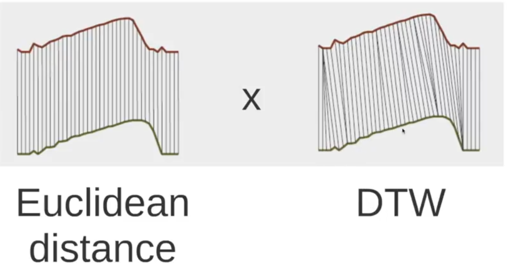

# Time Series Search

This page is about comparing and grouping time series with DTW, then clustering series and detecting anomalies in them. It collects myths, code, and toolkit notes for those three jobs.

### Dynamic Time Warping (DTW)

This subsection covers DTW myths, code, and hierarchical clustering examples.

The same notes are in [Clustering Algorithms](clustering-algorithms.md) and [Distance](../data/feature-engineering.md#distance).

DTW, ie., how to compute a better distance for two time series.

1. The three myths of using DTW

Myth 1: The ability of DTW to handle sequences of different lengths is a great advantage, and therefore the simple lower bound that requires different-length sequences to be reinterpolated to equal length is of limited utility \[10]\[19]\[21]. In fact, as we will show, there is no evidence in the literature to suggest this, and extensive empirical evidence presented here suggests that comparing sequences of different lengths and reinterpolating them to equal length produce no statistically significant difference in accuracy or precision/recall.
Myth 2: Constraining the warping paths is a necessary evil that we inherited from the speech processing community to make DTW tractable, and that we should find ways to speed up DTW with no (or larger) constraints\[19]. In fact, the opposite is true. As we will show, the 10% constraint on warping inherited blindly from the speech processing community is actually too large for real world data mining.
Myth 3: There is a need (and room) for improvements in the speed of DTW for data mining applications. In fact, as we will show here, if we use a simple lower bounding technique, DTW is essentially O(n) for data mining applications. At least for CPU time, we are almost certainly at the asymptotic limit for speeding up DTW.



- Time series classification and clustering code written in Python. [Python code](https://github.com/alexminnaar/time-series-classification-and-clustering)
- Jupyter Notebook Viewer. Jupyter Notebook Viewer. with a [good tutorial.](http://nbviewer.ipython.org/github/alexminnaar/time-series-classification-and-clustering/blob/master/Time%20Series%20Classification%20and%20Clustering.ipynb)
3. Another function for dtw distance in python
- [Medium](https://medium.com/datadriveninvestor/dynamic-time-warping-dtw-d51d1a1e4afc) mentions prunedDTW sparseDTW and fastDTW
- 1. Dynamic Time Warping — tslearn 0.10.0.dev documentation. [DTW in TSLEARN](https://tslearn.readthedocs.io/en/latest/user_guide/dtw.html#soft-dtw)
- dtw — The dtw-python package 1.7.4 documentation. [DynamicTimeWarping](https://dynamictimewarping.github.io/py-api/html/api/dtw.dtw.html#dtw.dtw)

<figure><figcaption>
Figure.

Credit: <a href="https://lh3.googleusercontent.com/aJYNIn2aCXwoZxIIcHbm-X03kwzJUqTBLQ96UPVUex_nRsO4eO1NuCWppkiMazcm5IQKUcnS9i2h2usU9GKLUAFIToRWxyx36W6SydTl4J1tVTd7vzLaywdvedmPSOQnmDj1sPZj">copied from the original hosted image</a>.
</figcaption></figure>

1. (duplicate above in classification) [Stackexchange](https://stats.stackexchange.com/questions/131281/dynamic-time-warping-clustering/131284) - Yes, you can use DTW approach for classification and clustering of time series. I've compiled the following resources, which are focused on this very topic (I've recently answered a similar question, but not on this site, so I'm copying the contents here for everybody's convenience):

- UCR Time Series Classification/Clustering: main page, software page and corresponding paper
- Time Series Classification and Clustering with Python: a blog post
- Capital Bikeshare: Time Series Clustering: another blog post
- Jupyter Notebook Viewer. Time Series Classification and Clustering: [ipython notebook](http://nbviewer.ipython.org/github/alexminnaar/time-series-classification-and-clustering/blob/master/Time%20Series%20Classification%20and%20Clustering.ipynb)
- Dynamic Time Warping using rpy and Python:. [another blog post](https://nipunbatra.wordpress.com/2013/06/09/dynamic-time-warping-using-rpy-and-python)
- Mining Time-series with Trillions of Points: Dynamic Time Warping at Scale: another blog post
- Time Series Analysis and Mining in R (to add R to the mix): yet another blog post
- And, finally, two tools implementing/supporting DTW, to top it off: R package and Python module

1. Time Series Hierarchical Clustering using Dynamic Time Warping in Python - notebook
2. K-Means with DTW, probably fixed length vectors, using tslearn
- (nice) [With time series](https://medium.com/@shachiakyaagba_41915/dynamic-time-warping-with-time-series-1f5c05fb8950)

- Welcome to the UCR Time Series Classification/Clustering Page. main page. [http://www.cs.ucr.edu/~eamonn/time_series_data](http://www.cs.ucr.edu/~eamonn/time_series_data)
- UCR Suite for Time Series Subsequence Search. software page. [http://www.cs.ucr.edu/~eamonn/UCRsuite.html](http://www.cs.ucr.edu/~eamonn/UCRsuite.html)
- corresponding paper. [http://www.cs.ucr.edu/~eamonn/SIGKDD_trillion.pdf](http://www.cs.ucr.edu/~eamonn/SIGKDD_trillion.pdf)
- Time Series Classification and Clustering with Python –. a blog post. [http://alexminnaar.com/2014/04/16/Time-Series-Classification-and-Clustering-with-Python.html](http://alexminnaar.com/2014/04/16/Time-Series-Classification-and-Clustering-with-Python.html)
- Weekdays on the bike share network are very different from weekends. another blog post. [http://ofdataandscience.blogspot.com/2013/03/capital-bikeshare-time-series-clustering.html](http://ofdataandscience.blogspot.com/2013/03/capital-bikeshare-time-series-clustering.html)
- The three myths of using DTW. [http://alumni.cs.ucr.edu/~ratana/RatanamC.pdf](http://alumni.cs.ucr.edu/~ratana/RatanamC.pdf)
- K-Means with DTW, probably fixed length vectors, using tslearn. [https://towardsdatascience.com/how-to-apply-k-means-clustering-to-time-series-data-28d04a8f7da3](https://towardsdatascience.com/how-to-apply-k-means-clustering-to-time-series-data-28d04a8f7da3)

### CLUSTERING TS

This subsection warns about rolling-window pitfalls and lists tslearn clustering.

The same notes are in [Clustering Algorithms](clustering-algorithms.md).

1. Clustering time series, subsequences with a rolling window, the pitfall.
- 4. Time Series Clustering — tslearn 0.9.0 documentation. [Clustering using tslearn](https://tslearn.readthedocs.io/en/stable/user_guide/clustering.html)
- [Kmeans for variable length](https://medium.com/@iliazaitsev/how-to-classify-a-dataset-with-observations-of-various-length-96fab8e95baf)
- Blog/trees/scikit_learn.py at master · i-zaitsev/Blog. [notebook](https://github.com/devforfu/Blog/blob/master/trees/scikit_learn.py)

### ANOMALY DETECTION TS

This subsection surveys time-series anomaly detection methods and toolkits.

The same notes are in [Anomaly Detection](anomaly-detection.md).

- Stationary process. Stationary process - Wikipedia. [What is stationary (process](https://en.wikipedia.org/wiki/Stationary_process)
- 11 Classical Time Series Forecasting Methods in Python (Cheat Sheet) - MachineLearningMastery.com. [mastery on arimas](https://machinelearningmastery.com/time-series-forecasting-methods-in-python-cheat-sheet/)
3. TS anomaly algos (stl, trees, arima)
- [AD techniques](https://medium.com/dp6-us-blog/anomaly-detection-techniques-c3817e8e7b2f)
- part [2](https://medium.com/dp6-us-blog/anomaly-detection-techniques-part-ii-9a08b6562619)
- Now that we have learned about two techniques for detecting anomalies, how do we apply them in our daily routine? part [3](https://medium.com/dp6-us-blog/anomaly-detection-techniques-part-iii-d27e7b0d6c8a)
- In the interest of making data science processes accessible to non-specialists, I’ve written a collection of functions for doing a particularly common task in the exploratory phase of data analysis: the detection of outliers, by Colin Gorrie. [Z-score, modified z-score and iqr an intro why z-score is not robust](http://colingorrie.github.io/outlier-detection.html)
6. [Adtk](https://adtk.readthedocs.io/en/stable/userguide.html) a sklearn-like toolkit with an amazing intro, various algorithms for non seasonal and seasonal, transformers, ensembles.
- List of tools & datasets for anomaly detection on time-series data. [Awesome TS anomaly detection](https://github.com/rob-med/awesome-TS-anomaly-detection)
- Transfer Learning Toolkit for Primary Researchers. [Transfer learning toolkit](https://github.com/FuzhenZhuang/Transfer-Learning-Toolkit)
- [paper and benchmarks](https://arxiv.org/pdf/1911.08967.pdf)
- [Ransac is a good baseline](https://medium.com/@iamhatesz/random-sample-consensus-bd2bb7b1be75) random sample consensus for outlier detection
 - [Ransac](https://medium.com/@angel.manzur/got-outliers-ransac-them-f12b6b5f606e)
 - [2](https://medium.com/@saurabh.dasgupta1/outlier-detection-using-the-ransac-algorithm-de52670adb4a)
 2. You can feed ransac with tsfresh/tslearn features.
- [Anomaly detection for time series](https://medium.com/@jetnew/anomaly-detection-of-time-series-data-e0cb6b382e33)
- AD for TS, recommended by DTAIDistance. [anomatools](https://github.com/Vincent-Vercruyssen/anomatools)
12. STL:
 - [AD where anomalies coincide with seasonal peaks!!](https://medium.com/@richa.mishr01/anomaly-detection-in-seasonal-time-series-where-anomalies-coincide-with-seasonal-peaks-9859a6a6b8ba)
 - Detect anomalies in time-series data with AIOPS, by Ravi Teja Verma. [AD challenges, stationary, seasonality, trend](https://cloudfabrix.com/blog/aiops/anomaly-detection-time-series-data/)
 - [Rt anomaly detection for time series pinterest](https://medium.com/pinterest-engineering/building-a-real-time-anomaly-detection-system-for-time-series-at-pinterest-a833e6856ddd) using stl decomposition
 - [AD](https://medium.com/wwblog/anomaly-detection-using-stl-76099c9fd5a7)
13. Sliding windows
 - [Solving sliding window problems](https://medium.com/outco/how-to-solve-sliding-window-problems-28d67601a66)
 - [Rolling window regression](https://medium.com/making-sense-of-data/time-series-next-value-prediction-using-regression-over-a-rolling-window-228f0acae363)
- pmdarima: ARIMA estimators for Python — pmdarima 2.1.1 documentation. Forecasting using Arima 1 [2](http://alkaline-ml.com/pmdarima/)
- Auto arima 1 [2](https://stackoverflow.com/questions/22770352/auto-arima-equivalent-for-python)
- A basic introduction to various time series forecasting methods and techniques, by Aishwarya Singh. [3](https://www.analyticsvidhya.com/blog/2018/08/auto-arima-time-series-modeling-python-r/)
16. [Twitters ESD test](https://medium.com/@elisha_12808/time-series-anomaly-detection-with-twitters-esd-test-50cce409ced1) for outliers, using z-score and t test
 1. Another esd test inside here
17. [Minimal sample size for seasonal forecasting](https://robjhyndman.com/papers/shortseasonal.pdf)
- Anomaly Detection on Golden Signals | USENIX. [Golden signals](https://www.usenix.org/conference/srecon19asia/presentation/chen-yu)
- SREcon19 Asia/Pacific - Anomaly Detection on Golden Signals, by USENIX. [youtube](https://www.youtube.com/watch?v=3T9ZzQQiPSo)
19. [Graph-based Anomaly Detection and Description: A Survey](https://arxiv.org/pdf/1404.4679.pdf)
- Time2vec [paper](https://arxiv.org/pdf/1907.05321.pdf) Time2vec for deep learning layer

## Deprecated links


These links and images no longer work. The original wording is kept here. A same-resource copy, when one was checked, is used above.

- Clustering time series, subsequences with a rolling window, the pitfall.. This address no longer opens: https://towardsdatascience.com/dont-make-this-mistake-when-clustering-time-series-data-d9403f39bbb2
- TS anomaly algos (stl, trees, arima). This address no longer opens: https://blog.statsbot.co/time-series-anomaly-detection-algorithms-1cef5519aef2
- 3. This address no longer opens: https://towardsdatascience.com/detecting-the-fault-line-using-k-mean-clustering-and-ransac-9a74cb61bb96
- 4. This address no longer opens: http://www.cs.tau.ac.il/~turkel/imagepapers/RANSAC4Dummies.pdf
- here. This address no longer opens: https://towardsdatascience.com/anomaly-detection-def662294a4e
- Time Series Hierarchical Clustering using Dynamic Time Warping in Python. This address no longer opens: https://towardsdatascience.com/time-series-hierarchical-clustering-using-dynamic-time-warping-in-python-c8c9edf2fda5
- notebook. This address no longer opens: https://github.com/avchauzov/_articles/blob/master/1.1.trajectoriesClustering.ipynb
