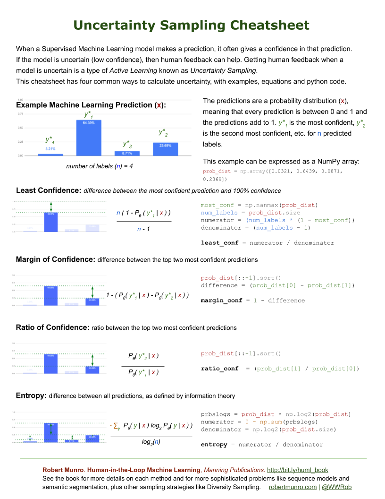
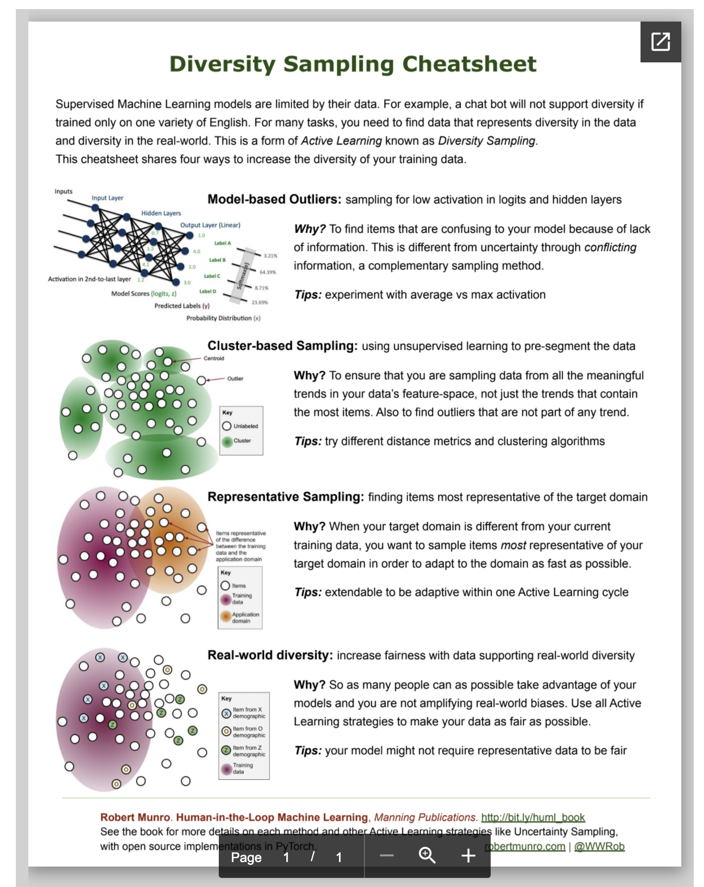
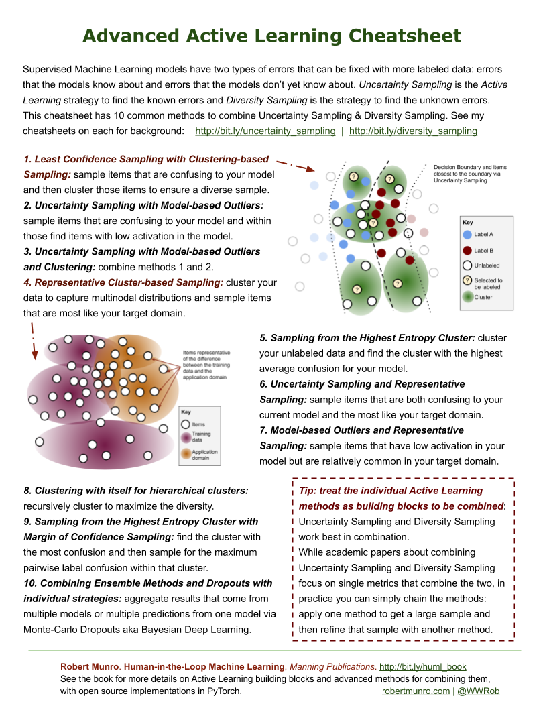
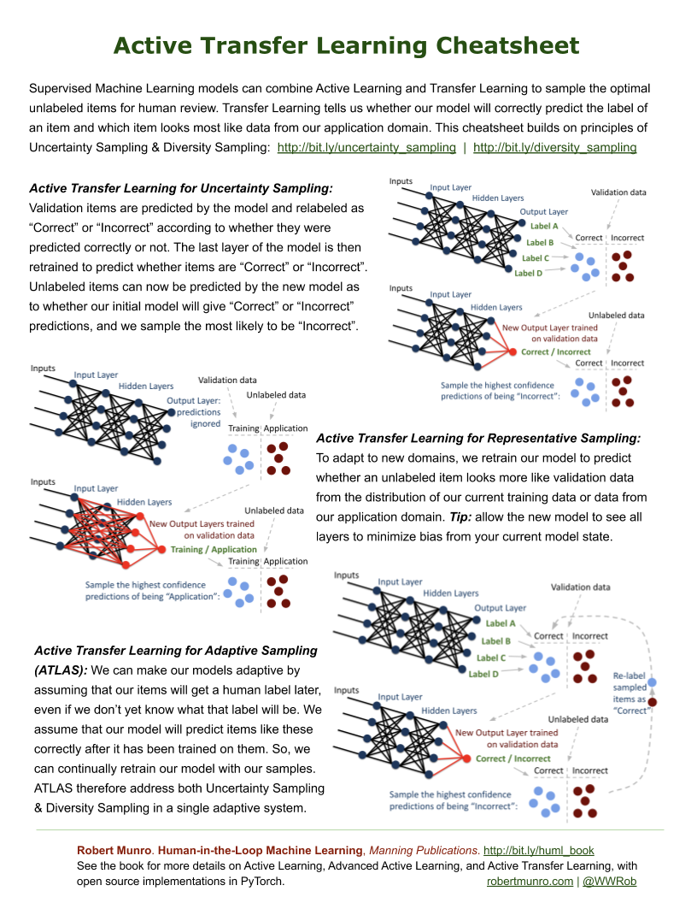

# Active Learning

This page collects tutorials, papers, and practical notes on active learning and human-in-the-loop labeling. It covers uncertainty and diversity sampling, query-by-committee, and pitfalls when labels are expensive.

The same notes are in [Active Learning Algorithms](../decision-intelligence/active-learning-algorithms.md) and [Annotation & Disagreement](../data/annotation-and-disagreement.md).

1. If you need to start somewhere start [here](https://www.datacamp.com/community/tutorials/active-learning) - types of AL, the methodology, examples, sample selection functions.
- # Burr Settles Computer Sciences Technical Report 1648 University of Wisconsin–Madison Updated on: January 26, 2010 Abstract. A thorough   thorough about [review paper](http://burrsettles.com/pub/settles.activelearning.pdf)
- # Burr Settles Computer Sciences Technical Report 1648 University of Wisconsin–Madison Updated on: January 26, 2010 Abstract. [The book on AL](http://burrsettles.com/pub/settles.activelearning.pdf)
- Active learning promises cheaper labels, but optimizing model uncertainty does not necessarily improve the dataset or the business outcome. [Choose your model first, then do AL, from lighttag](https://www.lighttag.io/blog/active-learning-optimization-is-not-imporvement/)
 1. The alternative is Query by committee - Importantly, the active learning method we presented above is the most naive form of what is called "uncertainty sampling" where we chose to sample based on how uncertain our model was. An alternative approach, called Query by Committee, maintains a collection of models (the committee) and selecting the most "controversial" data point to label next, that is one where the models disagreed on. Using such a committee may allow us to overcome the restricted hypothesis a single model can express, though at the onset of a task we still have no way of knowing what hypothesis we should be using.

The same notes are in [Ensembles](../predictive-ml/ensembles.md) and [Entropy / Information Gain](../data/information-theory.md#entropy--information-gain).

 2. [Paper](https://arxiv.org/pdf/1807.04801.pdf): warning against transferring actively sampled datasets to other models
- 910-AC0013.pdf. [How to increase accuracy with AL ](http://www.ijcte.org/papers/910-AC0013.pdf)
6. [AL with model selection](https://ojs.aaai.org/index.php/AAAI/article/download/9014/8873) - paper
- Using weak and strong oracle in AL. [paper](http://publications.lib.chalmers.se/records/fulltext/248447/248447.pdf)
8. [The pitfalls of AL](http://www.kdd.org/exploration_files/v12-02-9-UR-Attenberg.pdf) - how to choose (cost-effectively) the active learning technique when one starts without the labeled data needed for methods like cross-validation; 2. how to choose (cost-effectively) the base learning technique when one starts without the labeled data needed for methods like cross-validation, given that we know that learning curves cross, and given possible interactions between active learning technique and base learner; 3. how to deal with highly skewed class distributions, where active learning strategies find few (or no) instances of rare classes; 4. how to deal with concepts including very small subconcepts (“disjuncts”)—which are hard enough to find with random sampling (because of their rarity), but active learning strategies can actually avoid finding them if they are misclassified strongly to begin with; 5. how best to address the cold-start problem, and especially 6. whether and what alternatives exist for using human resources to improve learning, that may be more cost efficient than using humans simply for labeling selected cases, such as guided learning [3], active dual supervision [2], guided feature labeling [1], etc.
- # Confidence-Based Stopping Criteria for Active Learning for Data Annotation JINGBO ZHU and HUIZHEN WANG Northeastern University EDUARD HOVY University of Southern California and MATTHEW MA Scientific Works. [Confidence based stopping criteria paper](http://www.cs.cmu.edu/~./hovy/papers/10ACMjournal-activelearning-stopping.pdf)
- A lot of unlabeled data is plentiful and cheap, eg. A great [tutorial ](http://hunch.net/~active_learning/active_learning_icml09.pdf)
11. [AWS Sagemaker Active Learning](https://youtu.be/8J7y513oSsE?t=435), using annotation consolidation that finds outliers and weights accordingly, then takes that data, trains a model with the annotation + training data, if labeled with high probability, will use those labels, otherwise will re-annotate.
12. [An ok video](https://www.youtube.com/watch?v=Et7h1A1j4ns&feature=youtu.be)
- GitHub - bwallace/curious_snake: an active learning framework in python. [Active learning framework in python](https://github.com/bwallace/curious_snake)
- ResearchGate - Temporarily Unavailable. ResearchGate - Temporarily Unavailable. [Active Learning Using Pre-clustering](https://www.researchgate.net/profile/Arnold_Smeulders/publication/221345455_Active_learning_using_pre-clustering/links/54c3cc440cf2911c7a4cc74a/Active-learning-using-pre-clustering.pdf)
- The page covers # A literature survey of active machine learning in the context of natural language processing. [A literature survey of active machine learning in the context of natural language processing](https://www.ccs.neu.edu/home/vip/teach/MLcourse/4_boosting/materials/SICS-T--2009-06--SE.pdf)
16. Practical Online Active Learning for Classification
17. [Video 2](https://www.youtube.com/watch?v=8Jwp4_WbRio&index=7&list=PLegWUnz91Wfsn6skGOofRoeFoOyfdqSyN)
- An Exercise in Active Learning Implementation in R on MNIST dataset - gsimchoni/ActiveLearningExercise. [Active learning in R - code](https://github.com/gsimchoni/ActiveLearningExercise)
- The page covers deep Bayesian Active Learning with Image Data. [Deep bayesian active learning with image data](https://arxiv.org/pdf/1703.02910.pdf)
- ## Integrating Human-in-the-Loop (HITL) in machine learning is a necessity, not a choice, by Andy Kelly. [Integrating Human-in-the-Loop (HITL) in machine learning is a necessity, not a choice. Here’s why?](https://medium.com/@supriya2211/integrating-human-in-the-loop-hitl-in-machine-learning-application-is-a-necessity-not-a-choice-f25e131ca84e)

<figure><figcaption>
Basic Framework for HITL Supriya Ghosh wrong credit? let me know
</figcaption></figure>

#### Human In The loop ML book by [Robert munro](https://www.manning.com/books/human-in-the-loop-machine-learning#ref)

This block follows Robert Munro’s human-in-the-loop machine learning book and related cheat sheets.

- PyTorch Library for Active Learning to accompany Human-in-the-Loop Machine Learning book - rmunro/pytorch_active_learning. [GIT](https://github.com/rmunro/pytorch_active_learning)
- Active Transfer Learning with PyTorch. [Active transfer learning](https://medium.com/pytorch/active-transfer-learning-with-pytorch-71ed889f08c1)
- When a Supervised Machine Learning model makes a prediction, it often gives a confidence in that prediction. [Uncertainty sampling](https://medium.com/data-science/uncertainty-sampling-cheatsheet-ec57bc067c0b)
 - Least Confidence: difference between the most confident prediction and 100% confidence
 - Margin of Confidence: difference between the top two most confident predictions
 - Ratio of Confidence: ratio between the top two most confident predictions
 - Entropy: difference between all predictions, as defined by information theory

<figure><figcaption>
Uncertainty sampling.

Credit: <a href="https://lh3.googleusercontent.com/GK8uZ-WZg-0QFkXuxjR9iUM9tAhKJUeW-LApwTbknab37JXvvMQlQc-bvK2GpF5HGqoFCabSGzwWoSIzL6TdHg9_WclZhopIbn6s4JO3eG6-_yX8Q1S8C9tU90gvDGL_kSPNFU1J">by Robert (Munro) Monarch</a>.
</figcaption></figure>

[Diversity sampling](https://medium.com/data-science/diversity-sampling-cheatsheet-32619693c304) - you want to make sure that it covers as diverse a set of data and real-world demographics as possible.

- Model-based Outliers: sampling for low activation in your logits and hidden layers to find items that are confusing to your model because of lack of information
- Cluster-based Sampling: using Unsupervised Machine Learning to sample data from all the meaningful trends in your data’s feature-space
- Representative Sampling: sampling items that are the most representative of the target domain for your model, relative to your current training data
- Real-world diversity: using sampling strategies that increase fairness when trying to support real-world diversity

<figure><figcaption>
Diversity sampling.

Credit: <a href="https://lh6.googleusercontent.com/fsXyZEAvwEbhm7sGt7EcfxDz85zTKEwz4VvRdxzpXSaB2t_5jZ3g3mjdClqUcORG8PgmtUNFAKF8nrIRYGCfl5bNVxjvYt9bn0NxmsM2U7J4NtebGxXKQSaXaZubAKx9s4v29-FP">by Robert (Munro) Monarch</a>.
</figcaption></figure>

[Combine uncertainty sampling and diversity sampling](https://medium.com/data-science/advanced-active-learning-cheatsheet-d6710cba7667)

1. Least Confidence Sampling with Clustering-based Sampling: sample items that are confusing to your model and then cluster those items to ensure a diverse sample (see diagram below).
2. Uncertainty Sampling with Model-based Outliers: sample items that are confusing to your model and within those find items with low activation in the model.
3. Uncertainty Sampling with Model-based Outliers and Clustering: combine methods 1 and 2.
4. Representative Cluster-based Sampling: cluster your data to capture multinodal distributions and sample items that are most like your target domain (see diagram below).
5. Sampling from the Highest Entropy Cluster: cluster your unlabeled data and find the cluster with the highest average confusion for your model.
6. Uncertainty Sampling and Representative Sampling: sample items that are both confusing to your current model and the most like your target domain.
7. Model-based Outliers and Representative Sampling: sample items that have low activation in your model but are relatively common in your target domain.
8. Clustering with itself for hierarchical clusters: recursively cluster to maximize the diversity.
9. Sampling from the Highest Entropy Cluster with Margin of Confidence Sampling: find the cluster with the most confusion and then sample for the maximum pairwise label confusion within that cluster.
10. Combining Ensemble Methods and Dropouts with individual strategies: aggregate results that come from multiple models or multiple predictions from one model via Monte-Carlo Dropouts aka Bayesian Deep Learning.

<figure><figcaption>
Combine uncertainty sampling and diversity sampling.

Credit: <a href="https://lh5.googleusercontent.com/Ln4CzdRRCmVVrSNMhC5Ku6P5rhOFtaPcPduUFStCemdeZiASbU4G_bf98-VRPEIfwW6zXdxjXG9ujkez3iqHUPgGEk3o0naDD5yx65ET_YlssSv0Vfzp9MGthh9WWQpnKuqGmhCX">by Robert (Munro) Monarch</a>.
</figcaption></figure>

Active transfer learning.

<figure><figcaption>
Active transfer learning.

Credit: <a href="https://lh4.googleusercontent.com/v_wNRSX8ql9QU9ibjNkxGN9Z6KtgAxZ1jZk_wZo62Hcyt-p4XAh5ErtRdkU7pG9J8kVZ22PuxMhTrWrsJ7uehnMIGZlwR13kukFc7i63YmzBAC3Ow7NTnAjnG2rPsTkbKkcLbCq9">by Robert (Munro) Monarch</a>.
</figcaption></figure>

Machine in the loop

- Machine-in-the-loop labeling can reduce annotation cost while introducing bias; here is how to reason about the tradeoff. [Similar to AL, just a machine / model / algo adds suggestions. This is obviously a tradeoff of bias and clean dataset](https://www.lighttag.io/blog/when-to-use-machine-in-the-loop/)

- Practical Online Active Learning for Classification. [http://citeseerx.ist.psu.edu/viewdoc/download?doi=10.1.1.87.5536&rep=rep1&type=pdf](http://citeseerx.ist.psu.edu/viewdoc/download?doi=10.1.1.87.5536&rep=rep1&type=pdf)

## Deprecated links


These links and images no longer work. The original wording is kept here. A same-resource copy, when one was checked, is used above.


- AL with model selection - paper. This address no longer opens: http://www.alnurali.com/papers/paper_aaai_2014.pdf
- A literature survey of active machine learning in the context of natural language processing. This address no longer opens: http://eprints.sics.se/3600/
- Mnist competition (unpublished) using AL. This address no longer opens: http://dag.cvc.uab.es/mnist/statistics/
- Medium on AL. This address no longer opens: https://news.voyage.auto/active-learning-and-why-not-all-data-is-created-equal-8a43a758c6f9
- Uncertainty sampling. This address no longer opens: https://towardsdatascience.com/uncertainty-sampling-cheatsheet-ec57bc067c0b
- Diversity sampling - you want to make sure that it covers as diverse a set of data and real-world demographics as possible. This address no longer opens: https://towardsdatascience.com/https-towardsdatascience-com-diversity-sampling-cheatsheet-32619693c304
- Combine uncertainty sampling and diversity sampling. This address no longer opens: https://towardsdatascience.com/advanced-active-learning-cheatsheet-d6710cba7667
