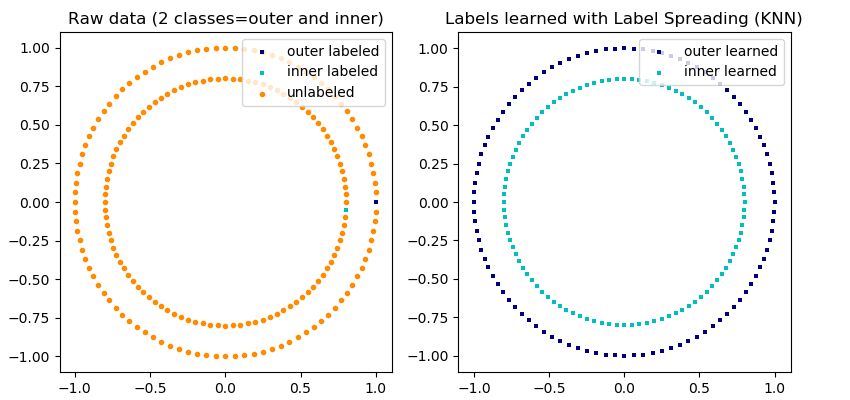
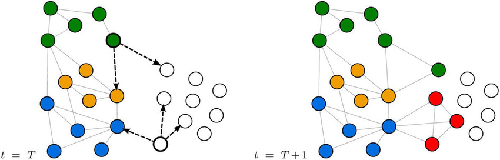

# Label Algorithms

Labels are often scarce, noisy, or unevenly spread, and each of those needs its own algorithm. The page takes them in that order: first unbalanced labels, then label propagation and spreading across a graph of related examples, then tools for label noise.

## Unbalanced labels

The first label problem is that one class dominates, and the fix can be resampling or a change to the loss. The same notes are in [Decision Trees](../predictive-ml/decision-trees.md), [IMBALANCED DATASETS](../data/datasets.md#imbalanced-datasets), and [Introduction](../decision-intelligence/reinforcement-learning.md#introduction).

The resampling route is [imbalance learn](https://imbalanced-learn.org/stable/auto_examples/over-sampling/plot_comparison_over_sampling.html#sphx-glr-auto-examples-over-sampling-plot-comparison-over-sampling-py) — is an open-source, MIT-licensed library that provides tools when dealing with classification with imbalanced classes; the linked page is its comparison of over-sampling methods, shown in the figure below.

The loss route is [Classifying Job Titles With Noisy Labels Using REINFORCE](https://medium.com/@ziprecruiter.engineering/classifying-job-titles-with-noisy-labels-using-reinforce-ce1a4bde05e2) this article has a very nice trick in adding a reward component to the loss function in order to mitigate for unbalanced class label problem, instead of the usual balancing.

The same notes are in [Reinforcement Learning](../decision-intelligence/reinforcement-learning.md).

<figure><figcaption>
Imbalance Learn comparison.
</figcaption></figure>

## Label Propagation / Spreading

Balancing assumes the labels exist; when only a few do, the labels have to travel to the unlabeled samples. This is semi-supervised label propagation and spreading on a graph Laplacian. The same notes are in [Semi Supervised](semi-supervised.md) and [Weakly Supervised](weakly-supervised.md).

Note: very much related to weakly and semi supervision, i.e., we have small amounts of labels and we want to generalize the labels to other samples, see also weak supervision methods.

Step 1 is to [build a laplacian](https://en.wikipedia.org/wiki/Laplacian_matrix) graph using KNN, distance metric is minkowski with p=2, i.e. euclidean distance. The NetworkX series walks the idea from there: the [Step by step tutorial](https://medium.com/@graphml/introduction-to-label-propagation-with-networkx-part-1-abcbe954a2e8) is "Introduction to Label Propagation with NetworkX — Part 1", which starts from the observation that similar objects, like two people with similar hobbies, are likely to form a connection, and [part 2](https://medium.com/@graphml/introduction-to-label-propagation-with-networkx-part-2-cd041fa44e1) implements Label Propagation in NetworkX.

[Spreading](https://scikit-learn.org/stable/modules/generated/sklearn.semi_supervised.LabelSpreading.html) (propagation upgrade), Essentially a community graph algorithm, however it resembles KNN in its nature, using semi supervised data set (i.e., labeled and unlabeled data) to spread or propagate labels to unlabeled data, with small incrementations in the algorithm, using KNN-like methodology, each unlabeled sample will be given a label based on its 1st order friends, if there is a tie, a random label is chosen. Nodes are connected by using a euclidean distance. The [Difference](https://www.researchgate.net/post/What_is_the_difference_between_Label_propagation_and_Label_spreading_in_semi-supervised_learning_context) between propagation and spreading is a laplacian matrix, vs normalized LM. The matrix itself is taught in [Laplacian matrix on youtube, videos 30-33](https://www.youtube.com/watch?v=siCPjpUtE0A&list=PLLssT5z_DsK9JDLcT8T62VtzwyW9LNepV&index=33), a Stanford lecture series that ends at lecture 33 on finding a spectral graph partition.

With the steps in place, the rest is worked examples and references. The [Really good example notebook](https://github.com/DavidBrear/sklearn-cookbook/blob/master/Chapter%204/4.1.1%20Label%20Propagation%20with%20Semi-Supervised%20Learning.ipynb) is chapter 4.1.1 of the code from the Scikit-Learn Cookbook, label propagation with semi-supervised learning. The [Spreading vs propagation](https://www.researchgate.net/post/What_is_the_difference_between_Label_propagation_and_Label_spreading_in_semi-supervised_learning_context) thread is the same ResearchGate question as above. The Wikipedia article on the label propagation algorithm is [https://en.wikipedia.org/wiki/Label_Propagation_Algorithm](https://en.wikipedia.org/wiki/Label_Propagation_Algorithm).

For video, Youtube [1](https://www.youtube.com/watch?v=UWf8hxeehOg) is Graphileon's community detection by label propagation, and [2](https://www.youtube.com/watch?v=hmashUPJwSQ) and [3](https://www.youtube.com/watch?v=F4f247IyOTs) are Leonid Zhukov's Network Analysis lecture 17, parts 1 and 2, on label propagation on graphs. Part 1 of the NetworkX series is also on [Medium](https://medium.com/@graphml/introduction-to-label-propagation-with-networkx-part-1-abcbe954a2e8).

In scikit-learn, the LabelPropagation page of the Sklearn user guide [1](https://scikit-learn.org/stable/modules/generated/sklearn.semi_supervised.LabelPropagation.html) and [2](https://scikit-learn.org/stable/modules/generated/sklearn.semi_supervised.LabelPropagation.html) is the API, and [3](https://scikit-learn.org/stable/auto_examples/semi_supervised/plot_label_propagation_digits.html) is the digits example, which demonstrates the power of semisupervised learning by training a Label Spreading model to classify handwritten digits with sets of very few labels.

<figure><figcaption>
Label propagation.

Credit: <a href="https://lh3.googleusercontent.com/RvKaNtYZDEWL0GUPmS-z4SlFVQvjBMV2Y1rSIwhncDXEMYeSxOsQ2CgEdAIcY5zM0d_ECzRpmaMJ887wktGP-oS408o-Uwt9d3ECUzELSP6anOh0WoWGruUvy02cQTMTMfPv7hMC">copied from the original hosted image</a>.
</figcaption></figure>

The figure shows the basic propagation; the implementations go further. [Git](https://github.com/benedekrozemberczki/LabelPropagation) is a NetworkX implementation of Label Propagation from a "Near Linear Time Algorithm to Detect Community Structures in Large-Scale Networks" (Physical Review E 2008). [incremental LP](https://github.com/johny-c/incremental-label-propagation) is Incremental Label Propagation (ILP), incremental semi-supervised learning from streams for object classification. [Git2](https://github.com/yamaguchiyuto/label_propagation/) holds implementations of label propagation like algorithms:

 1. Harmonic Function (HMN) [Zhu+, ICML03]
 2. Local and Global Consistency (LGC) [Zhou+, NIPS04]
 3. Partially Absorbing Random Walk (PARW) [Wu+, NIPS12]
 4. OMNI-Prop (OMNIProp) [Yamaguchi+, AAAI15]
 5. Confidence-Aware Modulated Label Propagation (CAMLP) [Yamaguchi+, SDM16]

<figure><figcaption>
Label propagation variants.

Credit: <a href="https://lh6.googleusercontent.com/O7nhJu4DU47zpTRkJy53CloKGW6Msk7jZIhMdsI3VePsRgzJji3XCG0Nmlpv4F3rBmb4eS-fTRMUyuTfwaHE9k687ScSFYQmadOkIKRNaRMBvW-PiRs1vGeINYTV8uYZ3tjmcdRk">copied from the original hosted image</a>.
</figcaption></figure>

For slides, Presentation [1](http://www.leonidzhukov.net/hse/2015/networks/lectures/lecture17.pdf) is Zhukov's "Label propagation on graphs" lecture notes from the School of Data Analysis and Artificial Intelligence, and [2](https://www.slideshare.net/dav009/label-propagation-semisupervised-learning-with-applications-to-nlp) is "Label propagation - Semisupervised Learning with Applications to NLP".

Neo4j 1, 2, 3, were the Neo4j label-propagation pointers; the first is kept at the end of the page.

## Label Noise

Propagation spreads labels as if they were right; the last problem is labels that are wrong. This is cleanlab, PU-learning, and pumml for positive-unlabeled data. The same notes are in [Annotation & Disagreement](../data/annotation-and-disagreement.md).

The main tool is [clean lab](https://github.com/cleanlab/cleanlab), the open-source library for data quality and machine learning with messy, real-world data and labels. Its own description — "`cleanlab` is the data-centric ML ops package for machine learning with noisy labels. `cleanlab` `clean`s `lab`els and supports finding, quantifying, and learning with label errors in datasets. See datasets cleaned with `cleanlab` at [labelerrors.com](https://labelerrors.com/). Check out the: [cleanlab code documentation](https://cleanlab.readthedocs.io/). `cleanlab` is powered by confident learning, published in this [paper](https://jair.org/index.php/jair/article/view/12125) | [blog](https://l7.curtisnorthcutt.com/confident-learning)." The labelerrors.com site shows label errors in benchmark ML datasets, the paper is Curtis Northcutt's confident learning article, and the blog overviews that paper by Curtis G. Northcutt, Lu Jiang, and Isaac L. Chuang.

The research behind it has two references. Reference 1: [Pervasive Label Errors in Test Sets Destabilize Machine Learning Benchmarks](https://openreview.net/forum?id=XccDXrDNLek), by [Curtis G Northcutt](https://openreview.net/profile?id=~Curtis_G_Northcutt1), [Anish Athalye](https://openreview.net/profile?id=~Anish_Athalye1), and [Jonas Mueller](https://openreview.net/profile?id=~Jonas_Mueller1). Reference 2: [Confident Learning: Estimating Uncertainty in Dataset Labels](https://www.jair.org/index.php/jair/article/view/12125) in the Journal of Artificial Intelligence Research, which moves confidence from model predictions to label quality by pruning noisy data, counting with probabilistic thresholds to estimate noise, and ranking examples. It can be used for positive unlabeled learning.

That last point opens the positive-unlabeled case. [PULearn](https://github.com/pulearn/pulearn) — "Positive-unlabeled learning (aka PU-learning) is a machine learning scenario for binary classification where the training set consists of a set of positively-labeled examples and an additional unlabeled set that contains positive and negative examples in unknown proportions (so no training example is explicitly labeled as negative). Positive-unlabeled learning methods aim to incorporate the unique structure of this scenario into the learning process, in a way that improves generalization of the learned notion of the positive class, when compared to simply treating all unlabeled examples as negative examples, or alternatively discarding them and training a one-class classifier over only the positive samples."

[PUMML](https://github.com/ncfrey/pumml), Medium — "Positive and Unlabeled Materials Machine Learning (pumml) is a code that uses semi-supervised machine learning to classify materials from only positive and unlabeled examples." The Medium post is [https://towardsdatascience.com/positive-and-unlabeled-materials-machine-learning-8b216edea899](https://towardsdatascience.com/positive-and-unlabeled-materials-machine-learning-8b216edea899), which describes that implementation for predicting the synthesizability of theoretical materials.

Back on propagation, reference 4 (plotly) was the Plotly version of the label-propagation structure example, [https://plot.ly/scikit-learn/plot-label-propagation-structure/](https://plot.ly/scikit-learn/plot-label-propagation-structure/); the page now says it does not exist.

## Deprecated links


These links and images no longer work. The original wording is kept here. A same-resource copy, when one was checked, is used above.


- Sklearn. This address no longer opens: https://scikit-learn.org/stable/modules/label_propagation.html

- 1. This address no longer opens: https://dzone.com/articles/graph-algorithms-in-neo4j-label-propagation
