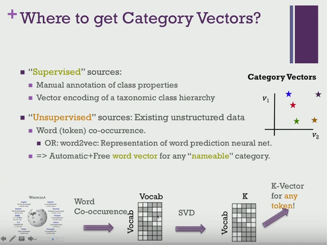
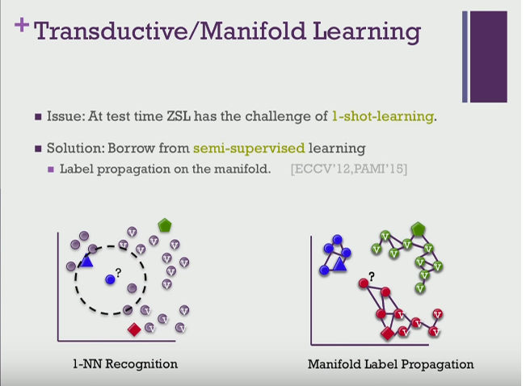

# N-Shot Learning

Sometimes each class has only a handful of labeled examples, or none at all. The page defines zero-, one-, and few-shot learning, then shows how zero-shot learning replaces labels with class vectors, and ends with how large language models treat prompts as zero-, one-, and few-shot shots.

The same notes are in [SIAMESE NETWORKS](../deep-learning/deep-neural-nets.md#siamese-networks) and [SIAMESE NETWORKS (one shot)](../deep-learning/siamese-nets.md#siamese-networks-one-shot).

### N-SHOT LEARNING

N-shot learning means training or adapting with only a handful of labeled examples per class. The FloydHub Team's "N-Shot Learning: Learning More with Less Data" asks whether it is possible to use machine learning with small data, and answers yes, covering [Zero shot, one shot, few shot](https://floydhub.github.io/n-shot-learning/).

### ZERO SHOT LEARNING

The extreme case is zero examples: zero-shot learning classifies new classes using side information instead of labeled examples for those classes. [Instead of using class labels](https://www.youtube.com/watch?v=jBnCcr-3bXc), we use some kind of vector representation for the classes, taken from a co-occurrence-after-svd or word2vec. — quite clever. This enables us to figure out if a new unseen class is near one of the known supervised classes. KNN can be used or some other distance-based classifier. Can we use word2vec for similarity measurements of new classes?

The same notes are in [WORD2VEC](../language-ai/language-embeddings.md#word2vec).

The two figures below come from that video, by Dr. Timothy Hospedales at Yandex. The first shows the class-vector idea.

<figure><figcaption>
Image by Dr. Timothy Hospedales, Yandex

Credit: <a href="https://www.youtube.com/watch?v=jBnCcr-3bXc">Dr. Timothy Hospedales, Yandex</a>.
</figcaption></figure>

Once classes live in a vector space, for classification, we can use nearest neighbour or manifold-based labeling propagation, as the second figure shows.

<figure><figcaption>
Image by Dr. Timothy Hospedales, Yandex

Credit: <a href="https://www.youtube.com/watch?v=jBnCcr-3bXc">Dr. Timothy Hospedales, Yandex</a>.
</figcaption></figure>

Multiple category vectors? Multilabel zero-shot also in the video.

The same idea works for text. Intent recognition is an essential task for goal-oriented dialogue systems: classifying each user utterance with a label from a predefined set. "Zero-Shot Intent Classification with Siamese Networks" does it [with siamese networks](https://medium.com/data-science/zero-shot-intent-classification-with-siamese-networks-35900471c7fd).

#### GPT3 is ZERO, ONE, FEW

With large language models, the shots move into the prompt: GPT-3 style prompting treats zero-, one-, and few-shot use as how many examples you put in the prompt.

The same notes are in [GPT3](../language-ai/pretrained-language-models.md#gpt3), [Large Language Models (LLMs)](../generative-ai/large-language-models-llms.md), and [Prompt](../generative-ai/prompt.md).

Writing those prompts is its own skill. [Prompt Engineering Tips & Tricks](https://blog.andrewcantino.com/blog/2021/04/21/prompt-engineering-tips-and-tricks/) is Andrew Cantino on what GPT-3 Prompt Engineering is, why it matters, and some tips and tricks to help you do it well. [Open GPT3 prompt engineering](https://medium.com/swlh/openai-gpt-3-and-prompt-engineering-dcdc2c5fcd29) is "OpenAI GPT-3 and Prompt Engineering", which starts from GPT-3's June 2020 release and its 175 billion parameters, 10x GPT-2, and then digs into prompts as the way to get the model to produce text.

The prompt can also turn the model into a classifier. [Using LLMs as black box classifiers](https://cohenori.medium.com/understanding-scikit-llm-86441a5af370) (May 2023) is the n-shot note for this setting.

## Deprecated links


These links and images no longer work. The original wording is kept here. A same-resource copy, when one was checked, is used above.


- Zero shot, one shot, few shot (siamese is one shot). This address no longer opens: https://blog.floydhub.com/n-shot-learning/
- with siamese networks. This address no longer opens: https://towardsdatascience.com/zero-shot-intent-classification-with-siamese-networks-35900471c7fd
