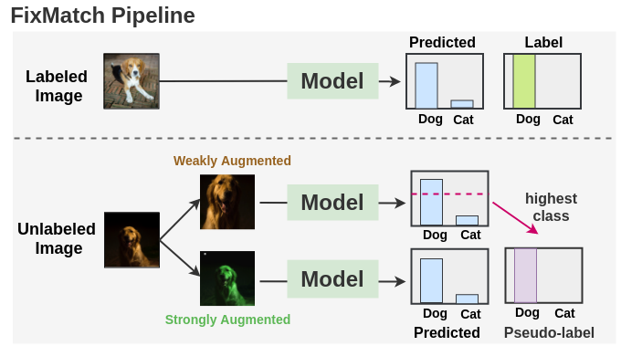
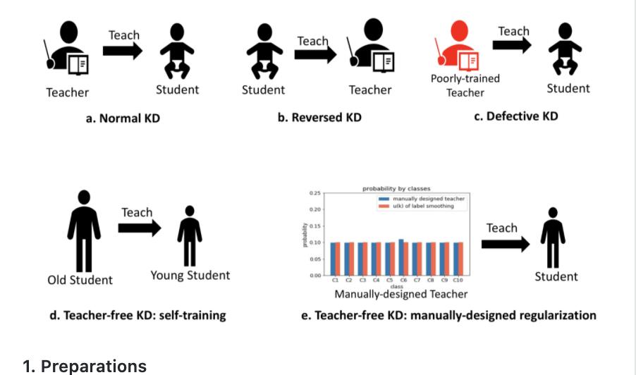
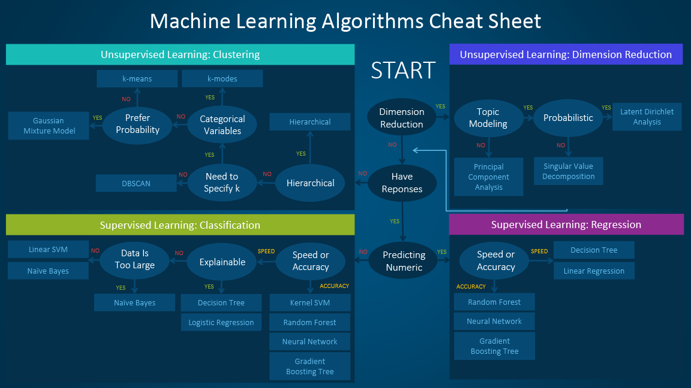

# Semi Supervised

With lots of unlabeled data and only a little labeled data, the question is how to make the unlabeled part teach the model. The page starts with surveys, then self-training and tri-training, then consistency-based methods such as UDA, MixMatch, ReMixMatch, and FixMatch, and ends with pseudo-labeling and student-teacher approaches.

The same notes are in [COP-CLUSTERING](../predictive-ml/clustering-algorithms.md#cop-clustering), [Label Propagation / Spreading](label-algorithms.md#label-propagation--spreading), and [Weakly Supervised](weakly-supervised.md).

The map comes first. The [Paper review](https://pdfs.semanticscholar.org/3adc/fd254b271bcc2fb7e2a62d750db17e6c2c08.pdf) is Zhi-Hua Zhou's survey from Nanjing University's National Key Laboratory for Novel Software Technology, the same review that frames weak supervision. [Ruder an overview of proxy labeled for semi supervised (AMAZING)](https://ruder.io/semi-supervised/) starts from the point that while unsupervised learning is still elusive, researchers have made a lot of progress in semi-supervised learning, and focuses on methods that assign proxy labels to unlabelled data and use them as targets for learning.

Self training is the simplest proxy-label method: the model labels unlabeled data and learns from its own labels. [Self training and tri training](https://github.com/zidik/Self-labeled-techniques-for-semi-supervised-learning) is the zidik repository of self-labeled techniques. [Confidence regularized self training](https://github.com/yzou2/CRST) is the code for Confidence Regularized Self-Training, an ICCV19 oral. [Domain adaptation for semantic segmentation using class balanced self-training](https://github.com/yzou2/CBST) is the code for the ECCV18 paper on class-balanced self-training. The same zidik repository also serves as the reference for [Self labeled techniques for semi supervised learning](https://github.com/zidik/Self-labeled-techniques-for-semi-supervised-learning).

Tri training replaces one self-labeling model with three that label for each other. [Trinet for semi supervised Deep learning](https://www.ijcai.org/Proceedings/2018/0278.pdf) is the Tri-net paper from Nanjing University's National Key Laboratory for Novel Software Technology. [Tri training exploiting unlabeled data using 3 classes](https://www.researchgate.net/publication/3297469_Tri-training_Exploiting_unlabeled_data_using_three_classifiers) is the tri-training paper on exploiting unlabeled data using three classifiers. [Improving tri training with unlabeled data](https://link.springer.com/chapter/10.1007/978-3-642-25349-2_19) is a chapter in Software Engineering and Knowledge Engineering (AISC 115), and [Tri training using NN ensemble](https://link.springer.com/chapter/10.1007/978-3-642-31919-8_6) is the Springer chapter on doing it with a neural-network ensemble. [Asymmetric try training for unsupervised domain adaptation](https://github.com/corenel/pytorch-atda) is a PyTorch implementation of Asymmetric Tri-training for Unsupervised Domain Adaptation, [another implementation](https://github.com/vtddggg/ATDA) is an unofficial one, and [another](https://github.com/ksaito-ut/atda) is the TensorFlow version, all for the arXiv 1702.08400 [paper](https://arxiv.org/abs/1702.08400). [Tri training git](https://github.com/LiangjunFeng/Tri-training) is the python implementation of tri-triaing.

The newer methods add consistency and augmentation on top of proxy labels. If you have access to lots of unlabeled data, but a relatively small amount of labeled data, Semi-Supervised Learning (SSL) might be really useful; the [Fast ai forums](https://forums.fast.ai/t/semi-supervised-learning-ssl-uda-mixmatch-s4l/56826) thread on UDA, MixMatch, and S4L is the entry point. [UDA GIT](https://github.com/google-research/uda) is Google Research's Unsupervised Data Augmentation (UDA) code, and its [paper](https://arxiv.org/abs/1904.12848) is "Unsupervised Data Augmentation for Consistency Training". [medium\*](https://medium.com/syncedreview/google-brain-cmu-advance-unsupervised-data-augmentation-for-ssl-c0a6157505ce) is Synced's write-up of how Google Brain and CMU advance unsupervised data augmentation for semi-supervised learning, starting from data augmentation as a way to expand labeled training data. Unsupervised Data Augmentation is also covered in medium 2 ( [has data augmentation articles)](https://medium.com/towards-artificial-intelligence/unsupervised-data-augmentation-6760456db143), which starts from how costly it is to annotate a large amount of training data. [s4l](https://arxiv.org/abs/1905.03670) is "S4L: Self-Supervised Semi-Supervised Learning".

[Google’s UDM and MixMatch dissected](https://mlexplained.com/2019/06/02/papers-dissected-mixmatch-a-holistic-approach-to-semi-supervised-learning-and-unsupervised-data-augmentation-explained/) explains the text side of UDA: - For text classification, the authors used a combination of back translation and a new method called TF-IDF based word replacing.

 Back translation consists of translating a sentence into some other intermediate language (e.g. French) and then translating it back to the original language (English in this case). The authors trained an English-to-French and French-to-English system on the WMT 14 corpus.

 TF-IDF word replacement replaces words in a sentence at random based on the TF-IDF scores of each word (words with a lower TF-IDF have a higher probability of being replaced).

MixMatch is the next step after UDA. [MixMatch](https://arxiv.org/abs/1905.02249) is "MixMatch: A Holistic Approach to Semi-Supervised Learning"; it has a medium post kept at the end of the page, and [2](https://medium.com/@sanjeev.vadiraj/eureka-mixmatch-a-holistic-approach-to-semi-supervised-learning-125b14e82d2f), [3](https://medium.com/@sshleifer/mixmatch-paper-summary-1995f3d11cf), [4](https://medium.com/@literallywords/tl-dr-papers-mixmatch-9dc4cd217121) are summaries of it: "Eureka", which frames SSL as using extra information about the input distribution; a readable paper summary for training on little labeled and much unlabeled data; and a TL;DR that calls it a form of data augmentation and pseudo-labeling combining already-known techniques. The algorithm is one that works by guessing low-entropy labels for data-augmented unlabeled examples and mixing labeled and unlabeled data using MixUp. We show that MixMatch obtains state-of-the-art results by a large margin across many datasets and labeled data amounts

ReMixMatch - [paper](https://arxiv.org/pdf/1911.09785.pdf) is really good. “We improve the recently-proposed “MixMatch” semi-supervised learning algorithm by introducing two new techniques: distribution alignment and augmentation anchoring”

[FixMatch](https://amitness.com/2020/03/fixmatch-semi-supervised/) - FixMatch is a recent semi-supervised approach by Sohn et al. from Google Brain that improved the state of the art in semi-supervised learning(SSL). It is a simpler combination of previous methods such as UDA and ReMixMatch. The figure below shows it.

<figure><figcaption>
FixMatch semi-supervised learning.

<em>Image via</em> <a href="https://amitness.com/">Amit Chaudhary</a> <em>wrong credit?</em> <a href="mailto:ori@oricohen.com"><em>let me know</em></a>

Credit: <a href="https://lh6.googleusercontent.com/9gNryK4qk-1VHSlpbSFThr0rTnKe6EDiwSDxqDaW4EEx-rIm9LGqs5uGFYHfMsQtJWd9Ls_NAnap_wHHAe_qOBGcZgMJ7ruGkuxv2nIY8AP1mq82PgDxtgmsVO59G_rDOnoNvUDk">copied from the original hosted image</a>.
</figcaption></figure>

The FixMatch figure is via Amit Chaudhary. Pseudo-labeling is revisited in [Curriculum Labeling: Self-paced Pseudo-Labeling for Semi-Supervised Learning](https://arxiv.org/pdf/2001.06001.pdf), which applies pseudo-labels to the unlabeled set using a model trained on the small labeled set.

At scale, the proxy labels come from a teacher model. [FAIR](https://ai.facebook.com/blog/billion-scale-semi-supervised-learning/) is Facebook AI's billion-scale semi-supervised learning for image and video classification, part of doing more with less labeled training data overall. [2](https://ai.facebook.com/blog/mapping-the-world-to-help-aid-workers-with-weakly-semi-supervised-learning/) is the weakly, semi-supervised mapping work, where Facebook AI researchers created the world’s most detailed population density maps of Africa to help humanitarian organizations. The original [Summarization of FAIR’s student teacher weak/ semi supervision](https://analyticsindiamag.com/how-to-do-machine-learning-when-data-is-unlabelled/) was on AIM — India. For text, [Leveraging Just a Few Keywords for Fine-Grained Aspect Detection Through Weakly Supervised Co-Training](https://www.aclweb.org/anthology/D19-1468.pdf) is the EMNLP-IJCNLP 2019 paper from Hong Kong.

[Fidelity-Weighted](https://openreview.net/forum?id=B1X0mzZCW) Learning - “fidelity-weighted learning” (FWL), a semi-supervised student- teacher approach for training deep neural networks using weakly-labeled data. FWL modulates the parameter updates to a student network (trained on the task we care about) on a per-sample basis according to the posterior confidence of its label-quality estimated by a teacher (who has access to the high-quality labels). Both student and teacher are learned from the data."

The student-teacher code follows. [Unproven student teacher git](https://github.com/EricHe98/Teacher-Student-Training) stores the files from a summer internship on "teacher-student learning", an experimental method for training deep neural networks using a trained teacher model. [A really nice student teacher git with examples](https://github.com/yuanli2333/Teacher-free-Knowledge-Distillation) is the CVPR2020 oral code for Revisiting Knowledge Distillation via Label Smoothing Regularization, shown in the figure below.

<figure><figcaption>
Image by yuanli2333. wrong credit? let me know

Credit: <a href="https://lh6.googleusercontent.com/tlo5HqMjycySNl9Pbmr-uW-azozTC5cc7if-7r6-0LCeRJO2snTm-hsEf7mUpr1hp6wSnIVy6GnqFG6pEbxTPgu9fjjHP6gtn1dKQCwEI-x12UxYzWBWfidqMwVxZetA10VznMhs">copied from the original hosted image</a>.
</figcaption></figure>

The student-teacher idea then closes the loop back to tri-training: [Teacher student for tri training for unlabeled data exploitation](https://arxiv.org/abs/1909.11233) is "Teacher-Student Learning Paradigm for Tri-training: An Efficient Method for Unlabeled Data Exploitation". The figure below is by the late Dr. Hui Li, @ SAS.

<figure><figcaption>
Image by the late Dr. Hui Li, @ SAS. wrong credit? let me know

Credit: <a href="https://lh6.googleusercontent.com/J648WfIzGrbgjfSCK4S4lkCFbPWrSq6vwN1KERJ-yk5E21Jl3ZIeX7V98LS6rNIuY1Yc631oKIX-8H-dUyoqBHSoQEerZG_KnKpwKWbhk5IHK3G0nTpCZ4ddGYGP-beBydYVOkKx">copied from the original hosted image</a>.
</figcaption></figure>

The last paper states the setting of the whole page: in many practical data mining applications such as web page classification, unlabeled training examples are readily available but labeled ones are fairly expensive to obtain, which is why semi-supervised algorithms such as co-training exist. The paper is [http://citeseerx.ist.psu.edu/viewdoc/download?doi=10.1.1.487.2431&rep=rep1&type=pdf](http://citeseerx.ist.psu.edu/viewdoc/download?doi=10.1.1.487.2431&rep=rep1&type=pdf).

## Deprecated links


These links and images no longer work. The original wording is kept here. A same-resource copy, when one was checked, is used above.


- medium. This address no longer opens: https://towardsdatascience.com/a-fastai-pytorch-implementation-of-mixmatch-314bb30d0f99
