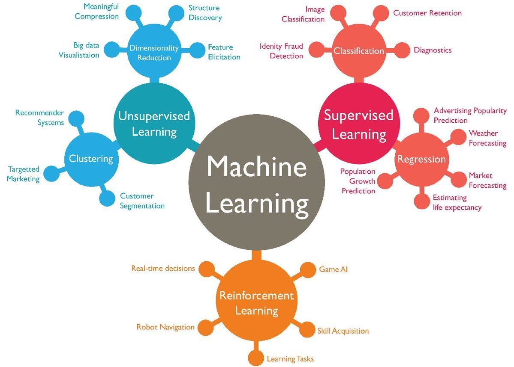

# Overview

Before any method is picked, a problem has to be placed: machine learning setups differ by how much supervision and feedback they use. The figure below is that map, and the rest of the chapter takes its regions one at a time.

<figure><figcaption>
Image via Abdul Rahid, via Dan Shewan, wrong credit? let me know

Credit: <a href="https://lh3.googleusercontent.com/AZPfRGUTS-0AN0SRSjjBfc3tFlIpYSGsOyjaX00K9_QIOWVU_GLlgxwNWZCB4bWXVo1Wb52-D6KCRD8uEYuxcbaqJJ9CCEPa-gy__DbCMJ4esb2A9hRLJuapX_tKGJZi8rRlrDzE">copied from the original hosted image</a>.
</figcaption></figure>

The image comes via Abdul Rahid, via Dan Shewan, and is copied from the original hosted image; if that credit is wrong, let me know.
