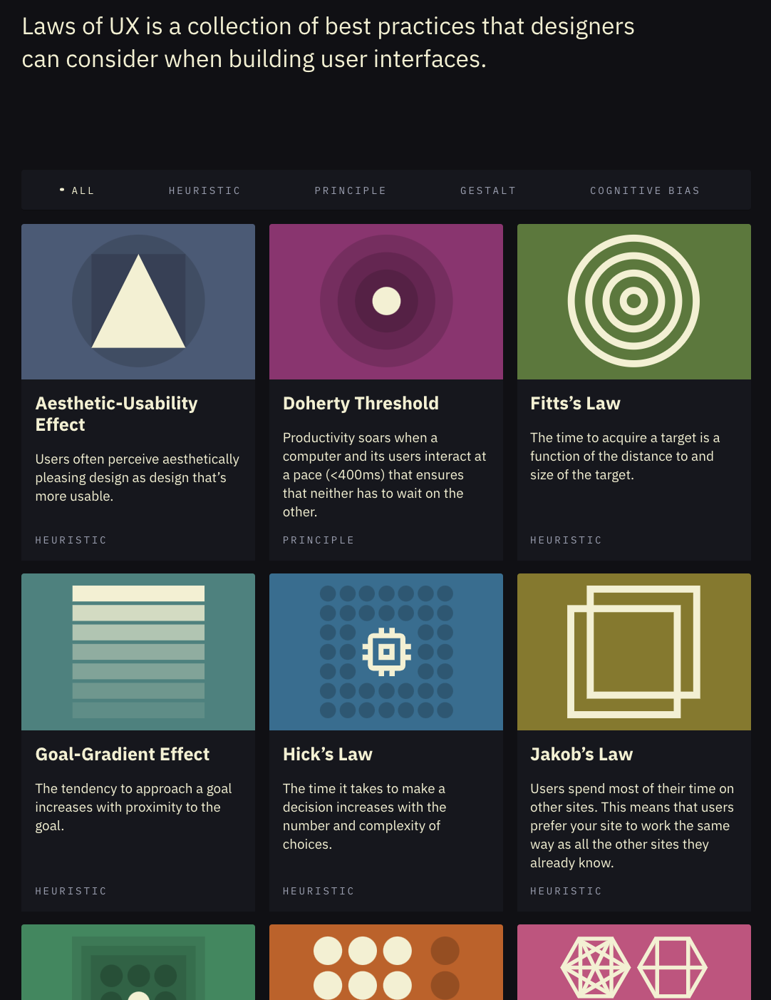
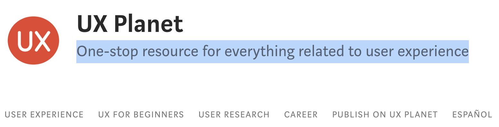
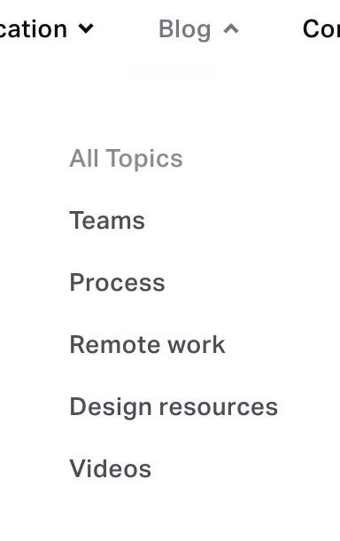
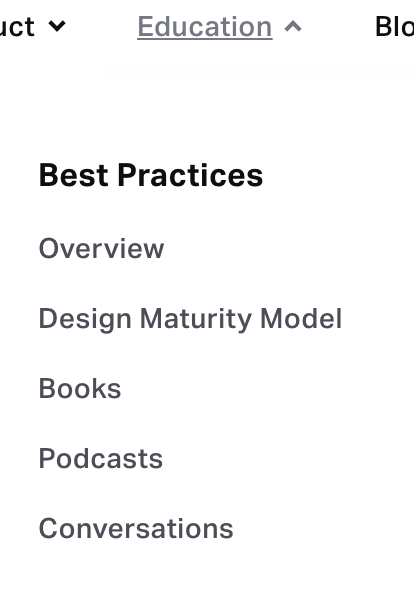

# User Experience Design (UX)

This page points at UX references and growth-design case studies.

1. [**Laws of UX**](https://lawsofux.com/) **is a collection of best practices that designers can consider when building user interfaces.**

   <figure><figcaption>
Laws of UX

Credit: <a href="https://lh6.googleusercontent.com/w4eZWyJ7QwjjihGtYFRT3x98XLPmsoz7NDDilJLAQEgUMqImz6crTPqQUkkEAp6mmo-v28a_f_dsRaUEx5yKDsf8oH6Wat0s3jWkWFOaAlp6SlfEGYcKwLH3JtnsgaX3o037NuV6">copied from the original hosted image</a>.
</figcaption></figure>

2. [**UX planet**](https://uxplanet.org/) **- One-stop resource for everything related to user experience, a medium publication**

   <figure><figcaption>
UX planet

Credit: <a href="https://lh3.googleusercontent.com/fwbgHcd5adh6QKydJDfTfZz83HCsexCsGqgDJ9toSqxSdiK0pfC6ACGIdEDCSaCaT8UtqddUQ8A139UxGz2QRJ0-NxdnG7zBrclz3RKvNlkn27HrmmZcENl3oRyoifPX8TnnIAlG">copied from the original hosted image</a>.
</figcaption></figure>

3. [**Invision blog**](https://www.invisionapp.com/inside-design/) **- blog posts and best practices about UX, XD, UI**

   <figure><figcaption>
Invision blog

Credit: <a href="https://lh5.googleusercontent.com/8405At2oPxM6idJthi64DEwQJQWmihJE9mleZ8BrxQ5lzNkupD8g5cIAikjMjHkfq_mZYv9zFPk_9901noCzp_CpudHTE3AyoVwyLKBAJHTMHiw69i-egVv-isPzuXhbsvmeQ9Qz">copied from the original hosted image</a>.
</figcaption></figure>

   <figure><figcaption>
Invision blog

Credit: <a href="https://lh3.googleusercontent.com/GtlwM90rJ0br-DZst5pSJm7Nt6XjzS07mDkkAmNspPHBCj9aciUqTgp2_rII3SriiNnHrCuuooosrW6tYxjMT6DjhpW2xoQ3ojCecFDVOm8Dj_JqTJWM0NZAYB1a7H_D-C8VbOzF">copied from the original hosted image</a>.
</figcaption></figure>

4. **(really good) Growth design** [**Case Studies**](https://growth.design/case-studies/)
