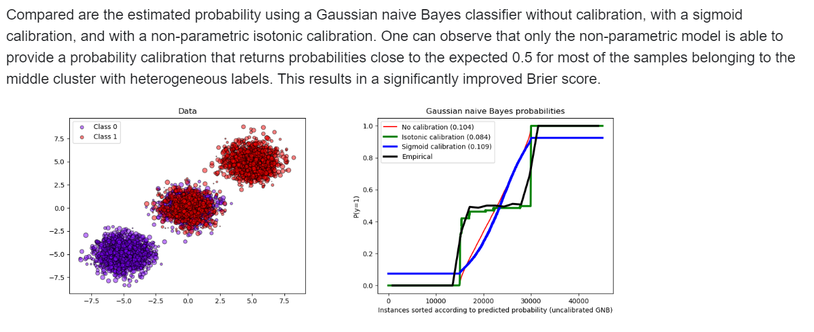

# Calibration

A classifier that says 0.9 is only useful if it is right about nine times in ten, and most models do not earn that on their own. This page first shows why predicted probabilities need calibration, then walks the classic fixes, isotonic and Platt scaling in sklearn, and ends with neural nets, where temperature scaling and language-model confidence take over.

The same notes are in [Evaluation Metrics](../evals/evaluation-metrics.md).

The starting point is [Why do we need to calibrate models, or in other words, dont trust predict_proba to give you probabilities](https://medium.com/data-science/pythons-predict-proba-doesn-t-actually-predict-probabilities-and-how-to-fix-it-f582c21d63fc): data scientists typically evaluate their predictive models in terms of accuracy or precision, but hardly ever ask whether the scores that `predict_proba` returns behave like probabilities at all.

## Classic Model Calibration

Once it is clear that the scores cannot be trusted as they are, the classic answer is to fit a mapping on top of them. The goal, in the author's words, is that calibration **allows us to use the probability as confidence. I.e, Well calibrated classifiers are probabilistic classifiers for which the output of the predict_proba method can be directly interpreted as a confidence level**.

**How do we do isotonic and sigmoid calibration - read** [this](http://fastml.com/classifier-calibration-with-platts-scaling-and-isotonic-regression/), the note on classifier calibration with Platt's scaling and isotonic regression, **then,** [how to use in sklearn](https://stats.stackexchange.com/questions/263393/scikit-correct-way-to-calibrate-classifiers-with-calibratedclassifiercv), a question on the correct way to use CalibratedClassifierCV, since the data for fitting the classifier and the data for calibrating it must be disjoint. Two follow-ups stay open on the author's list: how to speed up isotonic regression for sklearn, which the archived post at the end of this page answers, and a TODO: how to calibrate a DNN (except sklearn wrapper for keras). **(good)** [Probability Calibration Essentials (with code)](https://medium.com/analytics-vidhya/probability-calibration-essentials-with-code-6c446db74265) is the hands-on version of the same essentials.

To know whether a calibration helped, you need a score for probabilities. **The** [Brier score](https://en.wikipedia.org/wiki/Brier_score) **is a** [proper score function](https://en.wikipedia.org/wiki/Scoring_rule#ProperScoringRules), the Wikipedia entry on scoring rules explaining what "proper" means. The [Sk learn](http://scikit-learn.org/stable/auto_examples/calibration/plot_calibration_curve.html#sphx-glr-auto-examples-calibration-plot-calibration-curve-py) calibration-curve example starts from the same point: when performing classification one often wants to predict not only the class label, but also the associated probability, which gives some kind of confidence on the prediction.

The sklearn tool that does the fitting is [**‘calibrated classifier cv in sklearn**](http://scikit-learn.org/stable/modules/generated/sklearn.calibration.CalibratedClassifierCV.html#sklearn.calibration.CalibratedClassifierCV) **- The method to use for calibration. Can be ‘sigmoid’ which corresponds to Platt’s method or ‘isotonic’ which is a non-parametric approach. It is not advised to use isotonic calibration with too few calibration samples (<<1000) since it tends to overfit. Use sigmoids (Platt’s calibration) in this case.**

The reason a separate step is needed at all is spelled out in the sklearn examples:

 **However, not all classifiers provide well-calibrated probabilities, some being over-confident while others being under-confident. Thus, a separate calibration of predicted probabilities is often desirable as a postprocessing. This example illustrates two different methods for this calibration and evaluates the quality of the returned probabilities using Brier’s score**

Three sklearn examples show it in practice. **Example** [1](http://scikit-learn.org/stable/auto_examples/calibration/plot_calibration.html#sphx-glr-auto-examples-calibration-plot-calibration-py) **- binary class below,** the probability calibration of classifiers example; [2](http://scikit-learn.org/stable/auto_examples/calibration/plot_calibration_multiclass.html#sphx-glr-auto-examples-calibration-plot-calibration-multiclass-py) **- 3 class moving prob vectors to a well defined location,** which illustrates how sigmoid calibration changes predicted probabilities on the 2-simplex; and [3](http://scikit-learn.org/stable/auto_examples/calibration/plot_compare_calibration.html#sphx-glr-auto-examples-calibration-plot-compare-calibration-py) **- comparison of non calibrated models, only logreg is calibrated naturally**, the comparison of calibration of classifiers whose `predict_proba` output can be read as a confidence level only when well calibrated. The figure below is from those examples.

 <figure><figcaption>
Sklearn calibration examples.

Credit: <a href="https://lh4.googleusercontent.com/pgzEadilkxa1ihkvs-8aw5wBnxfAaBBfLsutGQ38mAWcANEKQEOowO_6A5O6tbaj7DgeRt1vDBk74IYCFBqQX61lTo5YHhFE5NXJu7J5XYYsRzhjLIyoeaPz59WlF4NDDjUNgzsp">copied from the original hosted image</a>.
</figcaption></figure>

For the argument in one place, [Mastery on why we need calibration](https://machinelearningmastery.com/calibrated-classification-model-in-scikit-learn/) is MachineLearningMastery.com on how and when to use a calibrated classification model with scikit-learn. The same doubt reaches deep models: [Why softmax is not good as an uncertainty measure for DNN](https://stats.stackexchange.com/questions/309642/why-is-softmax-output-not-a-good-uncertainty-measure-for-deep-learning-models) asks whether a CNN's softmax "heat map" of low and high activations can really be read as uncertain and confident predictions.

Some models have no probabilities to calibrate. [If a model doesn't have probabilities use the decision function](http://scikit-learn.org/stable/auto_examples/calibration/plot_calibration_curve.html#sphx-glr-auto-examples-calibration-plot-calibration-curve-py), as the same calibration-curve example does, and rescale it to the unit range:

**y_pred = clf.predict(X_test)**

 **if hasattr(clf, "predict_proba"):**

 **prob_pos = clf.predict_proba(X_test)[:, 1]**

 **else: # use decision function**

 **prob_pos = clf.decision_function(X_test)**

 **prob_pos = \\**

 **(prob_pos - prob_pos.min()) / (prob_pos.max() - prob_pos.min())**

## Neural Net Calibration

That softmax question is where the classic tools stop being enough. [Paper: Calibration of modern NN](https://arxiv.org/pdf/1706.04599.pdf), On Calibration of Modern Neural Networks, treats confidence calibration as predicting probability estimates representative of the true correctness likelihood, and finds that modern neural networks, unlike those from a decade ago, are poorly calibrated. The companion calibration post by Geoff Pleiss is archived at the end of this page.

### Temperature

The simplest fix for an over-confident softmax is to divide the logits by a temperature before applying it. The same notes are in [ACTIVATION FUNCTIONS](../deep-learning/deep-neural-nets.md#activation-functions) and [Softmax](../data/information-theory.md#softmax).

(great) [Softmax temperature](https://medium.com/mlearning-ai/softmax-temperature-5492e4007f71) great Harshit, explains temperature as a hyperparameter that controls the randomness of predictions by scaling the logits before softmax, widely used in NLP tasks with a softmax decision layer. Luke Salamone's [Interactive demo](https://lukesalamone.github.io/posts/what-is-temperature/) shows temperature as a parameter that increases or decreases the “confidence” a model has in its most likely response. The [lower level explanation](http://www.kasimte.com/2020/02/14/how-does-temperature-affect-softmax-in-machine-learning.html) is a notebook that builds the effect of high and low temperature settings on softmax from the ground up. The [short explanation](https://medium.com/@majid.ghafouri/why-should-we-use-temperature-in-softmax-3709f4e0161) by Majid Ghafouri starts from how a softmax layer turns each class logit into a probability by comparing it with the other logits. In code, [Change temperature in Keras](https://stackoverflow.com/questions/37246030/how-to-change-the-temperature-of-a-softmax-output-in-keras) is the question about controlling the temperature of the final softmax layer while reproducing the RNN-effectiveness sampling results.

Calibration can also come in a different flavor, you want to make your algorithm certain, one trick is to use dropout layers when inferring/predicting/classifying, do it 100 times and average the results in some capacity , [see this chapter on BNN](https://docs.google.com/document/d/1dXELAcJn9KCPSRMDvZoumUyHx8K8Yn7wfFxesSpbNCM/edit#heading=h.slqfz2k65bd2).

The same question reaches language models. [How Can We Know When Language Models Know? This paper is about calibration.](http://phontron.com/paper/jiang20lmcalibration.pdf) Its abstract:

“Recent works have shown that language models (LM) capture different types of knowledge regarding facts or common sense. However, because no model is perfect, they still fail to provide appropriate answers in many cases. In this paper, we ask the question “how can we know when language models know, with confidence, the answer to a particular query?” We examine this question from the point of view of calibration, the property of a probabilistic model’s predicted probabilities actually being well correlated with the probability of correctness. We first examine a state-ofthe-art generative QA model, T5, and examine whether its probabilities are well calibrated, finding the answer is a relatively emphatic no. We then examine methods to calibrate such models to make their confidence scores correlate better with the likelihood of correctness through fine-tuning, post-hoc probability modification, or adjustment of the predicted outputs or inputs. Experiments on a diverse range of datasets demonstrate the effectiveness of our methods. We also perform analysis to study the strengths and limitations of these methods, shedding light on further improvements that may be made in methods for calibrating LMs.”

Two older posts survive only as archived copies. For the isotonic speed-up asked about earlier, read this: Speeding up isotonic regression in scikit-learn by 5,000x — Andrew Tulloch, at [https://web.archive.org/web/2020/http://tullo.ch/articles/speeding-up-isotonic-regression/](https://web.archive.org/web/2020/http://tullo.ch/articles/speeding-up-isotonic-regression/). For neural nets, Geoff Pleiss's calibration post is at [https://web.archive.org/web/2020/http://geoffpleiss.com/nn_calibration](https://web.archive.org/web/2020/http://geoffpleiss.com/nn_calibration).

## Deprecated links


These links and images no longer work. The original wording is kept here. A same-resource copy, when one was checked, is used above.


- Why do we need to calibrate models, or in other words, dont trust predict_proba to give you probabilities. This address no longer opens: https://towardsdatascience.com/pythons-predict-proba-doesn-t-actually-predict-probabilities-and-how-to-fix-it-f582c21d63fc
- How to speed up isotonic regression for sklearn. This address no longer opens: http://tullo.ch/articles/speeding-up-isotonic-regression/
- **How do we do isotonic and sigmoid calibration - read** this. This address no longer opens: http://tullo.ch/articles/speeding-up-isotonic-regression/
- Calibration post. This address no longer opens: http://geoffpleiss.com/nn_calibration
