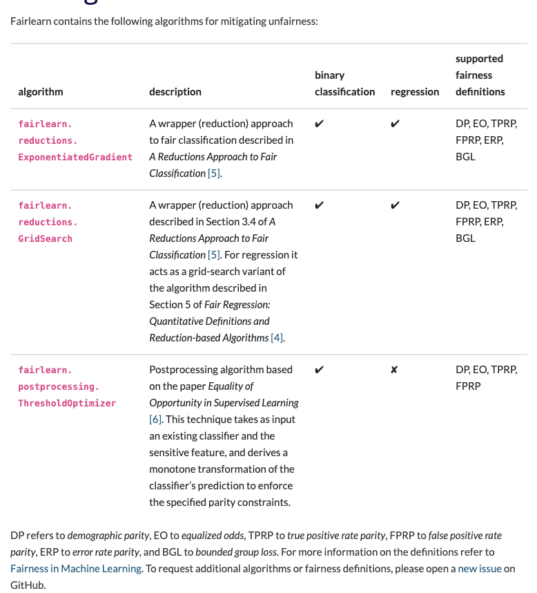
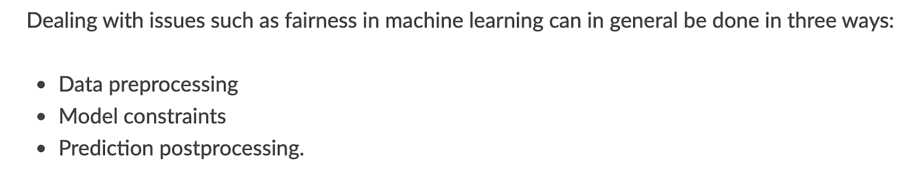
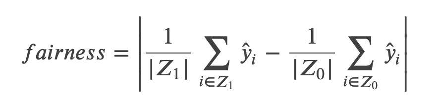
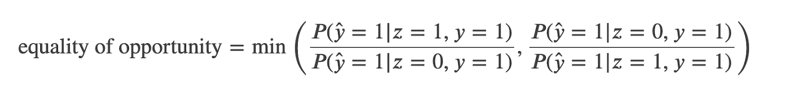
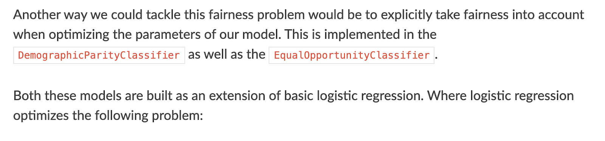
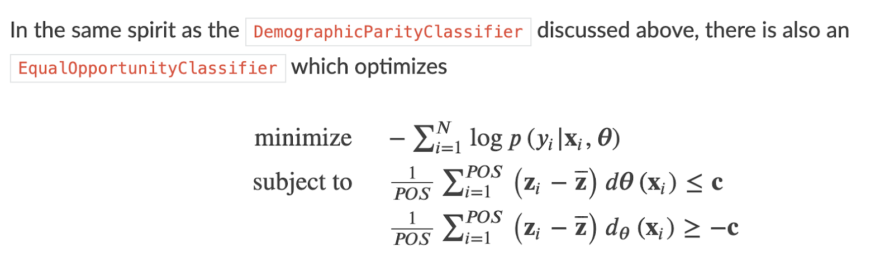
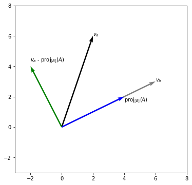
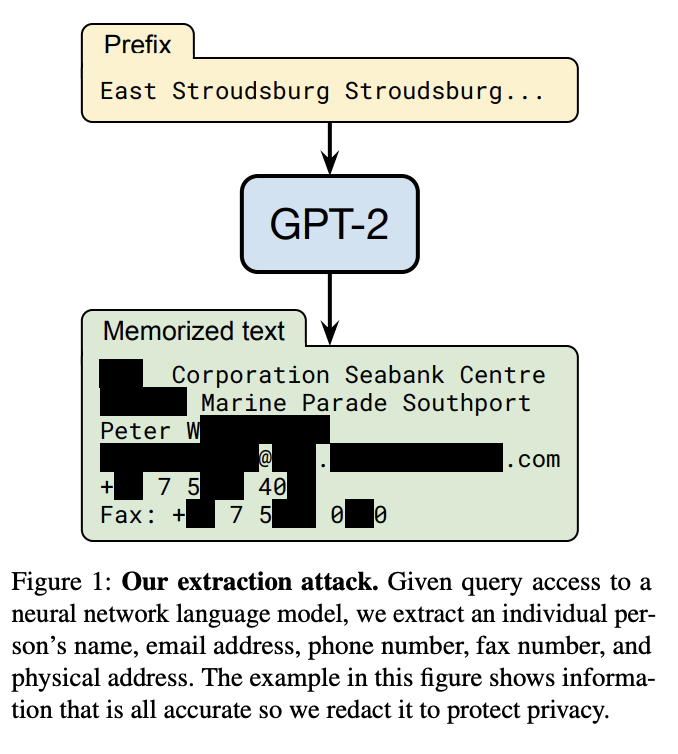

# Fairness, Accountability, and Transparency

This page collects regulation, fairness tooling, debiasing methods, and privacy resources.
The sections below cover regulation, FAT research, bias, debiasing, fairness tools, and privacy topics.

The same notes are in [Fairness, Accountability, and Transparency In Prompts](fairness-accountability-and-transparency-in-prompts.md).

### REGULATION FOR AI

This subsection links EU and Israel AI regulation reports and guidance.

- [Preparing for EU regulations](https://medium.com/@itai_88363/how-ai-leaders-should-prepare-for-the-looming-eu-regulations-99e9d4f4c039)
- AI Regulation draft.pdf. AI Regulation draft.pdf. [EU regulation DOC](https://drive.google.com/file/d/1ZaBPsfor_aHKNeeyXxk9uJfTru747EOn/view)
3. EIOPA - regulation for insurance companies.
4. Ethics and regulations in Israel
 1. [First Report by the intelligence committee](https://www.globes.co.il/news/article.aspx?did=1001307714) headed by prof. Itzik ben israel and prof. evyatar matanya
 2. [Second report by AI and data science committee ](https://innovationisrael.org.il/sites/default/files/%D7%93%D7%95%D7%97%20%D7%A1%D7%95%D7%A4%D7%99%20%D7%A1%D7%99%D7%9B%D7%95%D7%9D%20%D7%95%D7%95%D7%A2%D7%93%D7%AA%20%D7%AA%D7%9C%D7%9D%20%D7%9C%D7%AA%D7%9B%D7%A0%D7%99%D7%AA%20%D7%9E%D7%95%D7%A4%20%D7%9C%D7%90%D7%95%D7%9E%D7%99%D7%AA%20%D7%91%D7%91%D7%99%D7%A0%D7%94%20%D7%9E%D7%9C%D7%90%D7%9B%D7%95%D7%AA%D7%99%D7%AA%20-.pdf)
 - Third by meizam leumi for AI systems in. [ethics and regulation in israel](https://machinelearning.co.il/4330/israelaiethicsreport/#more-4330)
 - אתיקה ו-AI בגוגל: ג'ף דין מסביר על התהליך הפנימי של פיתוח מודלים מתקדמים | Machine Learning Israel. [lecture](https://machinelearning.co.il/3349/googleai/)

### FAIRNESS, ACCOUNTABILITY & TRANSPARENCY

This subsection introduces FATML, FAccT, and fairness research links.

1. FATML [website](https://www.fatml.org/) - The past few years have seen growing recognition that machine learning raises novel challenges for ensuring non-discrimination, due process, and understandability in decision-making. In particular, policymakers, regulators, and advocates have expressed fears about the potentially discriminatory impact of machine learning, with many calling for further technical research into the dangers of inadvertently encoding bias into automated decisions.

 At the same time, there is increasing alarm that the complexity of machine learning may reduce the justification for consequential decisions to “the algorithm made me do it.”
- Principles and Best Practices :: FAT ML. [Principles and best practices](https://www.fatml.org/resources/principles-and-best-practices)
- Projects :: FAT ML. Projects :: FAT ML. [projects](https://www.fatml.org/resources/relevant-projects)
3. [FAccT](https://facctconference.org/) - A computer science conference with a cross-disciplinary focus that brings together researchers and practitioners interested in fairness, accountability, and transparency in socio-technical systems.
- Verifying your browser | OpenReview. Verifying your browser | OpenReview. [Paper - there is no fairness, enforcing fairness can improve accuracy](https://openreview.net/forum?id=wXoHN-Zoel)
- A guiding framework for our responsible development and use of AI, alongside transparency and accountability in our AI development process. [Google on responsible ai practices](https://ai.google/responsibilities/responsible-ai-practices/)
- Deep learning is good at finding patterns in reams of data, but can't explain how they're connected, by Will Knight. [Bengio on ai](https://www.wired.com/story/ai-pioneer-algorithms-understand-why/)
7. [Poisoning attacks on fairness](https://arxiv.org/pdf/2004.07401.pdf) - Research in adversarial machine learning has shown how the performance of machine learning models can be seriously compromised by injecting even a small fraction of poisoning points into the training data. We empirically show that our attack is effective not only in the white-box setting, in which the attacker has full access to the target model, but also in a more challenging black-box scenario in which the attacks are optimized against a substitute model and then transferred to the target model
- A [series of articles](https://jonathan-hui.medium.com/ai-bias-fairness-series-ce21ebf7b2e9) about Bias Fairness Johnathan Hui
 1. [In Clinical research](https://jonathan-hui.medium.com/bias-in-clinical-research-data-science-machine-learning-deep-learning-40a8786a5046) - Selection , Sample , Time , Attrition , Survivorship, reporting, funding, citation, Volunteer , self-selection , non-response, pre-screening , healthy person, membership, ascertainment, performance, berkson admission, neyman, measurement, observer, expectation, response, self reporting, social desirability, recall, acquiescence agreement, leading, courtesy, attention verification, lead time, immortal time, misclassification, chronological, detection, spectrum, cofounder, susceptibility, collider, simpson, ommited, allocation, channeling.
 2. [AI](https://jonathan-hui.medium.com/ai-bias-b85c86bbca90) - known cases in Vision, NLP - sentiment, embedding, language models, historical, compass, recommender, datasets.
 3. [address AI Bias with Fairness criteria and tools](https://jonathan-hui.medium.com/address-ai-bias-with-fairness-criteria-tools-9af1ab8e4289) - per population, predictive parity, calibration by group
 4. [Caveats and limitations of AI Fairness Approaches](https://jonathan-hui.medium.com/caveats-limitations-on-ai-fairness-approaches-8628e6a992fd) - sample bias, label bias, miscalibration outcome test, redlining, etc.
 5. [AI Fairness Approaches](https://jonathan-hui.medium.com/ai-fairness-approaches-mathematical-definitions-49cc418feebd) - statistical fairness, equalizing acceptance rate, error rate, etc.

### BIAS

This subsection links monitoring guidance on bias in ML models.

- Understanding Bias in Machine Learning Models, by Gabe Barcelos. arize.ai on [model bias](https://arize.com/understanding-bias-in-ml-models/#MLMonitoring)

 <figure><figcaption>
Model bias monitoring.
</figcaption></figure>

### DEBIASING MODELS

This subsection covers adversarial debiasing, nullspace projection, and related papers.

1. [Adversarial removal of demographic features](https://arxiv.org/abs/1808.06640) - “We show that demographic information of authors is encoded in -- and can be recovered from -- the intermediate representations learned by text-based neural classifiers. The implication is that decisions of classifiers trained on textual data are not agnostic to -- and likely condition on -- demographic attributes. “\
 “we explore several techniques to improve the effectiveness of the adversarial component. Our main conclusion is a cautionary one: do not rely on the adversarial training to achieve invariant representation to sensitive features.”\
 \
2. [Null It Out: Guarding Protected Attributes by Iterative Nullspace Projection](https://arxiv.org/abs/2004.07667) (paper) , [github](https://github.com/shauli-ravfogel/nullspace_projection), [presentation](https://docs.google.com/presentation/d/1Xi5HLpvvRE8BqcNBZMyPS4gBa0i0lqZvRebz-AZxAPA/edit) by Shauli et al. - removing biased information such as gender from an embedding space using nullspace projection.\
 The objective is this: give a representation of text, for example BERT embeddings of many resumes/CVs, we want to achieve a state where a certain quality, for example a gender representation of the person who wrote this resume is not encoded in X. they used the light version definition for “not encoded”, i.e., you cant predict the quality from the representation with a higher than random score, using a linear model. I.e., every linear model you will train, will not be able to predict the person’s gender out of the embedding space and will reach a 50% accuracy.\
 This is done by an iterative process that includes. 1. Linear model training to predict the quality of the concept from the representation. 2. Performing ‘projection to null space’ for the linear classifier, this is an acceptable linear algebra calculation that has a meaning of zeroing the representation from the projection on the separation place that the linear model is representing, making the model useless. I.e., it will always predict the zero vector. This is done iteratively on the neutralized output, i.e., in the second iteration we look for an alternative way to predict the gender out of X, until we reach 50% accuracy (or some other metric you want to measure) at this point we have neutralized all the linear directions in the embedding space, that were predictive to the gender of the author.

 For a matrix W, the null space is a sub-space of all X such that WX=0, i.e., W maps X to the zero vector, this is a linear projection of the zero vector into a subspace. For example you can take a 3d vectors and calculate its projection on XY.
3. Can we extinct predictive samples? Its an open question, Maybe we can use influence functions?

 [Understanding Black-box Predictions via Influence Functions](https://arxiv.org/pdf/1703.04730.pdf) - How can we explain the predictions of a blackbox model? In this paper, we use influence functions — a classic technique from robust statistics — to trace a model’s prediction through the learning algorithm and back to its training data, thereby identifying training points most responsible for a given prediction.

 We show that even on non-convex and non-differentiable models where the theory breaks down, approximations to influence functions can still provide valuable information. On linear models and convolutional neural networks, we demonstrate that influence functions are useful for multiple purposes: understanding model behavior, debugging models, detecting dataset errors, and even creating visually indistinguishable training-set attacks.
4. [Removing ‘gender bias using pair mean pca](https://stackoverflow.com/questions/48019843/pca-on-word2vec-embeddings)
5. [Bias detector by intuit](https://github.com/intuit/bias-detector) - Based on first and last name/zip code the package analyzes the probability of the user belonging to different genders/races. Then, the model predictions per gender/race are compared using various bias metrics.

### FAIRNESS TOOLS

This subsection lists PII tools, Fairlearn, and scikit-lego fairness utilities.

- Analyze personal data and sensitive information at scale with PII Tools, sensitive data discovery tools for internal PII compliance and MSPs. [PII tools, by gensim](https://pii-tools.com/)
2. [Fair-learn](https://github.com/fairlearn/fairlearn) A Python package to assess and improve fairness of machine learning models.

 <figure><figcaption>
Fairlearn.

Credit: <a href="https://lh5.googleusercontent.com/ovdlVfds0jLUJzmmntUN70j5Qbsfq9hberlTf_evGgDKVGvFVHblHc-EbrbhmTviVRUVXJG9B2TlkcgSwO7vwt43y7tsia1gTjPJitTY2pCNAH_PWKxkrsXNcfKKHASqT3rW23FC">copied from the original hosted image</a>.
</figcaption></figure>
3. Sk-lego

 <figure><figcaption>
Sk-lego fairness.

Credit: <a href="https://lh6.googleusercontent.com/624RfKvyH_U6OG_VHISCDieoZ2Z4hil1tB9IyFynrssQme2iRPITK8am770Q_yg8FG6UJzs0FIiwx1-OoxQEOXSFPGBoZk0fwqQ4sInTpBRdmo62AIxFZ_wZywz3nCJLdAucfz9X">copied from the original hosted image</a>.
</figcaption></figure>
 1. Regression

 <figure><figcaption>
Regression fairness view.

Credit: <a href="https://lh5.googleusercontent.com/h_vzduMzENSsIUcgRY09p2XPtyrF6Mr5Wqho5GFZfdfjynkMzwkAGhABGv1cYOZ1RE_PViDDdt_J2WTt8kkWMiPOIv9d_zXZP_17LgFGl_qnG-z-82_7rP_RUrbJ3JiTefBY1XTx">copied from the original hosted image</a>.
</figcaption></figure>
 2. classification

 <figure><figcaption>
Classification fairness view.

Credit: <a href="https://lh6.googleusercontent.com/IbIrp6_AZtn2sebHBGICWiHsWmXwgSFN2Zmo_8Aqo4aVkmyETQvM-gvubm71wXCuL_yu7E7OliwZYTY0nq4wlbZngzkdBVwX6U6VZt9-lYS-9RWyXNYRTOe5VacTZqHgGaX5CI_8">copied from the original hosted image</a>.
</figcaption></figure>

 <figure><figcaption>
Fairness tools.

Credit: <a href="https://lh6.googleusercontent.com/cbsPagQpH6fQyie5FVQphEAtkYdo6Z4_jDzaP3ZkB-CtsJiN5-6et3ggYM9-oTohaITrjetZfQoqSL818tfK6SaHUFn6KTeSNpsp4GgH2xFw6ttPUwu5zf7mxxD2ekooCqI0wNd5">copied from the original hosted image</a>.
</figcaption></figure>

 <figure><figcaption>
Fairness tools.

Credit: <a href="https://lh6.googleusercontent.com/upoEK0-G4_0fe8xJ01s8PjtLQiI6Hz49BFIqjOmV14zKrKlRbFGF6pDwXSRxE8zkRqIO0iywNDzQ55Vwh2ac6xpZPCOU5646Bvs59xUwkCOo3EAekaVLlO9rHP53ag4TE0R1_6vV">copied from the original hosted image</a>.
</figcaption></figure>

 <figure><figcaption>
Fairness tools.

Credit: <a href="https://lh6.googleusercontent.com/Ze5Oc1TTNzIPaCJnkdy0iflUutgPb2w7nl2zd7s4uya_kz0tTR0RMFvJGrFFMs4GKVYYWuo2sc5qIPKzZBpHmTKtH0KJYu4AfrP8pc8xbmVq1vuKJ1zcBrTUAVCuARQ41GdCcEdZ">copied from the original hosted image</a>.
</figcaption></figure>
 3. information filter

 <figure><figcaption>
Information filter.

Credit: <a href="https://lh3.googleusercontent.com/0-2-4owRs592iwho_Yn62nZVWpYdCs6f9ZQyudZmqAoli1KbuTwQLOI8YlP-ZLzK5c-eWmzERHC976Dp7pLJVT2UEHRf_kee-g3ltI8kDhm6-ATzE39-KqK80t4chbk9Bao3B27F">copied from the original hosted image</a>.
</figcaption></figure>

M. Zafar et al. (2017), Fairness Constraints: Mechanisms for Fair Classification

M. Hardt, E. Price and N. Srebro (2016), Equality of Opportunity in Supervised Learning

### PRIVACY

This subsection links Unsupervised podcast episodes on privacy and fairness.

- KING4D : Ruang Eksplorasi Toto Slot Favorit dengan Akses Cepat & Nyaman. [Privacy in DataScience](http://www.unsupervised-podcast.xyz/ab55d406)
- KING4D : Ruang Eksplorasi Toto Slot Favorit dengan Akses Cepat & Nyaman. [Fairness in AI](http://www.unsupervised-podcast.xyz/5d7fc118)

### DIFFERENTIAL PRIVACY

This subsection explains differential privacy and links a video overview.

1. Differential privacy has emerged as a major area of research in the effort to prevent the identification of individuals and private data. It is a mathematical definition for the privacy loss that results to individuals when their private information is used to create AI products. It works by injecting noise into a dataset, during a machine learning training process, or into the output of a machine learning model, without introducing significant adverse effects on data analysis or model performance. It achieves this by calibrating the noise level to the sensitivity of the algorithm. The result is a differentially private dataset or model that cannot be reverse engineered by an attacker, while still providing useful information. Uses BOTLON & EPSILON
- Differential Privacy - Simply Explained. Differential Privacy - Simply Explained. [youtube](https://www.youtube.com/watch?v=gI0wk1CXlsQ&feature=emb_title)

### ANONYMIZATION

This subsection links an NLP approach to data anonymization.

The same notes are in [Named Entity Recognition (NER)](../language-ai/named-entity-recognition-ner.md).

- [Using NER (omri mendels)](https://medium.com/data-science/nlp-approaches-to-data-anonymization-1fb5bde6b929)

### DE-ANONYMIZATION

This subsection links a language-model dataset paper and a related figure.

- GPT2 - [Of language datasets](https://arxiv.org/pdf/2012.07805.pdf)

 <figure><figcaption>
Of language datasets.

Credit: <a href="https://lh5.googleusercontent.com/XkrwLQ2tm0xAA3bvGOQ5H3WkwWOgSwpzFal4rvRrTmcB6vzSrbGO-OK8Q8vxdQ4zhbT__MJyfbpwnIesc5BPmCdhr210Vlqy7pjipEbgezxW9WcP1CxL7uQsPQuIgmGCr1LHJY9w">copied from the original hosted image</a>.
</figcaption></figure>

- Preparing for EU regulations by MonaLabs. [https://towardsdatascience.com/how-ai-leaders-should-prepare-for-the-looming-eu-regulations-99e9d4f4c039](https://towardsdatascience.com/how-ai-leaders-should-prepare-for-the-looming-eu-regulations-99e9d4f4c039)
- Practical ways for de-identifying real-world private data, by Omri Mendels. Using NER (omri mendels). [https://towardsdatascience.com/nlp-approaches-to-data-anonymization-1fb5bde6b929](https://towardsdatascience.com/nlp-approaches-to-data-anonymization-1fb5bde6b929)
- Fairness — scikit-lego latest documentation. Sk-lego. [https://web.archive.org/web/2020/https://scikit-lego.readthedocs.io/en/latest/fairness.html](https://web.archive.org/web/2020/https://scikit-lego.readthedocs.io/en/latest/fairness.html)
- How do you aggregate data across your customer base without violating data rights contracts or making your customers angry? Differential privacy. [https://web.archive.org/web/2020/https://georgianpartners.com/what-is-differential-privacy/](https://web.archive.org/web/2020/https://georgianpartners.com/what-is-differential-privacy/)

## Deprecated links


These links and images no longer work. The original wording is kept here. A same-resource copy, when one was checked, is used above.


- EIOPA - regulation for insurance companies. This address no longer opens: https://www.eiopa.europa.eu/content/eiopa-publishes-report-artificial-intelligence-governance-principles_en
- Sk-lego. This address no longer opens: https://scikit-lego.readthedocs.io/en/latest/fairness.html
- Differential privacy. This address no longer opens: https://georgianpartners.com/what-is-differential-privacy/
