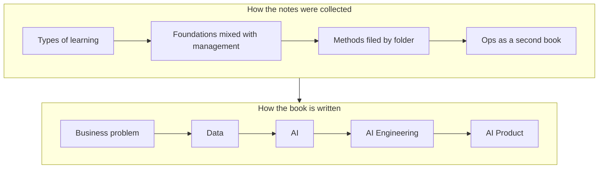

# AI Compendium

The AI Compendium was previously the Machine & Deep Learning Compendium, also known as the ML Compendium and the ML & DL Compendium.

The old order is the order the notes were collected, and this order is the order of the work.
An AI engineer solves a business problem with data, AI, and engineering, and puts the result in a product. The model is one step on that path.

The notes inside each chapter are the sources for a later manuscript.

[The ML & Ops Compendium Open Books](https://medium.com/data-science-collective/the-ml-ops-compendium-open-books-43a3c571d971) (December 2024) explains the open books this manuscript grows from.
The August 2021 post titled The Machine & Deep Learning Compendium Open Book is pinned on the [author profile](https://cohenori.medium.com/) and belongs in this introduction.

