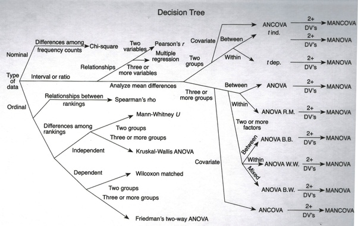
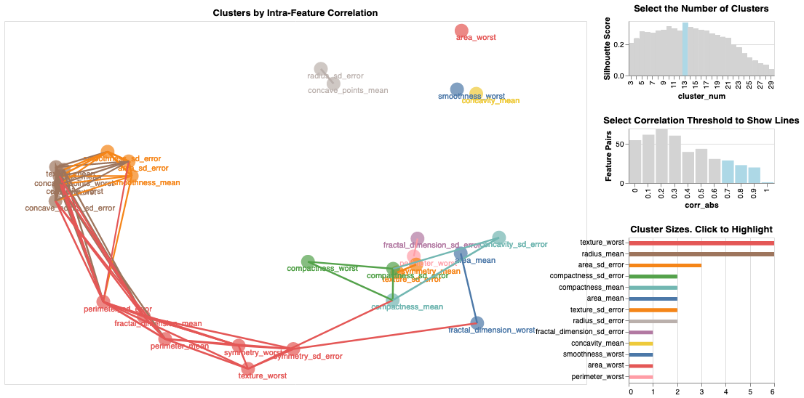
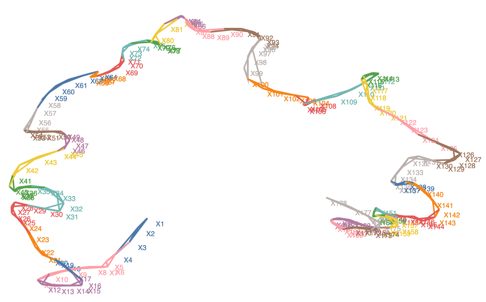
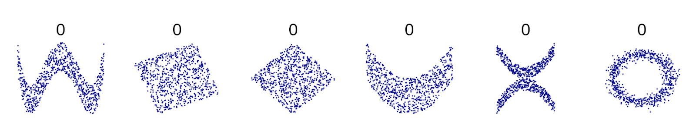
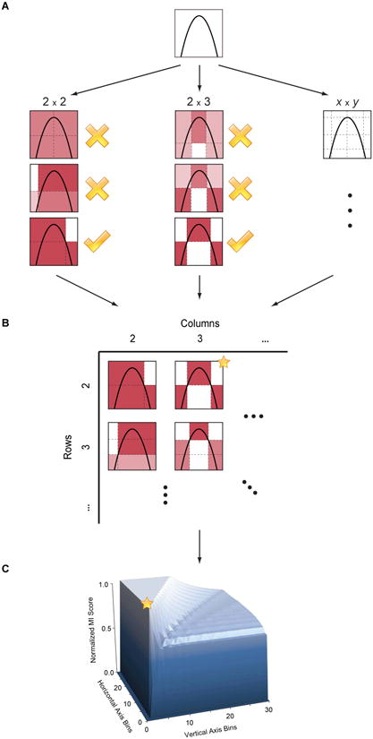
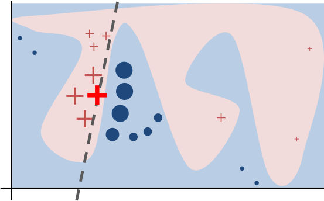
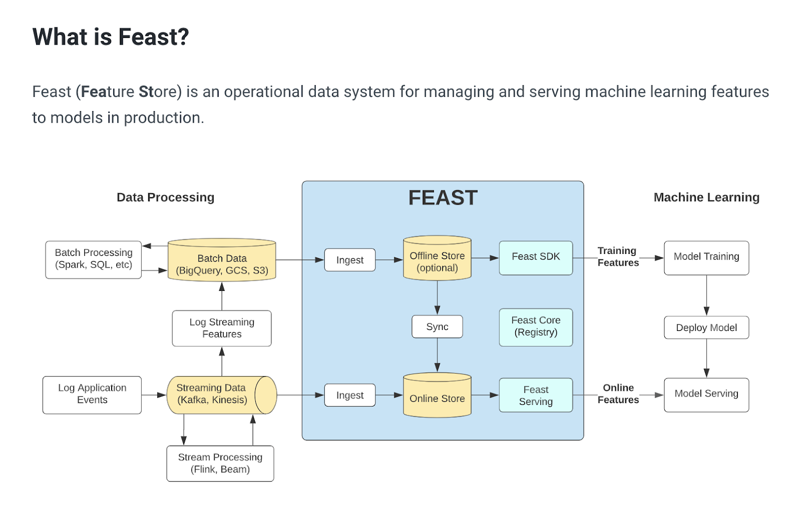
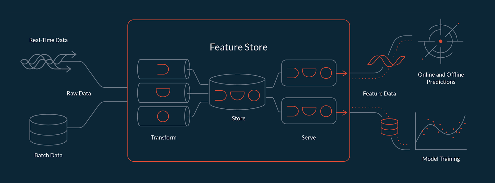
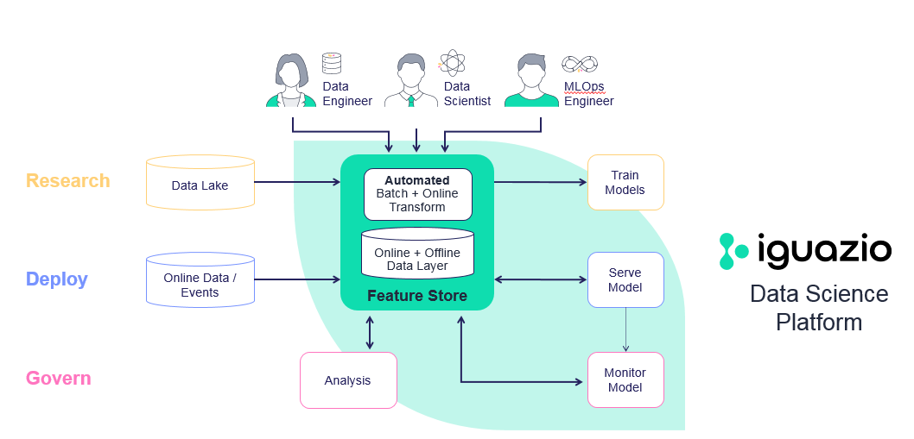

# Features

This page covers correlation, feature selection, engineering, similarity, importance, and feature stores.

### **CORRELATION**

This section links Pearson correlation and related measures.

1. [**Pearson**](https://machinelearningmastery.com/how-to-use-correlation-to-understand-the-relationship-between-variables/)

#### **CORRELATION VS COVARIANCE**

This subsection contrasts correlation and covariance scales.

1. **Correlation is between -1 to 1, covariance is -inf to inf, units in covariance affect the scale, so correlation is preferred, it is normalized.**
   **Correlation is a measure of association. Correlation is used for bivariate analysis. It is a measure of how well the two variables are related.**
   **Covariance is also a measure of association. Covariance is a measure of the relationship between two random variables.**

#### **CORRELATION BETWEEN FEATURE TYPES**

This subsection covers associations across categorical and numeric features.

1. **Association vs correlation - correlation is a measure of association and a yes no question without assuming linearity**
2. [**A great article in medium**](https://medium.com/@outside2SDs/an-overview-of-correlation-measures-between-categorical-and-continuous-variables-4c7f85610365)**, covering just about everything with great detail and explaining all the methods plus references.**
3. **Heat maps for categorical vs target - groupby count per class, normalize by total count to see if you get more grouping in a certain combination of cat/target than others.**
4. [**Anova**](https://www.researchgate.net/post/Which_test_do_I_use_to_estimate_the_correlation_between_an_independent_categorical_variable_and_a_dependent_continuous_variable)**/**[**log regression**](https://www.statalist.org/forums/forum/general-stata-discussion/general/1470627-correlation-between-continous-and-categorical-variable) [**2\*,**](https://dzone.com/articles/correlation-between-categorical-and-continuous-var-1) [**git**](https://github.com/ShitalKat/Correlation/blob/master/Correlation%20between%20categorical%20and%20continuous%20variables.ipynb)**,** **3**, for numeric/**[**cont vs categorical**](https://www.quora.com/How-can-I-measure-the-correlation-between-continuous-and-categorical-variables) **- high F score from anova hints about association between a feature and a target, i.e.,  the importance of the feature to separating the target.**

The same notes are in [Distribution Transformation](../foundation-knowledge/distribution-transformation.md).

5. **Anova youtube** [**1**](https://www.youtube.com/watch?v=ITf4vHhyGpc)**,** [**2**](https://www.youtube.com/watch?v=-yQb_ZJnFXw)

   <figure><figcaption>
Features.

Credit: <a href="https://lh6.googleusercontent.com/3yJV2mUiy1_z0a7yd2PN4FiJzJukUspYtZDvVHusaWxiNKQWGrV--KQB9-Hytgc3dwLirzIlP_e8tVbTVWGV5Xx-t_zrogDU1t7HbPZXvYq4UuqCtM_cuTDoS0sJC1J92XStN-Mq">copied from the original hosted image</a>.
</figcaption></figure>

   **image by multiple possible sources,** [**rayhanul islam**](https://www.quora.com/How-can-I-measure-the-correlation-between-continuous-and-categorical-variables)**,** [**statistics for fun**](https://www.facebook.com/statneil/photos/a.787373884990868/839856346409288/?type=3)**.**
6. **Cat vs cat**, many metrics - on medium

#### **CORRELATION VISUALIZATION**

This subsection links visual ways to explore correlated features.

Feature space

<figure><figcaption>
Feature space.

Credit: <a href="https://medium.com/data-science/escape-the-correlation-matrix-into-feature-space-4d71c51f25e5">Matt Britton</a>.
</figcaption></figure>

<figure><figcaption>
Feature space.

Credit: <a href="https://medium.com/data-science/escape-the-correlation-matrix-into-feature-space-4d71c51f25e5">Matt Britton</a>.
</figcaption></figure>

### **PREDICTIVE POWER SCORE (PPS)**

This section describes the predictive power score as an alternative to correlation.

[**Is  an asymmetric, data-type-agnostic score for predictive relationships between two columns that ranges from 0 to 1.**](https://medium.com/data-science/rip-correlation-introducing-the-predictive-power-score-3d90808b9598) [**github**](https://github.com/8080labs/ppscore)

<figure><figcaption>
Predictive power score examples.

Credit: <a href="https://en.wikipedia.org/wiki/Correlation_and_dependence">Denis Boigelot</a>.
</figcaption></figure>

**Too many scenarios where the correlation is 0. This makes me wonder if I missed something… (Excerpt from the** [**image by Denis Boigelot**](https://en.wikipedia.org/wiki/Correlation_and_dependence)**)**\

**Regression**

**In case of an regression, the ppscore uses the mean absolute error (MAE) as the underlying evaluation metric (MAE\_model). The best possible score of the MAE is 0 and higher is worse. As a baseline score, we calculate the MAE of a naive model (MAE\_naive) that always predicts the median of the target column. The PPS is the result of the following normalization (and never smaller than 0):**\

$$\text{PPS} = 1 - (\text{MAE}_{model} / \text{MAE}_{naive})$$\

**Classification**

**If the task is a classification, we compute the weighted F1 score (wF1) as the underlying evaluation metric (F1\_model). The F1 score can be interpreted as a weighted average of the precision and recall, where an F1 score reaches its best value at 1 and worst score at 0. The relative contribution of precision and recall to the F1 score are equal. The weighted F1 takes into account the precision and recall of all classes weighted by their support as described** [**here**](https://scikit-learn.org/stable/modules/generated/sklearn.metrics.f1_score.html)**. As a baseline score (F1\_naive), we calculate the weighted F1 score for a model that always predicts the most common class of the target column (F1\_most\_common) and a model that predicts random values (F1\_random). F1\_naive is set to the maximum of F1\_most\_common and F1\_random. The PPS is the result of the following normalization (and never smaller than 0):**\

$$\text{PPS} = (F1_{model} - F1_{naive}) / (1 - F1_{naive})$$\

### **MUTUAL INFORMATION COEFFICIENT**

This section covers MIC and mutual information feature scores.

The same notes are in [Information Theory](../foundation-knowledge/information-theory.md).

[**Paper**](https://www.ncbi.nlm.nih.gov/pmc/articles/PMC3325791/) **- we present a measure of dependence for two-variable relationships: the maximal information coefficient (MIC). MIC captures a wide range of associations both functional and not, and for functional relationships provides a score that roughly equals the coefficient of determination (R2) of the data relative to the regression function.**\

**Computing MIC**\
<figure><figcaption>
Features.

Credit: <a href="https://lh3.googleusercontent.com/hHaY4yL__XiqkTQ7Dsb8E-SVtH4fqetiwdHFcSgftiL5hRK4ejUiauAIr_EPCAihPVqZBh4ghVsthSNiGo6DaiyOp9Q2z3i4GeyLoillF440kBFFlcL5TrGyBKwYyYnafM45GIOa">copied from the original hosted image</a>.
</figcaption></figure>

**(A) For each pair (x,y), the MIC algorithm finds the x-by-y grid with the highest induced mutual information. (B) The algorithm normalizes the mutual information scores and compiles a matrix that stores, for each resolution, the best grid at that resolution and its normalized score. (C) The normalized scores form the characteristic matrix, which can be visualized as a surface; MIC corresponds to the highest point on this surface.** \

**In this example, there are many grids that achieve the highest score. The star in (B) marks a sample grid achieving this score, and the star in (C) marks that grid's corresponding location on the surface.**\

[**Mutual information classifier**](https://scikit-learn.org/stable/modules/generated/sklearn.feature_selection.mutual_info_classif.html) **- Estimate mutual information for a discrete target variable.**

**Mutual information (MI)** [**\[1\]**](https://scikit-learn.org/stable/modules/generated/sklearn.feature_selection.mutual_info_classif.html#r50b872b699c4-1) **between two random variables is a non-negative value, which measures the dependency between the variables. It is equal to zero if and only if two random variables are independent, and higher values mean higher dependency.**

**The function relies on nonparametric methods based on entropy estimation from k-nearest neighbors distances as described in** [**\[2\]**](https://scikit-learn.org/stable/modules/generated/sklearn.feature_selection.mutual_info_classif.html#r50b872b699c4-2) **and** [**\[3\]**](https://scikit-learn.org/stable/modules/generated/sklearn.feature_selection.mutual_info_classif.html#r50b872b699c4-3)**. Both methods are based on the idea originally proposed in** [**\[4\]**](https://scikit-learn.org/stable/modules/generated/sklearn.feature_selection.mutual_info_classif.html#r50b872b699c4-4)**.**\

[**MI score**](https://scikit-learn.org/stable/modules/generated/sklearn.metrics.mutual_info_score.html) **- Mutual Information between two clusterings.**

**The Mutual Information is a measure of the similarity between two labels of the same data.** \

[**Adjusted MI score**](https://scikit-learn.org/stable/modules/generated/sklearn.metrics.adjusted_mutual_info_score.html#sklearn.metrics.adjusted_mutual_info_score) **- Adjusted Mutual Information between two clusterings.**

**Adjusted Mutual Information (AMI) is an adjustment of the Mutual Information (MI) score to account for chance. It accounts for the fact that the MI is generally higher for two clusterings with a larger number of clusters, regardless of whether there is actually more information shared.**

**This metric is furthermore symmetric: switching label\_true with label\_pred will return the same score value. This can be useful to measure the agreement of two independent label assignments strategies on the same dataset when the real ground truth is not known**\

[**Normalized MI score**](https://scikit-learn.org/stable/modules/generated/sklearn.metrics.normalized_mutual_info_score.html#sklearn.metrics.normalized_mutual_info_score) **- Normalized Mutual Information (NMI) is a normalization of the Mutual Information (MI) score to scale the results between 0 (no mutual information) and 1 (perfect correlation). In this function, mutual information is normalized by some generalized mean of H(labels\_true) and H(labels\_pred)), defined by the average\_method.**\

### **CRAMER’S COEFFICIENT**

This subsection links a Stack Overflow thread on Cramér’s coefficient in pandas.

[**Calculating** ](https://stackoverflow.com/questions/20892799/using-pandas-calculate-cram%C3%A9rs-coefficient-matrix)

##

This marker separated sections in the original notes.

### **FEATURE SELECTION**

This section lists feature selection tutorials and libraries.

The same notes are in [Interpretable & Explainable AI (XAI)](interpretable-and-explainable-ai-xai.md) and [L1 and L2](../foundation-knowledge/regularization.md#l1-and-l2).

**A series of good articles that explain about several techniques for feature selection**

1. [**How to parallelize feature selection on several CPUs,**](https://stackoverflow.com/questions/37037450/multi-label-feature-selection-using-sklearn) **do it per label on each cpu and average the results.**
2. **A great notebook about feature correlation and manytypes of visualization, what to drop what to keep, using many feature reduction and selection methods (quite a lot actually). Its a really good intro**
3. [**Multi class classification, feature selection, model selection, co-feature analysis**](https://medium.com/data-science/multi-class-text-classification-with-scikit-learn-12f1e60e0a9f)
4. [**Text analysis for sentiment, doing feature selection**](https://streamhacker.com/tag/chi-square/) **a tutorial with chi2(IG?),** [**part 2 with bi-gram collocation in ntlk**](https://streamhacker.com/2010/05/24/text-classification-sentiment-analysis-stopwords-collocations/)
5. **What is collocation? - “the habitual juxtaposition of a particular word with another word or words with a frequency greater than chance.”**
6. [**Sklearn feature selection methods (4) - youtube**](https://www.youtube.com/watch?v=wjKvyk8xStg)
7. [**Univariate**](http://blog.datadive.net/selecting-good-features-part-i-univariate-selection/) **and independent features**
8. [**Linear models and regularization,**](http://blog.datadive.net/selecting-good-features-part-ii-linear-models-and-regularization/) **doing feature ranking**
9. [**Random forests and feature ranking**](http://blog.datadive.net/selecting-good-features-part-iii-random-forests/)
10. [**Random Search for focus and only then grid search for Random Forest**](https://medium.com/data-science/hyperparameter-tuning-the-random-forest-in-python-using-scikit-learn-28d2aa77dd74)**,** [**code**](https://github.com/WillKoehrsen/Machine-Learning-Projects/blob/master/random_forest_explained/Improving%20Random%20Forest%20Part%202.ipynb)
11. [**Stability selection and recursive feature elimination (RFE).**](http://blog.datadive.net/selecting-good-features-part-iv-stability-selection-rfe-and-everything-side-by-side/) **are wrapper methods in sklearn for the purpose of feature selection.** [**RFE in sklearn**](http://scikit-learn.org/stable/modules/generated/sklearn.feature_selection.RFE.html)
12. [**Kernel feature selection via conditional covariance minimization**](http://bair.berkeley.edu/blog/2018/01/23/kernels/) **(netanel d.)**
13. [**Github class that does the following**](https://medium.com/data-science/a-feature-selection-tool-for-machine-learning-in-python-b64dd23710f0)**:**
    - **Features with a high percentage of missing values**
    - **Collinear (highly correlated) features**
    - **Features with zero importance in a tree-based model**
    - **Features with low importance**
    - **Features with a single unique value**
14. [**Machinelearning mastery on FS**](https://machinelearningmastery.com/feature-selection-machine-learning-python/)**:**
    - **Univariate Selection.**
    - **Recursive Feature Elimination.**
    - **Principle Component Analysis.**
    - **Feature Importance.**
15. [**Sklearn tutorial on FS:**](http://scikit-learn.org/stable/modules/feature_selection.html)
    - **Low variance**
    - **Univariate kbest**
    - **RFE**
    - **selectFromModel using \_coef \_important\_features**
    - **Linear models with L1 (svm recommended L2)**
    - **Tree based importance**
16. [**A complete overview of many methods**](https://www.analyticsvidhya.com/blog/2016/12/introduction-to-feature-selection-methods-with-an-example-or-how-to-select-the-right-variables/)
    - **(reduction) LDA: Linear discriminant analysis is used to find a linear combination of features that characterizes or separates two or more classes (or levels) of a categorical variable.**
    - **(selection) ANOVA: ANOVA stands for Analysis of variance. It is similar to LDA except for the fact that it is operated using one or more categorical independent features and one continuous dependent feature. It provides a statistical test of whether the means of several groups are equal or not.**

The same notes are in [Distribution Transformation](../foundation-knowledge/distribution-transformation.md).

    - **(Selection) Chi-Square: It is a is a statistical test applied to the groups of categorical features to evaluate the likelihood of correlation or association between them using their frequency distribution.**
    - **Wrapper methods:**
       - **Forward Selection: Forward selection is an iterative method in which we start with having no feature in the model. In each iteration, we keep adding the feature which best improves our model till an addition of a new variable does not improve the performance of the model.**
       - **Backward Elimination: In backward elimination, we start with all the features and removes the least significant feature at each iteration which improves the performance of the model. We repeat this until no improvement is observed on removal of features.**
       - **Recursive Feature elimination: It is a greedy optimization algorithm which aims to find the best performing feature subset. It repeatedly creates models and keeps aside the best or the worst performing feature at each iteration. It constructs the next model with the left features until all the features are exhausted. It then ranks the features based on the order of their elimination.**
17. [**Relief**](https://medium.com/@yashdagli98/feature-selection-using-relief-algorithms-with-python-example-3c2006e18f83) **-** [**GIT**](https://github.com/GrantRVD/ReliefF) [**git2**](https://pypi.org/project/ReliefF/#description) **a new family of feature selection trying to optimize the distance of two samples from the selected one, one which should be closer the other farther.**

**“The weight updation of attributes works on a simple idea (line 6). That if instance Rᵢ and H have different value (i.e the diff value is large), that means that attribute separates two instance with the same class which is not desirable, thus we reduce the attributes weight. On the other hand, if the instance Rᵢ and M have different value, that means the attribute separates the two instance with different class, which is desirable.”**

1. [**Scikit-feature (includes relief)**](https://github.com/chappers/scikit-feature) **forked from** [**this**](https://github.com/jundongl/scikit-feature/tree/master/skfeature) [**(docs)**](http://featureselection.asu.edu/algorithms.php)
2. [**Scikit-rebate (based on relief)**](https://github.com/EpistasisLab/scikit-rebate)

[**Feature selection using entropy, information gain, mutual information and … in sklearn.**](https://gist.github.com/GaelVaroquaux/ead9898bd3c973c40429)

[**Entropy, mutual information and KL Divergence by AurelienGeron**](https://www.techleer.com/articles/496-a-short-introduction-to-entropy-cross-entropy-and-kl-divergence-aurelien-geron/)\

### **FEATURE ENGINEERING**

This section links guides on encoding, text, and embedding features.

The same notes are in [Auto Feature Engineering](../machine-learning/meta-learning.md#auto-feature-engineering), [Box Cox](../foundation-knowledge/distribution-transformation.md#box-cox), and [Feature engineering](../ops/dataops/lakes-and-warehouses.md#feature-engineering).

1. [**Vidhya on FE, anomalies, engineering, imputing**](https://www.analyticsvidhya.com/blog/2016/01/guide-data-exploration/?utm_source=outlierdetectionpyod&utm_medium=blog)
2. [**Many types of FE**](https://medium.com/data-science/understanding-feature-engineering-part-1-continuous-numeric-data-da4e47099a7b)**, including log and box cox transform - a very useful explanation.**
3. [**Categorical Data**](https://medium.com/data-science/understanding-feature-engineering-part-2-categorical-data-f54324193e63)
4. [**Dummy variables and feature hashing**](https://medium.com/data-science/understanding-feature-engineering-part-2-categorical-data-f54324193e63) **- hashing is really cool.**
5. [**Text data**](https://medium.com/data-science/understanding-feature-engineering-part-3-traditional-methods-for-text-data-f6f7d70acd41) **- unigrams, bag of words, N-grams (2,3,..), tfidf matrix, cosine\_similarity(tfidf) ontop of a tfidf matrix, unsupervised hierarchical clustering with similarity measures on top of (cosine\_similarity), LDA for topic modelling in sklearn - pretty awesome, Kmeans(lda),.**
6. [**Deep learning data for FE**](https://medium.com/data-science/understanding-feature-engineering-part-4-deep-learning-methods-for-text-data-96c44370bbfa)  **-** [**Word embedding using keras, continuous BOW - CBOW, SKIPGRAM, word2vec - really good.**](https://medium.com/data-science/understanding-feature-engineering-part-4-deep-learning-methods-for-text-data-96c44370bbfa)
7. [**Topic Modelling**](http://chdoig.github.io/pygotham-topic-modeling/#/) **- a fantastic slide show about topic modelling using LDA etc.**

The same notes are in [LDA (Latent Dirichlet Allocation)](../natural-language-processing/topics-modeling.md#lda-latent-dirichlet-allocation).

8. **Dipanjan on feature engineering** [**1**](https://medium.com/data-science/understanding-feature-engineering-part-1-continuous-numeric-data-da4e47099a7b) **- cont numeric** [ **2 -**](https://medium.com/data-science/understanding-feature-engineering-part-2-categorical-data-f54324193e63) **categorical** [**3**](https://medium.com/data-science/understanding-feature-engineering-part-3-traditional-methods-for-text-data-f6f7d70acd41) **- traditional methods**
9. [**Target encoding git**](https://pypi.org/project/target_encoding/)
10. [**Category encoding git**](https://pypi.org/project/category-encoders/)

### **REPRESENTATION LEARNING**

This subsection links a representation learning paper.

1. [**paper**](https://arxiv.org/abs/1807.03748?utm_campaign=The%20Batch&utm_source=hs_email&utm_medium=email&utm_content=83602348&_hsenc=p2ANqtz-8DcgUdDF--k3tWOmhM51lm28wHerZxlXKoGNU6hIu2P4Fj-RuEuciKtbWZZdWmvBg7KGeI44FWUrmpHdZIbAM-pUicgg&_hsmi=83602348)

### **TFIDF**

This section notes TF-IDF vectorizer options and retrieval links.

The same notes are in [LSA (TFIDF + SVD)](../natural-language-processing/topics-modeling.md#lsa-tfidf--svd) and [TF-IDF](../natural-language-processing/tf-idf.md).

1. [Max\_features in tf idf](https://stackoverflow.com/questions/46118910/scikit-learn-vectorizer-max-features) -Sometimes it is not effective to transform the whole vocabulary, as the data may have some exceptionally rare words, which, if passed to TfidfVectorizer().fit(), will add unwanted dimensions to inputs in the future. One of the appropriate techniques in this case, for instance, would be to print out word frequences accross documents and then set a certain threshold for them. Imagine you have set a threshold of 50, and your data corpus consists of 100 words. After looking at the word frequences 20 words occur less than 50 times. Thus, you set max\_features=80 and you are good to go. If max\_features is set to None, then the whole corpus is considered during the TF-IDFtransformation. Otherwise, if you pass, say, 5 to max\_features, that would mean creating a feature matrix out of the most 5 frequent words accross text documents.
2. Understanding Term based retrieval - TFIDF Bm25
3. [understanding TFIDF and BM25](https://kmwllc.com/index.php/2020/03/20/understanding-tf-idf-and-bm-25/)

### **SIMILARITY**

This section covers vector and text similarity measures.

The same notes are in [Recommender Systems](../machine-learning/recommender-systems.md) and [String Matching](../natural-language-processing/string-matching.md).

1. [**Cosine similarity tutorial**](http://blog.christianperone.com/2013/09/machine-learning-cosine-similarity-for-vector-space-models-part-iii/)
   - [**Cosine vs dot product**](https://datascience.stackexchange.com/questions/744/cosine-similarity-versus-dot-product-as-distance-metrics)
   - [**Cosine vs dot product 2**](https://blog.christianperone.com/2013/09/machine-learning-cosine-similarity-for-vector-space-models-part-iii/)
   - [**Fast cosine similarity**](https://stackoverflow.com/questions/51425300/python-fast-cosine-distance-with-cython) **implementation**
2. **Edit distance similarity**
3. [**Diff lib similarity and soundex**](https://datascience.stackexchange.com/questions/12575/similarity-between-two-words)
4. [**Soft cosine and cosine**](https://www.machinelearningplus.com/nlp/gensim-tutorial/)
5. [**Pearson also used to detect similar vectors**](https://machinelearningmastery.com/how-to-use-correlation-to-understand-the-relationship-between-variables/)

### Distance

This section lists common distance metrics and geo tools.

The same notes are in [Dynamic Time Warping (DTW)](../machine-learning/timeseries.md#dynamic-time-warping-dtw).

1. [Mastery on distance formulas](https://machinelearningmastery.com/distance-measures-for-machine-learning/)
   1. Role of Distance Measures
   2. Hamming Distance
   3. Euclidean Distance
   4. Manhattan Distance (Taxicab or City Block)
   5. Minkowski Distance
2. Cosine distance = 1 - cosine similarity
3. [Haversine](https://kanoki.org/2019/12/27/how-to-calculate-distance-in-python-and-pandas-using-scipy-spatial-and-distance-functions/) distance

#### Distance Tools

This subsection points to GeoPandas for geographic distance.

1. [GeoPandas](https://geopandas.org/en/stable/index.html)

### **FEATURE IMPORTANCE**

This section covers global importance and LIME-style local explanations.

The same notes are in [Lime](interpretable-and-explainable-ai-xai.md#lime) and [Shap](interpretable-and-explainable-ai-xai.md#shap).

**Note: point 2, about lime is used for explainability, please also check that topic, down below.**

1. [**Using RF and other methods, really good**](https://medium.com/data-science/explaining-feature-importance-by-example-of-a-random-forest-d9166011959e)
2. [**Non parametric feature impact and importance**](https://arxiv.org/abs/2006.04750) **- while there are nonparametric feature selection algorithms, they typically provide feature rankings, rather than measures of impact or importance.In this paper, we give mathematical definitions of feature impact and importance, derived from partial dependence curves, that operate directly on the data.**
3. [**Paper**](https://arxiv.org/abs/1602.04938) **(**[**pdf**](https://arxiv.org/pdf/1602.04938.pdf)**,** [**blog post**](https://www.oreilly.com/learning/introduction-to-local-interpretable-model-agnostic-explanations-lime)**): (**[**GITHUB**](https://github.com/marcotcr/lime/blob/master/README.md)**) how to "explain the predictions of any classifier in an interpretable and faithful manner, by learning an interpretable model locally around the prediction."**\
   \
   **they want to understand the reasons behind the predictions, it’s a new field that says that many 'feature importance' measures shouldn’t be used. i.e., in a linear regression model, a feature can have an importance rank of 50 (for example), in a comparative model where you duplicate that feature 50 times, each one will have 1/50 importance and won’t be selected for the top K, but it will still be one of the most important features. so new methods needs to be developed to understand feature importance. this one has git code as well.**

**Several github notebook examples:** [**binary case**](https://marcotcr.github.io/lime/tutorials/Lime%20-%20basic%20usage%2C%20two%20class%20case.html)**,** [**multi class**](https://marcotcr.github.io/lime/tutorials/Lime%20-%20multiclass.html)**,** [**cont and cat features**](https://marcotcr.github.io/lime/tutorials/Tutorial%20-%20continuous%20and%20categorical%20features.html)**, there are many more for images in the github link.**\

**“Intuitively, an explanation is a local linear approximation of the model's behaviour. While the model may be very complex globally, it is easier to approximate it around the vicinity of a particular instance. While treating the model as a black box, we perturb the instance we want to explain and learn a sparse linear model around it, as an explanation. The figure below illustrates the intuition for this procedure. The model's decision function is represented by the blue/pink background, and is clearly nonlinear. The bright red cross is the instance being explained (let's call it X). We sample instances around X, and weight them according to their proximity to X (weight here is indicated by size). We then learn a linear model (dashed line) that approximates the model well in the vicinity of X, but not necessarily globally. For more information, read our paper, or take a look at this blog post.”**\
\
<figure><figcaption>
Features.

Credit: <a href="https://lh3.googleusercontent.com/kG3FAsrFUCsJEWKHu5VIALphtEB2Fp82hOuQVUVMz5jJg_YJew27k4Hptrmb9HGfSK6jf0shjsjP4o3zk0MGI8s8MHkRnEv2hgZTNNmn_ImljyFeVJjt0DaIEE0qhxcMRDO3t6Ig">copied from the original hosted image</a>.
</figcaption></figure>

### **FEATURE IMPUTING**

This section links imputation libraries and exploration guides.

1. [**Vidhya on FE, anomalies, engineering, imputing**](https://www.analyticsvidhya.com/blog/2016/01/guide-data-exploration/?utm_source=outlierdetectionpyod&utm_medium=blog)
2. [**Fancy impute**](https://pypi.org/project/fancyimpute/)

###

### **FEATURE STORE**

This section describes feature store products and articles.

The same notes are in [Feature Stores & Feature Pipelines](../ops/mlops/feature-stores-and-feature-pipelines.md).

1. **The importance of having one -** medium
2. [**What is?**](https://feast.dev/blog/what-is-a-feature-store/)
3. [**Feature store vs data warehouse**](https://www.kdnuggets.com/2020/12/feature-store-vs-data-warehouse.html)
4. **Why feature store is not enough**
5. [**Feast**](https://docs.feast.dev/) [**what is 1**](https://feast.dev/blog/what-is-a-feature-store/) [**what is 2**](https://neptune.ai/blog/feature-stores-components-of-a-data-science-factory-guide)

<figure><figcaption>
Features.

Credit: <a href="https://lh3.googleusercontent.com/-Syb5MJEHTEHc12GTKNQN8bWnt83zFs_isY_CFMISCYQJPLnvt-XdV3B_ycaRziMns-z0crVA01PpZUHI3Hgw251xhnIh_LB88cQKMb9_MNUzmN68cxvBZ6lsEw8FGxzMDX-_9xo">copied from the original hosted image</a>.
</figcaption></figure>

1. [**Tecton.ai**](https://www.tecton.ai/) **(managed feature store)**\
   <figure><figcaption>
Features.

Credit: <a href="https://lh3.googleusercontent.com/3NQTUG2PVOIJZbNBYNj-BxZv5A4POEf1KJ20f4nhet_gaxj4cAJXjXwld9ZG-RoEWnRe-DWfS_qe1PrSojfXcTtlJZYy4w6_njyBi9qgsnDr7jnnfqMDMG-8Ea31qWGn5toG4HwI">copied from the original hosted image</a>.
</figcaption></figure>
2. [**Iguazio feature store**](https://www.iguazio.com/feature-store/)\
   \
   <figure><figcaption>
Features.

Credit: <a href="https://lh3.googleusercontent.com/RWd1x9OSefMVbp_X6JYdfIy_Kz9hM_x7Wtg0mvm3mWUt_hvvi6gWATMcMDDUJrv1jGYhXUlVtBnlI4oCPm0nXkDWxMrzUpD1gLUefWv0fczK3XGRCQqqN6iDQ5yc2-4MbT7U304r">copied from the original hosted image</a>.
</figcaption></figure>

## Deprecated links


These links and images no longer work. The original wording is kept here. A same-resource copy, when one was checked, is used above.


- Correlation is between -1 to 1, covariance is -inf to inf, units in covariance affect the scale, so correlation is preferred, it is normalized.. This address no longer opens: https://towardsdatascience.com/correlation-coefficient-clearly-explained-f034d00b66ac
- Feature space. This address no longer opens: https://towardsdatascience.com/escape-the-correlation-matrix-into-feature-space-4d71c51f25e5
- Cat vs cat**, many metrics - on medium**. This address no longer opens: https://towardsdatascience.com/the-search-for-categorical-correlation-a1cf7f1888c9
- 3. This address no longer opens: https://www.edvancer.in/DESCRIPTIVE+STATISTICS+FOR+DATA+SCIENCE-2
- Github class that does the following. This address no longer opens: https://towardsdatascience.com/a-feature-selection-tool-for-machine-learning-in-python-b64dd23710f0
- A great notebook about feature correlation and manytypes of visualization, what to drop what to keep, using many feature reduction and selection methods (quite a lot actually). Its a really good intro. This address no longer opens: https://www.kaggle.com/kanncaa1/feature-selection-and-data-visualization
- Understanding Term based retrieval - TFIDF Bm25. This address no longer opens: https://towardsdatascience.com/understanding-term-based-retrieval-methods-in-information-retrieval-2be5eb3dde9f
- **The importance of having one -** medium. This address no longer opens: https://towardsdatascience.com/the-importance-of-having-a-feature-store-e2a9cfa5619f
- Why feature store is not enough. This address no longer opens: https://towardsdatascience.com/effective-ai-infrastructure-or-why-feature-store-is-not-enough-43bc2d803401
