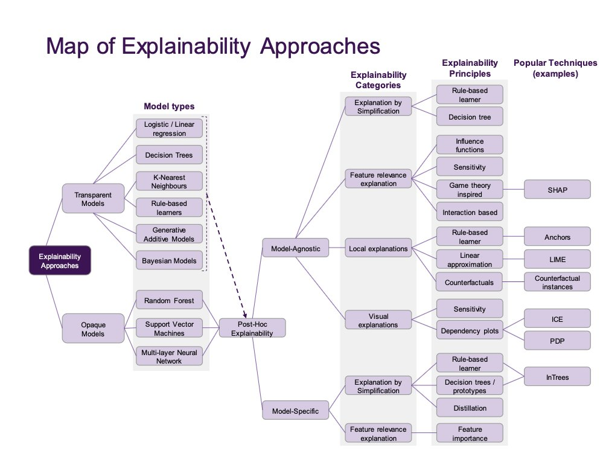
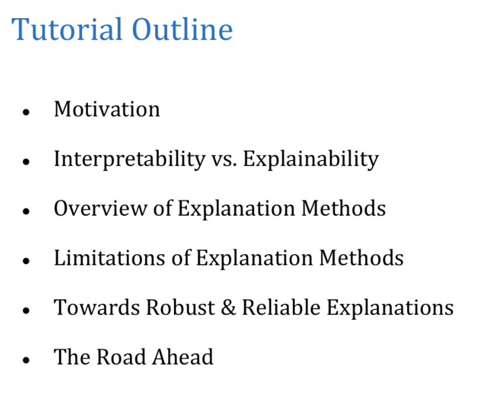

# Interpretable & Explainable AI (XAI)

This page lists courses, libraries, and articles on explaining and interpreting ML models.

The same notes are in [Books & notebooks](../foundation-knowledge/data-science.md#books--notebooks).

## XAI

This section is a curated list of XAI courses, tools, and papers.

<figure><figcaption>
Explainable AI.

Credit: <a href="https://lh3.googleusercontent.com/gQgeZyxlXU37RydzNxXz1VitIZ-vdWr0YGy59EphP1cD8KqEE3VB58CGxxORvdmNuSLeRcRaytp7nJkFZveApPd4Fq8xEOV51ZSuXJsFdkU9EpL8d1cQRKzoCEpBjqARmiRD0NEV">copied from the original hosted image</a>.
</figcaption></figure>

1. [A series of videos about XAI.](https://www.youtube.com/watch?v=OZJ1IgSgP9E&list=PLV8yxwGOxvvovp-j6ztxhF3QcKXT6vORU&index=4)
2. [A curated document about XAI research resources. ](https://docs.google.com/spreadsheets/d/1uQy6a3BfxOXI8Nh3ECH0bqqSc95zpy4eIp_9JAMBkKg/edit?usp=sharing)
3. Interpretability and Explainability in Machine Learning [course](https://interpretable-ml-class.github.io/) / slides. Understanding, evaluating, rule based, prototype based, risk scores, generalized additive models, explaining black box, visualizing, feature importance, actionable explanations, casual models, human in the loop, connection with debugging.
4. [Explainable Machine Learning: Understanding the Limits & Pushing the Boundaries](https://drive.google.com/file/d/1xn2dCDAeEEhB_rex202KxMPqIPj31fZ4/view) a tutorial by Hima Lakkaraju (tutorial VIDEO, [youtube](https://www.youtube.com/watch?v=K6-ujR_67eY), [twitter](https://twitter.com/hima_lakkaraju/status/1390759698224271361))

   <figure><figcaption>
Explainable AI tutorial figure.

Credit: <a href="https://lh3.googleusercontent.com/rO4qszA6Hz3L21ZL3YOJB3GNG9u-Q0rGGQ0QxamCYq6MLwHPxkHhk5GUGhVpMKTM0EJH0SHDIr5Tts9vCvjTKWZzrKDdoaE8jfdLDV3Dstu66HiNYvKmoRBQDAEothlrQM7FSLdD">copied from the original hosted image</a>.
</figcaption></figure>
5. [Stop Explaining Black Box Machine Learning Models for High Stakes Decisions and Use Interpretable Models Instead](https://arxiv.org/pdf/1811.10154.pdf) by Cinthia rudin
   - A great[ talk](https://www.youtube.com/watch?app=desktop&v=FEAk-U0dT8Y) on the topic by Shir Meir Lador
6. [explainML tutorial](https://explainml-tutorial.github.io/neurips20)
7. [When not to trust explanations :)](https://docs.google.com/presentation/d/10a0PNKwoV3a1XChzvY-T1mWudtzUIZi3sCMzVwGSYfM/edit#slide=id.p)
8. From the above image: [Paper: Principles and practice of explainable models](https://arxiv.org/abs/2009.11698) - a really good review for everything XAI - “a survey to help industry practitioners (but also data scientists more broadly) understand the field of explainable machine learning better and apply the right tools. Our latter sections build a narrative around a putative data scientist, and discuss how she might go about explaining her models by asking the right questions. From an organization viewpoint, after motivating the area broadly, we discuss the main developments, including the principles that allow us to study transparent models vs opaque models, as well as model-specific or model-agnostic post-hoc explainability approaches. We also briefly reflect on deep learning models, and conclude with a discussion about future research directions.”
9. [Book: interpretable machine learning](https://christophm.github.io/interpretable-ml-book/agnostic.html), [christoph mulner](https://christophm.github.io/)
10. (great) [Interpretability overview,](https://thegradient.pub/interpretability-in-ml-a-broad-overview/) transparent (simultability, decomposability, algorithmic transparency) post-hoc interpretability (text explanation, visual local, explanation by example,), evaluation, utility.
11. [Medium: the great debate](https://medium.com/swlh/the-great-ai-debate-interpretability-1d139167b55)

    <figure><figcaption>
The great AI debate on interpretability.
</figcaption></figure>
12. [Paper: pitfalls to avoid when interpreting ML models](https://arxiv.org/abs/2007.04131) “A growing number of techniques provide model interpretations, but can lead to wrong conclusions if applied incorrectly. We illustrate pitfalls of ML model interpretation such as bad model generalization, dependent features, feature interactions or unjustified causal interpretations. Our paper addresses ML practitioners by raising awareness of pitfalls and pointing out solutions for correct model interpretation, as well as ML researchers by discussing open issues for further research.” - mulner et al.

    <figure><figcaption>
Pitfalls when interpreting ML models.
</figcaption></figure>
13. *** [whitening a black box.](https://francescopochetti.com/whitening-a-black-box-how-to-interpret-a-ml-model/) This is very good, includes eli5, lime, shap, many others.
14. Book: [exploratory model analysis](https://pbiecek.github.io/ema/)
15. [Alibi-explain](https://github.com/SeldonIO/alibi) - White-box and black-box ML model explanation library. Alibi is an open source Python library aimed at machine learning model inspection and interpretation. The focus of the library is to provide high-quality implementations of black-box, white-box, local and global explanation methods for classification and regression models.

    <figure><figcaption>
Alibi explain library.
</figcaption></figure>
16. [Hands on explainable ai](https://www.youtube.com/watch?v=1mNhPoab9JI) youtube, [git](https://github.com/PacktPublishing/Hands-On-Explainable-AI-XAI-with-Python)
17. [Explainable methods](https://medium.com/data-science/interpretable-machine-learning-with-xgboost-9ec80d148d27) are not always consistent and do not agree with each other, this article has a make-sense explanation and flow for using shap and its many plots.

    <figure><figcaption>
<a href="https://github.com/raghakot/keras-vis">Keras-vis</a> for cnns, 3 methods, activation maximization, saliency and class activation maps
</figcaption></figure>
18. [The notebook!](https://github.com/FraPochetti/KagglePlaygrounds/blob/master/InterpretableML.ipynb) [Blog](https://francescopochetti.com/whitening-a-black-box-how-to-interpret-a-ml-model/)
19. [More resources!](https://docs.google.com/spreadsheets/d/1uQy6a3BfxOXI8Nh3ECH0bqqSc95zpy4eIp_9JAMBkKg/edit#gid=0)
20. [Visualizing the impact of feature attribution baseline](https://distill.pub/2020/attribution-baselines/) - Path attribution methods are a gradient-based way of explaining deep models. These methods require choosing a hyperparameter known as the baseline input. What does this hyperparameter mean, and how important is it? In this article, we investigate these questions using image classification networks as a case study. We discuss several different ways to choose a baseline input and the assumptions that are implicit in each baseline. Although we focus here on path attribution methods, our discussion of baselines is closely connected with the concept of missingness in the feature space - a concept that is critical to interpretability research.
21. WHAT IF TOOL - GOOGLE, [notebook](https://colab.research.google.com/github/PAIR-code/what-if-tool/blob/master/WIT_Smile_Detector.ipynb), [walkthrough](https://pair-code.github.io/what-if-tool/learn/tutorials/walkthrough/)
22. [Language interpretability tool (LIT) -](https://pair-code.github.io/lit/) The Language Interpretability Tool (LIT) is an open-source platform for visualization and understanding of NLP models.
23. [Stop Explaining Black Box Machine Learning Models for High Stakes Decisions and Use Interpretable Models Instead](https://arxiv.org/abs/1811.10154) - “trying to \textit{explain} black box models, rather than creating models that are \textit{interpretable} in the first place, is likely to perpetuate bad practices and can potentially cause catastrophic harm to society. There is a way forward -- it is to design models that are inherently interpretable. This manuscript clarifies the chasm between explaining black boxes and using inherently interpretable models, outlines several key reasons why explainable black boxes should be avoided in high-stakes decisions, identifies challenges to interpretable machine learning, and provides several example applications where interpretable models could potentially replace black box models in criminal justice, healthcare, and computer vision.”
24. [Using genetic algorithms](https://medium.com/data-science/interpreting-black-box-machine-learning-models-with-genetic-algorithms-a803bfd134cb)
25. [ Google’s what-if tool](https://pair-code.github.io/what-if-tool/demos/image.html) from [PAIR](https://pair.withgoogle.com/)
26. [Boruta](https://github.com/scikit-learn-contrib/boruta_py) ([medium](https://medium.com/data-science/boruta-explained-the-way-i-wish-someone-explained-it-to-me-4489d70e154a)) was designed to automatically perform feature selection on a dataset using randomized features, i.e., measuring valid features against their shadow/noisy counterparts.

The same notes are in [FEATURE SELECTION](features.md#feature-selection).

27. [InterpretML](https://interpret.ml/) by Microsoft, [git](https://github.com/interpretml/interpret).
28. [Connecting Interpretability and Robustness in Decision Trees through Separation](https://icml.cc/virtual/2021/poster/10107), [git](https://github.com/yangarbiter/interpretable-robust-trees)
29. [Interpret Transformers](https://github.com/cdpierse/transformers-interpret) - explain transformers with 2 lines of code.

## Lime

This section explains how LIME works and links tutorials.

The same notes are in [FEATURE IMPORTANCE](features.md#feature-importance).

1. [*** how lime works behind the scenes](https://medium.com/analytics-vidhya/explain-your-model-with-lime-5a1a5867b423)
2. [LIME to interpret models](https://www.oreilly.com/learning/introduction-to-local-interpretable-model-agnostic-explanations-lime) NLP and IMAGE, [github](https://github.com/marcotcr/lime)- In the experiments in [our research paper](http://arxiv.org/abs/1602.04938), we demonstrate that both machine learning experts and lay users greatly benefit from explanations similar to Figures 5 and 6 and are able to choose which models generalize better, improve models by changing them, and get crucial insights into the models' behavior.

## Anchor

This section introduces Anchor explanations from the LIME authors.

1. [Anchor from the authors of Lime,](https://github.com/marcotcr/anchor) - An anchor explanation is a rule that sufficiently “anchors” the prediction locally – such that changes to the rest of the feature values of the instance do not matter. In other words, for instances on which the anchor holds, the prediction is (almost) always the same.

## Shap

This section collects SHAP theory, tutorials, and tooling.

The same notes are in [FEATURE IMPORTANCE](features.md#feature-importance).

1. Theory:
   - How Shap values are calculated - [youtube](https://www.youtube.com/watch?v=u7Om2joZWYs).
   - Cooporative game theory & Shapely values, [Medium](https://p17anshikap.medium.com/corporative-game-theory-and-shapley-values-b96dc7284701), [youtube](https://www.youtube.com/watch?v=w9O0fkfMkx0)
   - [Calculating a Taxi fare using Shap](https://www.youtube.com/watch?v=aThG4YAFErw)
   - [Shap explained](https://medium.com/data-science/shap-explained-the-way-i-wish-someone-explained-it-to-me-ab81cc69ef30)
2. Intro to shap and lime, [part 1](https://blog.dominodatalab.com/shap-lime-python-libraries-part-1-great-explainers-pros-cons/), [part 2](https://blog.dominodatalab.com/shap-lime-python-libraries-part-2-using-shap-lime/)
3. A series on Shap, Lime.
   1. Part I: [Explain Your Model with the SHAP Values](https://medium.com/data-science/explain-your-model-with-the-shap-values-bc36aac4de3d)
   2. Part II: [The SHAP with More Elegant Charts](https://dataman-ai.medium.com/the-shap-with-more-elegant-charts-bc3e73fa1c0c)
   3. Part III: [How Is the Partial Dependent Plot Calculated?](https://dataman-ai.medium.com/how-is-the-partial-dependent-plot-computed-8d2001a0e556)
   4. Part VI: [An Explanation for eXplainable AI](https://medium.com/analytics-vidhya/an-explanation-for-explainable-ai-xai-d56ae3dacd13)
   5. Part V: Explain Any Models with the SHAP Values — Use the KernelExplainer
   6. Part VI: [The SHAP Values with H2O Models](https://medium.com/dataman-in-ai/the-shap-values-with-h2o-models-773a203b75e3)
   7. Part VII: [Explain Your Model with LIME](https://medium.com/@Dataman.ai/explain-your-model-with-lime-5a1a5867b423)
   8. Part VIII: [Explain Your Model with Microsoft’s InterpretML](https://medium.com/@Dataman.ai/explain-your-model-with-microsofts-interpretml-5daab1d693b4)
4. Medium Intro to lime and shap
5. **** In depth SHAP
6. [Github](https://github.com/slundberg/shap)
7. [Country happiness using shap](https://sararobinson.dev/2019/03/24/preventing-bias-machine-learning.html)
8. [Stackoverflow example, predicting tags, pandas keras etc](https://stackoverflow.blog/2019/05/06/predicting-stack-overflow-tags-with-googles-cloud-ai/)
9. Intro to shapely and shap
10. [Fiddler on shap](https://medium.com/fiddlerlabs/case-study-explaining-credit-modeling-predictions-with-shap-2a7b3f86ec12)
11. Shapash
    - [shapash git - ](https://github.com/MAIF/shapash)[a web app](https://github.com/MAIF/shapash) (lime and shap)[. ](https://github.com/MAIF/shapash)
    - [making models understandable by everyone](https://pub.towardsai.net/shapash-making-ml-models-understandable-by-everyone-8f96ad469eb3) - Yann Golhen
    - [using shapash for confidence on XAI.](https://medium.com/data-science/building-confidence-on-explainability-methods-66b9ee575514) - francesco marini
       using 3 new metrics

       - Consistency - _do different explainability methods give, on average, similar explanations?_
       - Stability - _for similar instances, are the explanations similar?_
       - Compacity - do fewer features drive the model?
12. Partial Shap
    - Which Of Your Features Are Overfitting? by Samuele Mazzanti - "Discover “ParShap”: an advanced method to detect which columns make your model underperform on new data" implemented in [pingouin](https://pingouin-stats.org/)-stats. ([Medium link](https://medium.com/data-science/which-of-your-features-are-overfitting-c46d0762e769))
13. Shap residuals
    - [medium](https://medium.com/data-science/shapley-residuals-measuring-the-limitations-of-shapley-values-for-explainability-d9cdc3582522)
14. SHAP advanced
    1. [Official shap tutorial on their plots, you can never read this too many times.](https://shap.readthedocs.io/en/latest/example_notebooks/api_examples/plots/decision_plot.html)
    2. What are shap values on kaggle - whatever you do start with this
    3. Shap values on kaggle #2 - continue with this
    4. How to calculate Shap values per class based on this graph

       <figure><figcaption>
SHAP values per class.
</figcaption></figure>
15. [A thorough post about the many ways of explaining a model, from regression, to bayes, to trees, forests, lime, beta, feature selection/elimination](https://lilianweng.github.io/lil-log/2017/08/01/how-to-explain-the-prediction-of-a-machine-learning-model.html#interpretable-models)
16. [Trusting models](https://arxiv.org/pdf/1602.04938.pdf)
17. [Interpret using uncertainty](https://becominghuman.ai/using-uncertainty-to-interpret-your-model-67a97c28fea5)
18. [Shap in Python](https://medium.com/data-science/introduction-to-shap-with-python-d27edc23c454)

## Deprecated links


These links and images no longer work. The original wording is kept here. A same-resource copy, when one was checked, is used above.


- Explainable methods. This address no longer opens: https://towardsdatascience.com/interpretable-machine-learning-with-xgboost-9ec80d148d27
- Using genetic algorithms. This address no longer opens: https://towardsdatascience.com/interpreting-black-box-machine-learning-models-with-genetic-algorithms-a803bfd134cb
- (medium). This address no longer opens: https://towardsdatascience.com/boruta-explained-the-way-i-wish-someone-explained-it-to-me-4489d70e154a
- Shap explained. This address no longer opens: https://towardsdatascience.com/shap-explained-the-way-i-wish-someone-explained-it-to-me-ab81cc69ef30
- Part I: Explain Your Model with the SHAP Values. This address no longer opens: https://towardsdatascience.com/explain-your-model-with-the-shap-values-bc36aac4de3d
- using shapash for confidence on XAI.. This address no longer opens: https://towardsdatascience.com/building-confidence-on-explainability-methods-66b9ee575514
- medium. This address no longer opens: https://towardsdatascience.com/shapley-residuals-measuring-the-limitations-of-shapley-values-for-explainability-d9cdc3582522
- Shap in Python. This address no longer opens: https://towardsdatascience.com/introduction-to-shap-with-python-d27edc23c454
- Alibi. This address no longer opens: https://docs.seldon.io/projects/alibi
- Official shap tutorial on their plots, you can never read this too many times.. This address no longer opens: https://slundberg.github.io/shap/notebooks/plots/decision_plot.html
- Intro to shapely and shap. This address no longer opens: https://towardsdatascience.com/a-new-perspective-on-shapley-values-an-intro-to-shapley-and-shap-6f1c70161e8d?
- Part V: Explain Any Models with the SHAP Values — Use the KernelExplainer. This address no longer opens: https://towardsdatascience.com/explain-any-models-with-the-shap-values-use-the-kernelexplainer-79de9464897a
- Medium Intro to lime and shap. This address no longer opens: https://towardsdatascience.com/explain-nlp-models-with-lime-shap-5c5a9f84d59b
- * In depth SHAP. This address no longer opens: https://towardsdatascience.com/introducing-shap-decision-plots-52ed3b4a1cba
- Which Of Your Features Are Overfitting? by Samuele Mazzanti - "Discover “ParShap”: an advanced method to detect which columns make your model underperform on new data" implemented in pingouin-stats. (Medium link). This address no longer opens: https://towardsdatascience.com/which-of-your-features-are-overfitting-c46d0762e769. This address no longer opens: https://pingouin-stats.org/
- a tutorial by Hima Lakkaraju (tutorial VIDEO. This address no longer opens: https://www.chilconference.org/tutorial_T04.html
- What are shap values on kaggle - whatever you do start with this. This address no longer opens: https://www.kaggle.com/dansbecker/shap-values
- Shap values on kaggle #2 - continue with this. This address no longer opens: https://www.kaggle.com/dansbecker/advanced-uses-of-shap-values
- Alibi. This address no longer opens: https://web.archive.org/web/2020/https://docs.seldon.io/projects/alibi
